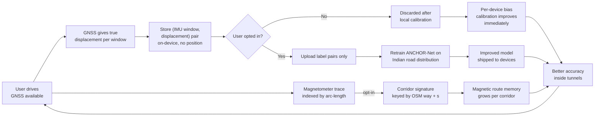
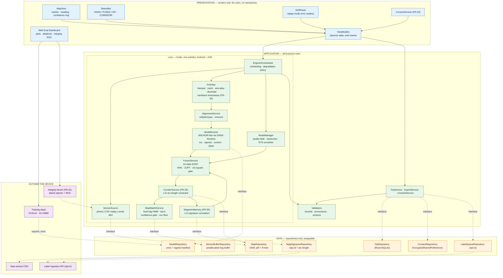
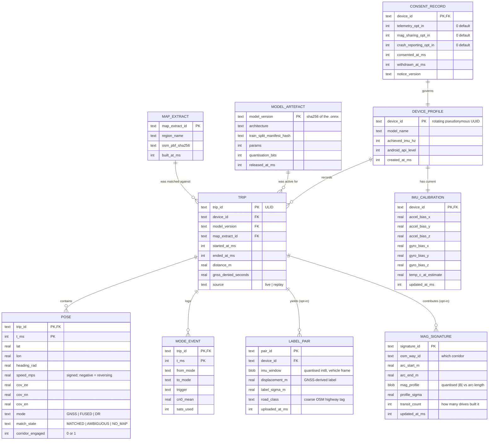
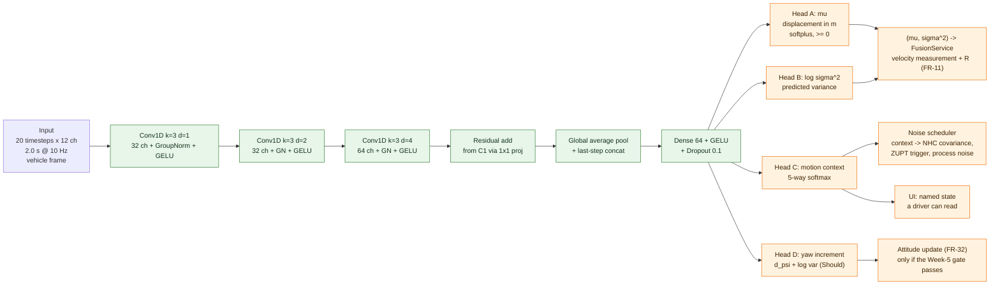

# PRD — Project **ANCHOR**
### AI-ML based Intelligent Dead Reckoning system for seamless navigation
**SIH 2026 · Problem Statement SIH26168 · ISRO / Department of Space · Category: Software · Theme: Smart Vehicles**

| | |
|---|---|
| **Version** | **2.0 — the definitive specification. Supersedes v1.0, v1.1, v1.2 and the Dhruva brief.** |
| Status | Pre-build specification. Written before code, deliberately. |
| Dataset of record | IO-VNBD — `github.com/onyekpeu/IO-VNBD` (mandated by the PS) |
| Proposal deadline | **20 September 2026** — submit 17 September |
| Primary readers | (a) the internal-round faculty panel, (b) the six engineers building this |
| **Self-contained** | **Yes. This document requires no other file to be read, reviewed or submitted.** The fact-check behind every corrected statistic is Appendix E; the novelty scoring and prior-art search is Appendix F; the demo script is §19; the evidence plan is §14.6–14.7 and Appendix B. |
| Working documents (change weekly, deliberately not part of the spec) | `BUILD_PLAN.md` — day-by-day schedule and named owners · `TASKS.md` — the FR → owner → status checklist |

### What changed in v2.0, and why you should read this instead of v1.2

Six changes, each forced by evidence rather than preference. **The fact-check that forced them is Appendix E**; the prior-art search behind V1 and V3 is Appendix F.

| # | Change | Forced by |
|---|---|---|
| **V1** | **The novelty claim is rewritten and narrowed.** v1.x claimed nobody had built phone-IMU→velocity DR. **AVNet/DMDVDR** (Satellite Navigation, 2025) and **arXiv:2505.18490** both published it. We now cite them as evidence the thesis works, and claim only what they did not do. | Prior-art search |
| **V2** | **Core language: C++17 → Kotlin/JVM.** One artefact runs on Android and as a plain `.jar`. The dual-implementation bit-parity conformance suite is deleted. | No C++ engineer on the team; a 15×15 EKF does not need C++ |
| **V3** | **Three new headline capabilities**, each with an ablation row: the **road-manifold constraint**, **magnetic route memory**, and the **GNSS integrity bench**. | Appendix F scoring |
| **V4** | **The edge/FOG engine is promoted from Should to Must.** The PS names it as a deliverable. Under V2 it is nearly free. | PS text |
| **V5** | **Head D (learned yaw increment) added as a Should.** Heading is half the error budget and AVNet demonstrates that learning attitude helps. | §1.2 arithmetic + AVNet |
| **V6** | **Ten factual and internal defects corrected** — wrong dataset author, stale statistics, FR miscount, out-of-order risk IDs, a DB constraint that rejects reversing, a latency budget summed across mismatched duty cycles. | Appendix E.5 |

> **How to read this document.** Every dense section is followed by an **In plain terms** block. Those are not simplifications — they are the same claim in ordinary language, accurate enough for a faculty member to read aloud.
>
> **On numbers.** Every quantitative statement is linked to a source or tagged `[VERIFY]`. `[VERIFY]` means *we have not measured this and will not say it out loud until we have*. There are no invented statistics in this document.

---

## 0. Assumptions

| # | Assumption | Consequence if wrong |
|---|---|---|
| A1 | Team of 6: 2 ML, 2 frontend, 1 backend, 1 generalist (pitch/design/security). **No systems/C++ engineer.** | Drives V2 and all of §20 |
| A2 | Two deadlines: **proposal 20 Sep 2026** (hard, external) and the internal round (date unconfirmed, ~8 weeks). The plan is phase-gated, not date-gated, except for the proposal. | §20 |
| A3 | A live in-vehicle drive in front of judges is **not** possible. Primary evidence is a **recorded run** through a real GNSS-denied stretch; secondary is the **live app handed to a judge**. | §19 |
| A4 | Shipping target is **Android native (Kotlin), minAPI 29**. | §10, §14 |
| A5 | Own data collection is **opportunistic and not load-bearing.** All headline metrics come from IO-VNBD. | §14, §18 |
| A6 | Offline maps are OSM `.osm.pbf` extracts: **UK (metrics)** and **Delhi-NCR + a hill corridor (demonstration)**. | §12, §14 |
| A7 | The edge engine is the **same compiled artefact** as the phone core, not a second product. | §10, §11 |
| A8 | **The synchronised V+S subset exists and is non-trivial.** `[VERIFY — Day 1, hour 1. This gates the entire supervised plan.]` | §14.3 fallback |

---

# PART I — INTERROGATING THE DATASET BEFORE DESIGNING AROUND IT

The rest of this document is only credible if it is buildable on what IO-VNBD actually contains. We read the dataset paper, not the repository abstract.

## I.1 What is actually in it

**Source:** Onyekpe, Palade, Kanarachos, **Szkolnik**, *IO-VNBD: Inertial and Odometry benchmark dataset for ground vehicle positioning*, arXiv:2005.01701 / *Data in Brief*, 2021.
*(v1.x cited a fourth author who is not on the paper. Corrected.)*

**Vehicle stream (`V-*`)** — CAN bus + Racelogic VBOX, 10 Hz: GPS satellite count, time, lat/lon, velocity, heading, height, vertical velocity, **steering angle**, **four wheel speeds (FL/FR/RL/RR, rad/s)**, **yaw rate**, **vehicle speed**, longitudinal and lateral acceleration, handbrake, gear, engine rpm, coolant temperature, clutch, brake pressure, brake position, battery voltage, air temperature, accelerator pedal position.

**Smartphone stream (`S-*`)** — Android, IMU 10 Hz, GPS 1 Hz `[VERIFY from Tables 3–4]`: GPS lat/lon/altitude/speed/accuracy/orientation/satellites, time, date, **accelerometer XYZ**, **gravity XYZ**, **gyroscope yaw/pitch/roll**, **magnetometer XYZ**, device orientation yaw/roll/pitch.

**Ground truth:** VBOX GPS. **Metre-class, not centimetre-class. No RTK, no reference-grade INS attitude.** Every error figure we report is bounded below by ground-truth error, and we say so.

| Stream | Duration | Distance | Countries |
|---|---|---|---|
| Vehicle `V-*` | ~40 h | ~1,300 km | England |
| Smartphone `S-*` | ~58 h | ~4,400 km | England, France, Nigeria |

*(Both figures confirmed verbatim from the paper abstract.)*

**Open question, Day 1:** the abstract says *"one research vehicle was used"*; v1.x's table lists three cars and three phones for the smartphone stream. **Resolve before writing the split protocol**, because holding out "by vehicle" is meaningless if there is one vehicle. `[VERIFY — Day 1]`

## I.2 The single most important thing in this dataset

The repository separates **"Synchronised V and S datasets"** from **"Unsynchronised V and S Dataset"**. In the synchronised drives, the CAN bus and the phone were recording **at the same moment**. For those drives we have:

- **Input:** phone accelerometer, gyroscope, magnetometer, gravity at 10 Hz — *exactly what a dashboard phone can see.*
- **Label:** four wheel-speed sensors and CAN vehicle speed at 10 Hz — *exactly what the PS forbids us from using at inference time.*

**This is the whole technical premise. We use the car's own speedometer to teach the model, then throw it away.** The deployed system consumes only phone sensors. Nothing needs an OBD-II port — which is precisely what PS 26168 asks for.

`[VERIFY — Day 1, hour 1]` The paper does not state the size of the synchronised subfolder. **This is the first thing measured, before any model code is written**, because the entire supervised training set is bounded by it. §14.3 carries the fallback.

## I.3 What the dataset does **not** contain that the PS implies we need

Stating these is not weakness. It is the difference between a team that read the dataset and a team that read the abstract.

| PS requires | IO-VNBD provides | How we handle it |
|---|---|---|
| Filtering of road noise; robustness to chassis vibration and shocks | IMU at **10 Hz. Nyquist = 5 Hz.** Engine harmonics (tens of Hz) and pothole impulses are **aliased away before we ever see them.** | The learned model is trained and evaluated at 10 Hz — honest. The high-frequency vibration-rejection stage (Hampel despiking + adaptive notch) runs on the phone's native ~100–200 Hz stream *before* decimation and is tuned on our own captures. **We never claim IO-VNBD validates it.** |
| Tunnels, multi-level parking, urban canyons | No labelled tunnel or car-park sequences | GNSS outages **synthetically induced** by masking GNSS over held-out segments with continuous ground truth, at **30/60/120/180 s** — matching WhONet's published protocol exactly. This is *stronger* than natural dropouts because ground truth continues through the outage. |
| Two-wheelers | Passenger cars only | Named as an open gap. A leaning motorcycle violates the vertical half of our NHC assumption. **We will not claim two-wheeler support on IO-VNBD evidence.** Phase 2, gated on own collection. |
| Indian roads | England, France, Nigeria | Domain-shift risk R-04. Mitigated by vehicle-frame inputs, augmentation, online per-device scale correction and the flywheel — not by pretending it is absent. |
| Phone remount / misalignment | Not labelled | Synthesised: random SO(3) rotations and mid-sequence rotation discontinuities as augmentation. **Labelled synthetic wherever reported.** |
| FOG-grade external IMU at ~200 Hz | Nothing above 10 Hz | Engine is rate-agnostic by construction. We *demonstrate* 200 Hz on replayed/synthetic data and state plainly that we have **no FOG-grade validation data.** |
| **(for our own X-factors)** audio, barometric pressure | **Absent** | Acoustic and barometric features cannot produce headline numbers. Scoped as demonstration/stretch and labelled as such. See Appendix F.3. |

## I.4 The leakage trap — four ways to fool yourself, and the protocol that prevents it

**A naive random split of this dataset is guaranteed to leak, in four separate ways. Naming all four is the point.**

1. **Window overlap.** A 2 s window at 10 Hz with 1-sample stride means adjacent windows share 19 of 20 samples. Random assignment puts near-identical windows in train and test. Reported error collapses toward zero and means nothing.
2. **Intra-drive correlation.** Two windows 30 s apart in the same drive share road surface, weather, tyre pressure, fuel load, driver behaviour and mounting angle. They are not independent samples.
3. **Driver / vehicle / phone identity.** A model that memorises "this is the Moto G7 in this car with this driver" scores well and generalises to nothing.
4. **Route repetition.** Sequence families (`V-Vta*`, `V-Vtb*`, `V-Vw*`) are repeated runs of the same road on different days. Random splitting puts the same geometry on both sides.

**Split protocol — held out at whole-sequence level, never at window level:**

| Split | Content | Purpose |
|---|---|---|
| **Train** | Synchronised England sequences, drivers A–D | Fit ANCHOR-Net |
| **Validation** | Two whole England sequences from a **driver not in train** | Early stopping, hyperparameters. Touched often. |
| **Test (in-distribution)** | Whole England sequences, **unseen driver + unseen route** | Headline numbers. Touched at most twice. |
| **Test (out-of-distribution)** | France (`S-T*`) and Nigeria (`S-I`) | Generalisation. Reported separately and honestly. |
| **Repeat-route pairs** | Matched pairs from `V-Vta*` / `V-Vtb*` / `V-Vw*`, both members held out | **Evaluates magnetic route memory (FR-30).** Signature built on run A, evaluated on run B. |
| **Golden set** | 40 frozen outage segments drawn from the test splits, checksummed, committed | CI regression gate. Never used for tuning. |

Three hygiene rules, enforced in code and tested:
- **No window crosses a sequence boundary** — `SequenceWindower`, `test_no_cross_sequence_windows`.
- **Normalisation statistics fitted on train only**, serialised with the model — `test_normaliser_fitted_on_train_only`.
- **A 10-second guard band is dropped at every split boundary.**

**Honesty note added in v2.0:** if Day 1 shows the dataset has effectively one vehicle (I.1), we say "held out by driver and route" and drop "by vehicle" from every claim. We do not keep a word in the protocol that the data cannot support.

## I.5 Baselines — three we should beat, two we cannot

| # | Baseline | What it has | Why it is in the table |
|---|---|---|---|
| **B1** | Constant-velocity extrapolation | Last GNSS velocity, held | What a consumer app effectively does when the fix dies. The true incumbent and the honest zero-line. |
| **B2** | Strapdown INS, no learning | Phone accel + gyro, double integration | The physics-only path. Published work reports ~171% translational error for pure IMU integration on KITTI with a *better* IMU than a phone's `[VERIFY from AI-IMU Table 1]`. Shows what the AI is actually buying. |
| **B3** | ESKF + NHC + ZUPT, no learned velocity | Phone IMU + kinematic constraints | **The ablation that decides whether the ML earns its place.** If B3 ≈ ANCHOR, the ML adds nothing and we say so. |
| **B4** | **WhONet** — *cited, not run* | Four wheel-speed sensors at 10 Hz | The academic reference on this exact dataset. Reports **up to 93% positioning-error reduction after 180 s**, evaluated at 30/60/120/180 s over 493 km (confirmed verbatim). **It uses data our phone does not have.** We report the gap as the price of being OBD-free. |
| **B5** | **AVNet / DMDVDR** — *cited, not run* · **new in v2.0** | Smartphone IMU only, deep attitude+velocity net into an invariant EKF | *Satellite Navigation*, 2025, DOI 10.1186/s43020-025-00168-7. Reports **0.64% positional drift after 578 m of GNSS loss.** **This is a smartphone-only system that already does our substitution, and it beats the PS threshold by ~15×.** Including it is the most credible thing in the deck: it proves the thesis is not speculative, and it sets our real bar. |

**Fair comparison requires:** identical outage segments, identical ground truth, identical metric definitions (§14.6), and every runnable baseline executed by the *same* harness — `ml/bench/run_baselines.py`, one command, versioned JSON output. B4 and B5 are cited, marked as cited, and never re-run from memory.

> ### In plain terms
> The dataset was recorded in a car that had sensors on its wheels *and* a phone on the dashboard, both at the same moment. That lets us train a model to guess the car's speed from the phone alone, check its guesses against the real wheel sensors, and then delete the wheel sensors. The dataset also has real limits — no Indian roads, no motorcycles, no tunnels, no microphone, no barometer, and phone sensors slower than a modern phone's. We list them openly instead of designing around capabilities we cannot demonstrate. And if you split sensor recordings randomly into practice and exam sets, the model effectively sees the exam paper in advance — so we split by whole journeys and by driver, and we check in code that we did.

---

# PART II — THE PRODUCT

## 1. Problem decomposition

### 1.1 It reads as one problem. It is five.

| # | Sub-problem | Difficulty | Reality |
|---|---|---|---|
| **P1** | **Attitude / alignment.** Phone orientation relative to the vehicle's forward axis, continuously, with change detection. | Moderate | Most teams do this adequately. The PS names it explicitly. |
| **P2** | **Forward speed without a speedometer.** Recover m/s from a noisy consumer IMU. | **Hard. This is the bottleneck.** | Most teams integrate acceleration and call it a solution. |
| **P3** | **Constrained propagation.** Fuse speed, gyro heading and kinematic constraints so error grows slowly. | Moderate-hard | Well-trodden filter engineering. |
| **P4** | **Map binding.** Bind the trajectory to the road network without binding to the *wrong* road. | Moderate | Teams implement the snapping; almost none implement the refusal. |
| **P5** | **Mode handover.** Move between GNSS-aided and pure DR with no visible jump, and detect *degraded* GNSS — which is worse than absent GNSS. | Easy if architected early, impossible if bolted on late | Teams treat it as a UI problem. |

### 1.2 The bottleneck is P2 — and here is the arithmetic, both halves

**Half one: along-track, from accelerometer bias.** Position from double integration accumulates an uncorrected bias `b` as `½·b·t²`. Taking a deliberately *optimistic* 1 mg = 0.0098 m/s²:

| Outage | Error from this one term |
|---|---|
| 10 s | ≈ **0.49 m** |
| 30 s | ≈ **4.4 m** |
| 60 s | ≈ **17.6 m** |
| 180 s | ≈ **159 m** |

That is **one** error source, generously assumed, ignoring gyro drift, scale factor and vibration coupling. `[VERIFY: measure real bias instability on our target devices — published MEMS figures vary by 1–2 orders of magnitude.]`

**Half two: cross-track, from gyro yaw bias — the half teams forget.** Cross-track error grows as `v·b·t²/2`. At 60 km/h (v = 16.7 m/s) with a residual yaw bias of 0.1°/s (0.001745 rad/s) over 60 s:

`16.7 × 0.001745 × 60² / 2 ≈ **52 m**`

**Half the entire 100 m budget, from heading alone, before speed error contributes anything.** `[VERIFY: measure residual yaw bias on target devices after the filter's bias states converge — 0.1°/s is a plausible *uncalibrated* figure and the post-estimation residual should be far lower.]`

**Three consequences, and they shape the whole design:**
1. The filter must carry **gyro bias as estimated states** and re-observe them at every opportunity — which is what makes **ZUPT (FR-26) load-bearing rather than a nicety.** Every red light is a free calibration.
2. **The magnetometer is not a rescue.** Inside a steel body, next to an alternator and a charger, its heading output is largely unusable *as a compass*. (It is useful for something else entirely — see FR-30.) **The road bearing from the offline map is a far better heading constraint than the compass.**
3. **The road-manifold constraint (FR-29) deletes the cross-track term entirely inside a corridor.** That is why it is a headline feature and not a refinement.

**The only way out of half one is to stop integrating acceleration for speed.** Speed must come from a *learned regression* on the signal's texture — vibration signature, suspension response, the frequency content that correlates with how fast a vehicle is actually moving — rather than from the integral of its mean. **A regression's error does not compound; it stays bounded per window. That converts a quadratic into a roughly linear.** That single substitution is the project. Everything else is competent engineering around it.

> ### In plain terms
> When a phone works out distance by adding up acceleration readings, tiny sensor errors get added up too — twice — so the mistake grows with the *square* of time. It doubles, then quadruples, then goes wildly wrong inside a minute. And there is a second mistake most people miss: a barely-perceptible error in which way the phone thinks it is pointing pushes you sideways off the road, and that also grows with the square of time. Our answer to the first is to stop adding up accelerations and instead train a model to *recognise* speed from the texture of the vibration — the way you can tell roughly how fast a bus is going with your eyes shut. Because it recognises rather than accumulates, its mistakes do not pile up. Our answer to the second is that inside a tunnel there is only one road, so we stop letting the system be wrong sideways at all.

### 1.3 Stakeholders

| Role | Who | What they feel |
|---|---|---|
| **Feels the pain** | Delivery rider, ambulance driver, cab driver, a family on a hill route, a truck driver in a tunnel | Missed exit, wrong turn at a tunnel fork, frozen icon in a basement, "recalculating" at 60 km/h |
| **Pays for it** | Logistics and quick-commerce operators (re-delivery cost, SLA penalties), fleet insurers, end customers | Cost per failed delivery, driver idle minutes, disputed trip distances |
| **Administers it** | Fleet ops managers; authorities operating tunnels and underpasses; ISRO/DoS as custodians of the national PNT stack | No lever — the failure is in the handset, not the road |
| **Blamed today** | The driver ("you should know the route") and the app ("Maps sent me wrong") | Neither is the cause. The cause is the physics of signal blockage. |
| **Adopts first** | Fleet operators with a captive Android driver app — one SDK update reaches thousands of phones overnight | This is the §17 go-to-market |

### 1.4 Quantified pain — sourced, or not said

| Claim | Value | Source / status |
|---|---|---|
| India's longest road tunnel — a fully GNSS-denied stretch of national highway | **9.28 km**, Dr. Syama Prasad Mookerjee Tunnel (Chenani–Nashri), NH-44, J&K, inaugurated 2 April 2017 | **VERIFIED** |
| Continuous blackout duration inside it at 60 km/h | **≈ 9.3 minutes**, every vehicle, every transit | Arithmetic: 9.28 ÷ 60 × 60 |
| Uncorrected phone INS drift over that duration | Hundreds of metres to kilometres | Derived, §1.2 |
| Two-wheeler registrations, India, FY26 | **21.42 million units, +13.4% YoY** — a record, past the pre-Covid FY19 peak of 18.4 m | **VERIFIED (full-year VAHAN).** *v1.x used the partial-year 20.05 m figure; corrected.* |
| DPDP Rules 2025 operational provisions take effect | **14 November 2026** — roughly two months after the SIH final | **VERIFIED.** Notified 14 Nov 2025; phased 14 Nov 2025 / 14 Nov 2026 / 14 May 2027 |
| NavIC constellation status | **VOLATILE — see below** | |
| Minutes lost per covered-area delivery | `[VERIFY]` — obtain from a partner fleet or measure. Do not estimate. | — |
| Cost per failed delivery | `[VERIFY]` | — |
| Total registered vehicles in India | **Deleted.** We do not need it and §16 is stronger without it. | — |

**On NavIC — say this carefully, and re-check it the morning of the pitch.** As of late August 2026 only three satellites (IRNSS-1B, IRNSS-1I, NVS-01) were providing PNT service, below the four required for standalone positioning, after IRNSS-1F's last atomic clock failed in March 2026. **NVS-03 was slated to launch in the first week of September 2026, with NVS-04 and NVS-05 to follow.** The constellation may therefore be *recovering or recovered* by the time we present.

**The pitch line must be robust either way, so it is phrased as a property of the architecture, not a jab at the constellation:**

> *"A positioning capability that does not depend on receiving a signal at all is resilient to everything at once — a tunnel, a jammer, a solar event, or a constellation in transition. NavIC's recovery launches are underway; an inertial engine that survives nine minutes of blackout is the layer that makes any constellation more useful, not a substitute for one."*

Said once, respectfully, to the organisation that operates it. Then move on. **Do not say "NavIC is degraded" to ISRO.**

### 1.5 The as-is workflow

| Step | What happens | Time cost |
|---|---|---|
| 1 | Rider follows turn-by-turn guidance, phone in a handlebar mount | — |
| 2 | Vehicle enters underpass / basement ramp / tunnel portal. Carrier-to-noise collapses in roughly a second. | 0 s |
| 3 | App holds the last fix. Marker **freezes**. | 1–5 s |
| 4 | Internal filter extrapolates, or the fix jumps to a multipath position. Marker **teleports** to a parallel road or the level above. | 5–20 s |
| 5 | Voice guidance goes silent, or announces a turn already passed | ongoing |
| 6 | Rider must guess or stop. **Stopping in a tunnel is not an option**, so they guess. | 0 s decision, high risk |
| 7 | Exit portal. GNSS reacquires; re-match. | 5–30 s `[VERIFY]` |
| 8 | Recalculate. If the exit was missed, reroute adds distance. | **2–15 min** `[VERIFY]` |
| 9 | Repeat at every covered stretch | multiplied |

**The compounding step is 8. The dangerous step is 6.**

---

## 2. Existing solutions teardown

| Solution | What it does | Where it fails | Why users tolerate it |
|---|---|---|---|
| **The driver's memory and eyes** (the real incumbent) | Recall the route, read signage, follow the car in front | Unfamiliar routes, multi-exit interchanges inside tunnels, identical parking levels, hill terrain at night. Zero support for a new rider. | Free, no software, works ~90% of the time on familiar routes |
| **Google / Apple Maps / MapmyIndia** | GNSS + Wi-Fi/cell + map matching + vendor sensor fusion. Excellent when a fix exists. | Freeze and teleport during blackout; no exposed confidence; no continuity through a 9 km tunnel; a black box a fleet cannot tune or audit | Free, superb 95% of the time, and there is no alternative. Users have normalised the failure. |
| **Factory-fitted automotive INS / DR head units** (OEM, u-blox-class DR chipsets) | True GNSS+INS with a wheel-tick or CAN speed feed. **Genuinely solves the problem.** | Requires hardware install and a physical connection to the vehicle. Absent from most Indian commercial trucks, older cars, and **every two-wheeler.** | Where fitted it works. The problem is the vehicles where it is not. |
| **OBD-II dongle + telematics** | Reads speed off the OBD-II port | Needs a port, a dongle, and a dongle that stays plugged in. No OBD-II on two-wheelers. Per-vehicle cost and a tamper surface. **Explicitly ruled out by the PS.** | Fleets that bought them get fuel and diagnostics data too |
| **WhONet / R-WhONet** (Onyekpe et al.) | RNN over four wheel-speed sensors at 10 Hz. The reference result on this exact dataset — up to 93% error reduction after 180 s. | **Requires wheel encoders.** A dashboard phone has none. | Academic state of the art, not a product |
| **AI-IMU Dead-Reckoning** (Brossard et al.) | IMU-only IEKF with a small CNN adapting measurement covariances, plus zero-lateral/vertical pseudo-measurements | Uses a **100 Hz automotive-grade IMU rigidly bolted to the vehicle** — no arbitrary phone rotation, no dashboard vibration coupling. Does not learn forward speed; it constrains sideways error. | The single most useful prior art for our filter design |
| **AVNet / DMDVDR** (Wuhan + Chongqing, 2025) | **Smartphone-only.** Deep net estimates attitude and velocity pseudo-measurements; invariant EKF fuses them. **0.64% drift after 578 m of GNSS loss.** | Point estimates — **no calibrated per-window uncertainty fed to the filter.** No map binding or refusal behaviour. No integrity gating against spoofing. No edge/FOG deployment. Research result, not a deployable product. | **The closest prior art to us, and the reason our thesis is not a gamble.** |

### 2.1 The gap — stated narrowly enough to survive cross-examination

v1.x claimed *"nobody has shipped a system that recovers vehicle forward speed from an arbitrarily-mounted consumer phone IMU alone."* **That is no longer true and we do not say it.** AVNet did it, published it, and got 0.64%.

The defensible gap is narrower and still real:

> **The phone-IMU-to-velocity substitution is published and works. What no published smartphone DR system does is: (i) output a *calibrated* per-window uncertainty and feed it to the filter as measurement noise; (ii) *refuse* — decline to snap when the map is ambiguous, decline a GNSS fix that contradicts felt motion, and refuse to let a map assertion make the filter confident; (iii) *change the dimensionality of the estimation problem* inside a road corridor instead of snapping onto it afterwards; (iv) publish a *measured integrity curve* against parameterised GNSS attacks; and (v) ship the identical engine to a phone and to a 200 Hz industrial IMU, as the PS requires.**

Three reasons the remaining gap is open, and all three have recently changed:
1. **The labelled data did not exist publicly.** IO-VNBD's synchronised subset is the first public source of simultaneous phone IMU and ground-truth vehicle speed. Published 2020; the authors used the wheel speeds as *inputs*, not as *labels*.
2. **On-device sequence-model inference was impractical until recently.** A quantised temporal CNN now runs in single-digit milliseconds on mid-range Android `[VERIFY on our target devices]`.
3. **Incumbents have no incentive.** A global navigation app optimises for the median user in a well-surveyed city where GNSS works. The covered route-kilometres are not where their leverage is — but they are exactly where Indian logistics, hill tourism and emergency response lose the most time.

> ### In plain terms
> Cars that already solve this plug a wire into the vehicle's own speedometer. Phones cannot. A research group in China published a phone-only version last year and it worked well — we cite them, because it proves the idea is sound and it would be dishonest to pretend we invented it. What they did not build is a system that knows *how much to trust itself*, that refuses to answer when it is unsure, that treats a tunnel as a line rather than a plane, that measures its own resistance to fake satellite signals, and that runs unchanged on industrial hardware. That is our part.

---

## 3. Solution thesis

### 3.1 One sentence

> **ANCHOR teaches a phone to feel how fast a vehicle is moving, and to know how sure it is — so that when the satellites disappear in a tunnel, the map keeps moving correctly instead of freezing, and says so when it cannot.**

### 3.2 The insight

Competing teams will treat this as a **filter-tuning problem**: better Kalman filter, better noise model, better snapping. The phrase "sensor fusion" pulls people there.

**Filter tuning cannot fix this, because the error is quadratic in time and no filter beats quadratic growth without a new measurement.** A Kalman filter is an optimal way of *combining* information. It cannot manufacture information that is not present, and double-integrated acceleration contains almost no usable distance information after twenty seconds.

So the insight is a **substitution, not a refinement: treat forward speed as a perception problem rather than an integration problem.** The vibration spectrum a phone feels — road-roughness excitation, suspension resonance, tyre-cavity noise, engine order content — is correlated with speed in a way that is learnable and, critically, **non-accumulating.** Every window's estimate is independent, so errors average out instead of compounding.

Then three quieter halves that are where the actual contribution lives:

- **The model must say how sure it is.** A speed estimate without a confidence is unusable inside a filter, because the filter needs to know how much to trust it. We train the velocity head to output a *distribution*, and feed its predicted variance directly into the measurement noise. That is what makes it *fuse* rather than merely be averaged in.
- **Geometry is information, and it is free.** Inside a corridor the road is one-dimensional. Using that changes what the filter solves for, and deletes the cross-track half of the error budget.
- **A wrong answer delivered confidently is worse than no answer.** Every failure path ends in wider stated uncertainty or an explicit refusal.

### 3.3 The 30-second pitch

> When your car enters a tunnel, your phone loses the satellites and your map freezes — and if you miss the exit, you lose ten minutes and take a real risk on a highway. Cars that solve this plug a wire into the speedometer. Phones cannot. So we asked a different question: can a phone *feel* how fast the vehicle is going, from vibration alone?
>
> We trained a model on a public research dataset where a car recorded its real wheel-sensor speed and a dashboard phone recorded its sensors at the same moment. The model learns to predict the wheel-sensor speed from the phone signal alone — and to say how confident it is. Then we throw the wheel sensors away. On the phone, that prediction is combined with the gyroscope, with the physical fact that a car cannot slide sideways, and with an offline road map, inside a filter that tracks its own uncertainty and refuses to guess when it cannot see.
>
> The result is a marker that keeps moving, accurately, through a nine-kilometre tunnel — on an ordinary Android phone, with no wires, no dongle and no internet. And the same engine, unchanged, runs on an industrial sensor at 200 hertz.

---

## 4. Moat

### 4.1 Accuracy — the arithmetic

**The PS benchmark, restated exactly:** *dead-reckoning drift must stay within **10% of distance travelled**, exemplified as **under 5 m over 50 m in a GNSS-denied environment within one minute**.* Applied to a 1 km outage, 10% is 100 m.

| System | Error over a 60 s / ~1 km GNSS-denied stretch | Meets it? |
|---|---|---|
| B1 — constant-velocity extrapolation | Unbounded. Equals the true path's entire deviation from a straight line. In a curved tunnel, hundreds of metres. | No |
| B2 — raw IMU double integration | Order-of-magnitude reference: ~171% translational error reported for pure IMU integration on KITTI with a *better* IMU than a phone's `[VERIFY]`. At 1 km, ~1,710 m. | No |
| B3 — ESKF + NHC + ZUPT, no learning | Constrains sideways drift only. Along-track error still grows quadratically. `[VERIFY — our own ablation, Week 5]` | Expected: no |
| **ANCHOR (target)** | **< 100 m over 1 km, i.e. < 10% drift.** Internal stretch target **≤ 3%**, set by B5. `[VERIFY — a target, not a result, until the golden set says otherwise]` | Target: yes |
| B5 — AVNet, smartphone-only (cited) | **0.64% drift over 578 m of GNSS loss** | **Yes, by ~15×.** A published phone-only system already clears this bar. |
| B4 — WhONet, with wheel encoders (cited) | Up to 93% error reduction after 180 s | Yes — but needs hardware we do not have |

**Read the last two rows honestly.** B5 tells us the PS threshold is a *low* bar for this class of method, and that a result of 8% would be a poor outcome, not a triumph. Setting our internal target from published work rather than from the requirement is the difference between aiming to pass and aiming to be good.

**Reach — stated as an exclusion, not a total.** Every vehicle without factory INS and without an OBD-II dongle is excluded from continuous covered-area positioning. **21.42 million two-wheelers were registered in India in FY26 alone, and no two-wheeler has an OBD-II port.** We deliberately state no national total; §16 does the arithmetic properly from a defensible base.

### 4.2 Cost

| Line | Value | Basis |
|---|---|---|
| Marginal inference cost per vehicle per month | **₹0** | All inference on-device. **There is no server in the positioning loop.** Structural, not a discount. |
| Competing solution's marginal cost | Retrofit INS or OBD dongle: hardware + install labour per vehicle `[VERIFY: get a real quote]` | Per-vehicle hardware |
| Our backend cost | Map extract hosting + optional opt-in telemetry only | §17 |

**A competitor with a server-side positioning API pays per request, forever, and fails when the tunnel also has no cellular coverage. Ours cannot fail that way, because there is nothing to call.**

### 4.3 The data flywheel

1. A user drives with ANCHOR running. **GNSS is available for most of the drive.**
2. During those stretches GNSS gives accurate displacement — **a free, automatically-generated training label**, the exact quantity the velocity head predicts. *(This is precisely the supervision signal arXiv:2505.18490 uses, which is independent evidence it works.)*
3. The device stores `(IMU window → displacement)` pairs locally, quantised and stripped of position.
4. With explicit opt-in, **label pairs — not trajectories, not locations —** are uploaded.
5. Retraining on real Indian roads, vehicles and phone models closes the domain gap IO-VNBD leaves open.
6. The improved model ships back. **Accuracy in tunnels improves because of driving done outside tunnels.**
7. **And, new in v2.0:** the same loop builds the **magnetic route memory** (FR-30). Every ordinary transit of a corridor with GNSS at the portals contributes a signature indexed by arc-length. The *n*-th driver through a tunnel benefits from the first *n−1*, with no survey and no infrastructure.

**The elegance: labels are generated exactly where the system is not needed, and spent exactly where it is. No user labels anything.**



### 4.4 What stops a competent team cloning this in a week?

Answered component by component. **Three of six are not defensible, and we say so.**

| Component | Clonable in a week? | Verdict |
|---|---|---|
| ESKF + NHC + ZUPT pseudo-measurements | **Yes.** Textbook. Three days for a good team. | **No moat.** We claim none. |
| HMM map matching on OSM | **Yes.** Newson–Krumm is published with open implementations. | **No moat.** |
| The velocity head itself | **Yes, now.** AVNet and arXiv:2505.18490 published the approach in 2025. | **No moat — and v1.x was wrong to claim one.** |
| The velocity head trained with a **leakage-safe protocol** on the synchronised subset | **No — 4 to 6 weeks.** Not because the architecture is hard but because the *protocol* is. A team that random-splits gets an impressive number that collapses on a held-out driver and will not know why. | **Moat: the method, ~5 weeks.** Erodes once published. |
| **Calibrated uncertainty feeding the filter** | **No — this is the part everyone skips.** Most produce a point estimate and hand-tune `R`. A *calibrated* variance, measured by expected calibration error on a frozen set, is distinct work. | **Moat: ~3 weeks.** |
| **Data + magnetic flywheel on real Indian driving** | **No — this is time, not skill.** It cannot be cloned at all without users. | **Durable moat. The only one that grows.** |

**Design consequence.** Since half the components have no moat, we deliberately do not spend scarce weeks re-deriving a Kalman filter. We implement the standard one carefully, test it against synthetic ground truth, and spend the saved time on the split protocol, the calibration, the road-manifold constraint and the flywheel. That is the reason for the phasing in §20.

> ### In plain terms
> Half of what we build is standard engineering any good team could reproduce in a week, and we say so rather than pretending otherwise. Even the central idea — guessing speed from vibration — was published by someone else last year, and we cite them. What is genuinely hard to copy is the training discipline: it is easy to produce a model that scores brilliantly in testing and fails on a road it has never seen, and avoiding that takes weeks. Harder still to copy is that every ordinary drive with a working signal quietly produces free training material and a free magnetic map — so the system gets better at tunnels because of the driving people do outside tunnels.

---

## 5. USP and wow factor

Full scoring and prior-art evidence in **Appendix F**. Three headline capabilities, each with an ablation row. **A feature that cannot be measured in the ablation table is a slide, not a contribution, and is cut.**

### 5.1 Primary USP — "the marker that does not freeze"

**What it is.** A split-screen, same-recording comparison. Left: a conventional GNSS-only trace. Right: ANCHOR. Both fed the identical sensor recording of a real covered stretch. At the portal the conventional marker freezes, then teleports. The ANCHOR marker continues, follows the curve, and arrives at the correct exit — with a **live drift counter against ground truth**.

**What a conventional app cannot do.** Show a drift counter. It does not know its own error, because it has no independent estimate to compare against.

**Under 60 seconds:** press play; both markers move together; at 0:12 the portal arrives and divergence is immediate and obvious; at 0:45 the exit arrives and the counter reads a number under the PS threshold. No narration needed while it runs.

### 5.2 Headline capability 1 — the **road-manifold constraint** (FR-29)

**"Inside a tunnel the road is a line. So we stop solving for a point on a plane and start solving for a distance along a line."**

A vehicle in a tunnel or a junction-free corridor has one translational degree of freedom, not two. Rather than snapping a 2-D estimate onto the polyline after the fact, the filter **switches the state it solves for**: when the map says the corridor is unambiguously 1-D, lateral offset is driven to zero with tight covariance and heading is pulled to the local road bearing. **Cross-track error — the ≈52 m half of the §1.2 budget — becomes structurally impossible**, and the whole budget goes to along-track distance, which is exactly what the learned velocity head is good at.

*Prior art, stated: track-constrained strapdown INS reduces 3-D position to 1-D arc length in the rail literature, and lane-constrained tunnel work reports 1.2–1.5 m horizontal accuracy. The technique is known. Applying it to an arbitrarily-mounted consumer phone with a learned velocity head, with an explicit test for when the corridor is 1-D and an instant exit when it is not, is our part.*

**On screen:** a `CORRIDOR` pill appears and the confidence ellipse visibly collapses to a cigar along the road.

### 5.3 Headline capability 2 — **magnetic route memory** (FR-30)

**"The second time you drive through a tunnel, your phone recognises it."**

Tunnel rebar, gantries and ventilation create a magnetic profile along the bore that is strong, spatially structured and stable. On a later transit, cross-correlating the live magnetometer trace against a stored one gives an **absolute along-track fix inside a GNSS-denied tunnel** — the one thing dead reckoning cannot give itself.

**It composes with 5.2:** once the state is a scalar arc-length, matching is a **1-D cross-correlation**, not a 2-D fingerprint search — cheap, well-posed and easy to gate. **It composes with 4.3:** the map builds itself from ordinary transits.

*Prior art, stated: this is not a novel concept. MVP (Magnetic Vehicular Positioning) reports 5.14 m accuracy across 56 tunnels in two countries over 36 months; DLR reports 1.5–1.8 m longitudinal accuracy for magnetic train localisation in tunnels. Our contribution is fusing it with a learned velocity estimate on a consumer phone, reducing the search to 1-D, and building the reference from crowd transits rather than a survey.*

**Why it can be proven on the mandated dataset — and this is the point.** IO-VNBD records magnetometer XYZ **and contains repeated runs of the same routes** (`V-Vta*`, `V-Vtb*`, `V-Vw*`). v1.x treated those only as a leakage hazard. They are also the test: build the signature from run A, evaluate re-localisation on held-out run B. **No other novelty on our list gets a held-out test on ISRO's own chosen data.**

*Honest caveat we state first: IO-VNBD's repeat routes are open roads, not bores, so magnetic structure is weaker than in a tunnel. The IO-VNBD number is a lower bound. If it fails, it is reported as a negative result with the correlation statistics shown.*

### 5.4 Headline capability 3 — the **GNSS integrity bench** (FR-31)

**"We don't claim to resist spoofing. We measured exactly how much we resist, and where we stop."**

The replay harness injects **parameterised synthetic GNSS attacks** into held-out sequences with known ground truth — **step spoof** (instantaneous jump of *d* m), **drag spoof** (position pulled off at *r* m/s), **jamming** (CN0 collapse with fixes still reported), **multipath** (correlated urban-canyon error) — and reports a **detection ROC** for the chi-square innovation gate (FR-27): detection rate versus false-rejection rate on clean fixes, with the crossover named.

**The most valuable part of the curve is where it fails.** We report the slowest drag rate we reliably catch and the fastest one we provably miss. That converts §15's careful sentence — *"we say 'detects discontinuous spoofing and multipath', never 'spoof-proof'"* — from a disclaimer into a measurement.

*Novelty: the gate is textbook. Benchmarking it against an attack model and publishing the operating curve, as a hackathon deliverable, is what nobody does. We claim the bench, not the gate.*

### 5.5 Supporting USP — "hand the judge the phone"

A judge holds the phone, **disables location services themselves in Android settings**, and walks a measured corridor. The ANCHOR marker tracks them. This converts a claim into a demonstration the judge performed, and answers the unspoken question every experienced panelist has: *"is this a video, or does it work?"*

> **Honesty note, non-negotiable.** A walking gait is *not* vehicle dynamics and ANCHOR-Net is trained on vehicles. We ship a clearly-labelled **pedestrian step-model fallback** for this demonstration and say out loud, *before the judge starts walking*, that it is a different model. Passing a walk off as vehicle validation is exactly what a sharp panelist catches, and it would cost more than the demo gains. Enforced by the demo script and by an on-screen label. See R-09.

### 5.6 Supporting USP — "it refuses to lie"

A confidence ring around the marker that grows with filter uncertainty; a map-matching indicator that goes **amber** when the system declines to snap because it cannot tell which road; a `MODE` pill; and a live **motion-context** label. A conventional app has exactly one failure mode visible to the user: silence. ANCHOR degrades *legibly* — it says "I am 12 m sure" instead of pretending to be exact. For an ambulance driver a known-bad estimate is operationally useful; an unknown-bad one is dangerous.

**Rule we hold ourselves to: every one of these exists on screen in the demo. None exists only in the architecture diagram.**

---

## 6. Scope

### 6.1 MoSCoW

MVP = **the smallest system that proves the thesis in §3.2 and survives §19's demo**: a trained velocity + variance head, a working filter, map binding, the road-manifold constraint, and a replay harness that produces the split screen.

| ID | Item | Priority | In demo? | Note |
|---|---|---|---|---|
| S-01 | ANCHOR-Net velocity + variance heads, leakage-safe split | **Must** | Yes | The thesis. |
| S-02 | 15-state error-state EKF with NHC and ZUPT | **Must** | Yes | Visible as smooth motion and no creep at traffic lights. |
| S-03 | Phone→vehicle alignment (roll/pitch from gravity, yaw from motion) + remount detection | **Must** | Yes | Shown as a 5 s "calibrating" state. |
| S-04 | GNSS quality monitor, quality-weighted fade, hysteresis, chi-square gate | **Must** | Yes | The `GNSS / FUSED / DR` pill. |
| S-05 | Offline OSM map matching (fixed-lag HMM) with confidence-gated snapping | **Must** | Yes | The amber refusal indicator. |
| S-06 | **Replay harness** — recorded CSV through the live engine as if it were sensors | **Must** | Yes | **This *is* the demo mechanism. Build it first, in P0.** |
| S-07 | Android app: map, marker, confidence ring, mode pill, drift counter, context label | **Must** | Yes | — |
| S-08 | Evaluation harness + golden set + baseline table | **Must** | Yes | The credibility artefact. |
| S-09 | **Road-manifold constraint** | **Must** | Yes | Headline 1. §5.2. |
| S-10 | **Edge/CLI engine** consuming CSV or serial IMU at arbitrary rate | **Must** *(was Should)* | One slide | **The PS names it as a deliverable.** Nearly free under V2. |
| S-11 | **GNSS integrity bench** | **Must** | One slide | Headline 3. §5.4. Two days' work. |
| S-12 | RTS backward smoothing on reacquisition | **Must** | Yes | The trail slides into place. Textbook; not claimed as novelty. |
| S-13 | Provenance hashing on every trace, plot and slide number | **Must** | Yes (printed sheet) | Discipline, not USP. |
| S-14 | **Magnetic route memory** | **Should** | Yes if ready | Headline 2. §5.3. Cut before S-01/09 under pressure. |
| S-15 | Motion-context head (idle/normal/rough/impulse/handling) → filter noise | **Should** | Yes if ready | Falls back to fixed `R` and deterministic detectors. |
| S-16 | Head D — learned yaw-increment correction | **Should** | No | Gated on the Week-5 ablation. Cut first. |
| S-17 | Web evaluation dashboard | **Should** | Yes | Also the proposal-screening artefact. |
| S-18 | Pedestrian step-model fallback (for §5.5 only, clearly labelled) | **Should** | Yes | Required for the highest-impact 30 s of the demo. |
| S-19 | On-device label collection for the flywheel (opt-in) | **Could** | No | Architecture shown; no data collected before the internal round. |
| S-20 | Barometric floor / ramp detection | **Could** | Yes if ready | Demo-only, labelled. No IO-VNBD validation possible. |
| S-21 | Per-device IMU bias auto-calibration during stationary periods | **Could** | No | Cheap win, low demo value. |
| S-22 | Hindi UI and voice | **Could** | No | String architecture committed now; translation is Phase 2. |
| S-23 | In-cabin acoustic ego-speed | **Won't** (this round) | No | Highest novelty on the list; **no audio in IO-VNBD.** P5 research spike; likely national-round headline. |
| S-24 | Two-wheeler support | **Won't** | No | §6.2 |
| S-25 | Turn-by-turn routing and voice navigation | **Won't** | No | §6.2 |
| S-26 | iOS app | **Won't** | No | §6.2 |
| S-27 | Cloud positioning API | **Won't — ever** | No | Contradicts the architecture (§4.2) |
| S-28 | Learned GNSS-trust model | **Won't** | n/a | Replaced by the chi-square gate (FR-27): principled, needs no training data, explainable, and removes an ML deliverable from a two-person ML team. |

### 6.2 What we are deliberately not building, and why

- **Two-wheeler support.** IO-VNBD contains no two-wheeler data. A motorcycle leans into turns, violating the vertical half of the non-holonomic constraint the filter relies on. We could *claim* it; we would be claiming it on zero evidence. Phase 2, gated on our own collection, and we say that on the slide.
- **Turn-by-turn routing and voice navigation.** ANCHOR is a **positioning engine**, not a navigation app. Routing is solved and well served. Building a worse Google Maps would consume the team and prove nothing. The correct product shape is an SDK a fleet's existing app embeds.
- **iOS.** iOS restricts background sensor rates and raw GNSS access in ways that materially change the design. Supporting it properly is a project; supporting it badly is worse than not supporting it.
- **A cloud positioning API.** Descoped **on principle**, not for time. A tunnel that blocks GNSS usually blocks cellular. Any design with a network call in the positioning loop fails in exactly the situation it exists for.
- **NavIC-specific signal processing.** Tempting given the sponsor, but Android's raw-measurement API does not expose constellations uniformly and the constellation status is in flux (§1.4). We consume NavIC as one more constellation in the quality monitor and build no story on it.
- **In-cabin acoustic speed, this round.** It is the most novel idea we have. **IO-VNBD has no audio**, so it cannot produce a headline number, and A5 says own data is not load-bearing. Promoting it would mean betting the most novel part of the pitch on the weakest evidence. Held for the national round.

---

## 7. Personas and journeys

### 7.1 Personas

**P1 — Ravi, 24, quick-commerce delivery rider, Ghaziabad.** Android, 4 GB RAM, mid-range chipset, 3 years old, degraded battery. Prepaid data, throttled after cap, frequently offline in basements. Functionally literate in Hindi, limited English; **reads icons faster than text.** Paid per delivery, penalised on SLA. Phone in a handlebar mount that **gets knocked out of alignment several times a shift.**
→ *Design consequences:* alignment must run **continuously**, not once (S-03); no assumption of connectivity; no assumption of English; must not drain battery.

**P2 — Sunita, 41, ambulance driver, hill road.** Fleet tablet, dash-mounted, permanently powered. Intermittent coverage with long dead stretches. High literacy, professional. Extreme time pressure — a wrong turn on a switchback costs minutes that matter clinically.
→ *Design consequences:* she needs the **confidence ring** more than anyone. A known-bad position lets her fall back on judgement; an unknown-bad one gets someone killed. Must work with **no data connection at all** for an entire journey.

**P3 — Arun, 35, fleet operations manager, 3PL, ~200 vehicles.** Desktop dashboard, office broadband, high literacy, not a programmer.
→ *Design consequences:* **he is the buyer.** He needs evidence, not vibes — trip-level drift statistics, a way to audit a disputed delivery, and an integration path that does not require physically touching 200 vehicles.

### 7.2 As-is vs to-be — Ravi, one basement delivery

| t | **As-is** | **To-be with ANCHOR** |
|---|---|---|
| 00:00 | Enters basement ramp. GNSS drops. | GNSS monitor sees CN0 collapse; filter stops accepting GNSS. **No mode "switch" occurs — the filter never stopped running.** |
| 00:02 | Marker **freezes** at the ramp mouth. | Marker continues down the ramp. Confidence ring widens. Pill reads **DR**. Barometer reports a descending ramp (S-20). |
| 00:15 | Marker **teleports** to the road above the mall. | Marker is on level **B1**, following ramp geometry. Map-matching goes amber (no OSM geometry indoors); filter relies on NHC, ZUPT and the velocity head. |
| 00:40 | Rider lost among identical levels; starts reading pillar numbers. | On-screen distance travelled and level indicator; rider navigates by the trace. |
| 03:30 | Finds the lift lobby by memory or by asking. Delivery late. | Reaches the lobby directly. |
| 06:00 | Back at the bike. Marker still wrong. ~20 s wait for reacquisition. `[VERIFY]` | Exits ramp. GNSS returns. Filter **fuses rather than jumps** — correction distributed over ~1 s and the trailing trace RTS-smoothed, so the marker slides rather than teleports. |
| **Δ** | **~3–6 min lost per covered delivery** `[VERIFY]` | **Near zero.** The delta *is* the pitch. |

### 7.3 As-is vs to-be — Sunita, hill tunnel emergency run

| t | **As-is** | **To-be** |
|---|---|---|
| 00:00 | Approaching a tunnel portal with a fork 400 m inside. | Same. |
| 00:05 | GNSS lost. Guidance goes silent. | DR engaged. **Road-manifold constraint engages** — the corridor is 1-D, cross-track error collapses. Guidance continues from the offline map. |
| 00:20 | Reaches the fork with no guidance. Must guess. | Guidance announces the fork; the constraint releases at the junction and the matcher keeps top-*k* hypotheses until one wins decisively. |
| 00:21 | **Wrong bore taken.** | Correct bore taken. |
| 05:00+ | Exits into the wrong valley. Reroute adds `[VERIFY]` minutes on a road with few turnarounds. | On route. |
| **Δ** | Minutes, on a clinical clock. | — |

---

## 8. Functional requirements

Each is atomic and testable. IDs are reused verbatim in §11. **Count: FR-01 … FR-34, 34 requirements.** *(v1.x said "twenty-five" while listing 28. Corrected and re-counted.)*

### Acquisition and conditioning

| ID | Requirement | Acceptance criteria |
|---|---|---|
| **FR-01** | Sensor acquisition at the highest rate the device supports. | **Given** an Android device with accelerometer and gyroscope, **when** the engine starts, **then** it registers at `SENSOR_DELAY_FASTEST`, records the *actual achieved* rate, and logs a warning below 50 Hz. |
| **FR-02** | High-rate pre-filtering of vibration and impulse noise. | **Given** a raw stream with injected impulse spikes, **when** pre-filtering runs, **then** spikes exceeding the Hampel criterion are replaced by the local median and residual energy above 5 Hz is attenuated by at least `[VERIFY: target dB, set after measuring real vibration spectra]`. |
| **FR-03** | Decimation to the model's operating rate with anti-aliasing. | **Given** a stream at rate `f`, **when** decimating to 10 Hz, **then** a low-pass with cutoff below 5 Hz is applied first and the output matches the Python reference on the golden vectors within tolerance. |
| **FR-33** | **Use hardware sensor timestamps, never wall clock, and resample onto a fixed grid.** | **Given** a batch of Android sensor events delivered irregularly, **when** the engine ingests them, **then** ordering and Δt come from `SensorEvent.timestamp`, out-of-order events are handled, and the resampled grid has no gap exceeding `[VERIFY]` ms. Tested with a recorded irregular-batch trace. *(This is the defect that silently kills projects like this. It is a requirement, not a note.)* |

### Alignment

| ID | Requirement | Acceptance criteria |
|---|---|---|
| **FR-04** | Estimate phone→vehicle roll and pitch from the gravity vector. | **Given** ≥3 s stationary or steady motion, **when** alignment runs, **then** roll and pitch are within `[VERIFY]`° of synthetic ground truth on the augmentation test set. |
| **FR-05** | Estimate the yaw offset between phone and vehicle forward axes. | **Given** ≥1 longitudinal acceleration event above threshold, **when** yaw estimation runs, **then** the estimate agrees with GNSS course-over-ground within `[VERIFY]`° while GNSS is available. |
| **FR-06** | Detect mid-drive remount and re-run alignment. | **Given** a synthetic rotation discontinuity at t=T, **when** the detector runs, **then** it flags within 2 s of T, re-initialises alignment, and inflates filter covariance accordingly. |

### The model

| ID | Requirement | Acceptance criteria |
|---|---|---|
| **FR-07** | Predict forward displacement per window from phone IMU alone. | **Given** a 2 s window of aligned IMU data, **when** ANCHOR-Net infers, **then** the velocity head returns a mean displacement and a variance, and **the inference path reads no GNSS and no wheel-speed input** — asserted by an input-provenance test that fails the build if a GNSS or CAN column reaches the model tensor. |
| **FR-08** | The predicted variance must be **calibrated**. | **Given** the golden set, **when** predictions are binned by predicted variance, **then** empirical error matches the predicted distribution with expected calibration error below `[VERIFY: target, e.g. 0.05]`, and a reliability diagram is produced. |
| **FR-24** | Fall back safely when the model is unavailable or implausible. | **Given** a missing, corrupt or out-of-bounds model output, **when** inference is attempted, **then** the engine logs it, degrades to the NHC-only filter (B3 behaviour), sets a degraded mode pill, and does not crash. |
| **FR-25** | Version and pin every model artefact. | **Given** a running engine, **when** a pose is emitted or a trace exported, **then** it carries the model version hash; loading a model whose hash is not in the signed manifest is refused. |

### The filter

| ID | Requirement | Acceptance criteria |
|---|---|---|
| **FR-09** | Propagate a 15-state error-state EKF (position, velocity, attitude, accel bias, gyro bias) at the device's native rate. | **Given** a stream of aligned samples, **when** the filter propagates, **then** state and covariance update without numerical failure over a 10-minute sequence and covariance remains positive-definite every step (Joseph-form or square-root update, asserted). |
| **FR-10** | Apply non-holonomic constraints as pseudo-measurements. | **Given** the vehicle is in motion, **when** the NHC update runs, **then** body-frame lateral and vertical velocity are driven toward zero with covariance from the context head or a fixed default, and the update is **suppressed** when stationary (FR-26) or reversing. |
| **FR-11** | Fuse predicted displacement weighted by its predicted variance. | **Given** a velocity-head output `(μ, σ²)`, **when** the update runs, **then** `R = σ² × trust_factor`, and a unit test confirms that doubling `σ²` halves the state correction magnitude. |
| **FR-26** | Apply a zero-velocity update when the vehicle is detected stationary. | **Given** IMU energy below the stationarity threshold and near-zero predicted displacement, **when** ZUPT runs, **then** velocity is driven to zero, **accelerometer and gyroscope bias states are re-observed**, NHC is suppressed, and the marker does not creep more than `[VERIFY]` m over a 120 s simulated idle. |
| **FR-27** | Gate every GNSS update with a chi-square test on the normalised innovation. | **Given** a fix and innovation covariance `S`, **when** the update is attempted, **then** `νᵀS⁻¹ν` is compared against the chi-square threshold for the measurement dimension at the configured confidence; a fix exceeding it is rejected and logged as a `MODE_EVENT` with trigger `innovation_gate`. A unit test injects a synthetic jump and asserts rejection. |
| **FR-32** | **Learned yaw-increment correction (Head D).** *Should.* | **Given** Head D is enabled, **when** it infers, **then** it returns a per-window yaw increment and variance fused as an attitude measurement; **and** the Week-5 ablation shows a heading-error improvement over Head-D-disabled at 5 seeds, otherwise the head is cut and the PRD records that it was. |

### Mode handover

| ID | Requirement | Acceptance criteria |
|---|---|---|
| **FR-12** | Monitor GNSS quality and classify each fix trusted / degraded / absent. | **Given** a fix with CN0 values, satellite count and reported accuracy, **when** the monitor runs, **then** it emits one of three states; a *degraded* fix is down-weighted or rejected per policy — **never silently accepted**. |
| **FR-13** | Continuous operation across GNSS loss with no output discontinuity. | **Given** GNSS stops at t=T, **when** the engine runs, **then** the pose stream contains no gap, no NaN and no position jump exceeding `[VERIFY]` m at T; the transition is logged. |
| **FR-14** | Smooth reacquisition, no visible teleport. | **Given** GNSS returns at t=T′ differing from the estimate, **when** the update is applied, **then** the correction is distributed over a configurable window (default 1 s) and the rendered marker's inter-frame displacement never exceeds a plausible vehicle speed. |
| **FR-34** | **RTS backward smoothing of the outage trace on reacquisition.** | **Given** an outage from T to T′, **when** GNSS is reacquired and accepted, **then** a Rauch–Tung–Striebel smoother is run over the buffered outage window and the *rendered trailing trace* is replaced by the smoothed path; **the live marker is never moved backwards in time.** Tested by asserting smoothed RMSE ≤ filtered RMSE over the outage on golden segments. |

### Map binding

| ID | Requirement | Acceptance criteria |
|---|---|---|
| **FR-15** | Offline map matching against a local OSM extract. | **Given** an `.osm.pbf` on device and a filtered trajectory, **when** the fixed-lag HMM matcher runs, **then** it returns a matched segment sequence and a per-fix confidence, **with no network access** — asserted by a no-socket test. |
| **FR-16** | **Refuse to snap when confidence is low.** | **Given** parallel candidate roads, **when** the posterior margin falls below threshold (default 0.20), **then** no map pseudo-measurement is applied, the indicator goes amber, and the raw filtered position is rendered. |
| **FR-28** | Bound matcher latency and prevent feedback lock-in. | **Given** a fixed-lag matcher with lag `L`, **when** a map pseudo-measurement is applied, **then** (a) reported pose lag never exceeds `L` (default 5 s) and the UI indicates a lagged match; (b) the matcher retains at least top-`k` hypotheses rather than committing; (c) **the map update can never reduce position covariance below a configured floor**, so a wrong snap cannot make the filter confident. |
| **FR-29** | **Road-manifold (1-D arc-length) constraint.** | **Given** the corridor detector finds exactly one candidate way within 3σ that is junction-free for the next `L_c` metres and whose posterior margin is decisive, **when** constrained mode engages, **then** (a) lateral offset from the polyline is driven to zero with tight covariance and heading is pulled to the local road bearing; (b) the covariance floor of FR-28 still applies; (c) the constraint **releases within one update** when a junction enters the horizon or the margin collapses; (d) engagement and release are logged as `MODE_EVENT`s and shown on the UI. Tested by `test_corridor_constraint_collapses_cross_track` and `test_corridor_disengages_at_junction`. |
| **FR-30** | **Magnetic route memory.** *Should.* | **Given** a stored magnetic signature for the current OSM way indexed by arc-length, **when** the vehicle traverses it under GNSS denial, **then** the live magnetometer trace is cross-correlated against the signature in 1-D and an along-track pseudo-measurement is applied **only if** the correlation peak exceeds the runner-up by a configured margin; otherwise no update is applied and the state is logged as `MAG_AMBIGUOUS`. Tested by `test_magnetic_relocalisation_on_repeat_route` using held-out IO-VNBD repeat-route pairs. |

### Interface, evidence, deployment, governance

| ID | Requirement | Acceptance criteria |
|---|---|---|
| **FR-17** | Render a live map with marker, heading, confidence ring, mode pill and context label. | **Given** poses at ≥10 Hz, **when** the map view is visible, **then** the marker updates at ≥10 Hz, the ring radius equals the 95% horizontal uncertainty, and the pill reads `GNSS / FUSED / DR` with a `CORRIDOR` indicator when FR-29 is engaged. |
| **FR-18** | Replay a recorded CSV through the **identical engine code path** as live sensors. | **Given** an IO-VNBD CSV, **when** replay runs, **then** the engine consumes it through the same `SensorSource` interface as the live device and produces a pose stream matching the reference within tolerance. |
| **FR-19** | Display live drift against ground truth in replay mode. | **Given** a replay with a ground-truth column, **when** it runs, **then** the UI shows instantaneous and cumulative horizontal error in metres and drift as a percentage of distance travelled. |
| **FR-20** | Export a trip trace for audit. | **Given** a completed trip, **when** the user exports, **then** a GeoJSON/CSV of timestamped poses, covariances, mode states and **the full provenance block** is written to device storage. |
| **FR-21** | Consume an external (non-phone) IMU stream at arbitrary rate. | **Given** a CSV or serial source at 200 Hz, **when** the edge CLI runs, **then** **the same compiled core** produces a pose stream, with the decimation stage adapting to the input rate and propagation running at 200 Hz. |
| **FR-31** | **GNSS integrity bench.** | **Given** a held-out sequence and an attack specification (`step`, `drag`, `jam`, `multipath`) with a swept parameter, **when** the bench runs, **then** it emits a detection ROC (detection rate vs false-rejection rate on clean fixes) and a summary naming the detection threshold and **the regime that is provably undetected**. Reproducible from a fixed seed and checked against a committed expected curve. |
| **FR-22** | Operate with zero network access for the entire trip. | **Given** airplane mode with location disabled, **when** the engine runs in replay mode, **then** all functionality except live GNSS operates, and a build-level assertion fails CI if any positioning-path code opens a socket. |
| **FR-23** | Explicit, granular, withdrawable consent before any data leaves the device. | **Given** first launch, **when** the consent screen is shown, **then** telemetry defaults to **off**, each category's purpose is stated in plain language, and withdrawal is available at any time from settings **without degrading positioning**. |

> ### In plain terms
> These thirty-four requirements are written so each can be marked passed or failed by a test rather than argued about. Several of them are requirements that the system *refuse* to do something — refuse to snap to a road it is unsure of, refuse a satellite fix that contradicts what it physically felt, refuse to run a model file it cannot verify, refuse to let a map assertion make it confident. Those matter as much as the requirements to do things.

---

## 9. Non-functional requirements

### 9.1 Latency budget

The hard constraint is the PS's **10 Hz update rate on a smartphone** — a 100 ms budget per pose. Our internal target is stricter because the budget must also absorb rendering and OS jitter.

**Corrected in v2.0:** v1.x summed stages that run at *different rates* into one p95, which is not a meaningful number. The table now shows each stage's **duty cycle** and the **amortised cost per 100 ms tick**.

| Stage | Runs at | p50 | p95 | Amortised per 100 ms tick (p95) |
|---|---|---|---|---|
| Sensor callback → pre-filter | ~100–200 Hz | 0.02 ms/sample | 0.05 ms/sample | ~1.0 ms |
| Decimation + feature assembly | 10 Hz | 0.5 ms | 2 ms | 2.0 ms |
| **ANCHOR-Net inference** (one trunk, 3–4 heads, int8) | **10 Hz** | **≤ 8 ms** | **≤ 15 ms** | **15.0 ms** |
| ESKF propagate + all updates (NHC, ZUPT, velocity, gated GNSS) | ~100–200 Hz | 0.01 ms/step | 0.03 ms/step | ~0.6 ms |
| Road-manifold constraint (FR-29) | 10 Hz | 0.1 ms | 0.3 ms | 0.3 ms |
| Map matching (fixed-lag HMM step) | **2 Hz** | 3 ms | 10 ms | **2.0 ms** |
| Magnetic correlation (FR-30) | **1 Hz**, corridor only | 1 ms | 4 ms | 0.4 ms |
| **Engine total per 100 ms tick** | — | — | — | **≈ 21 ms p95, leaving ≈ 79 ms headroom** |
| Pose → rendered frame | 60 Hz | 8 ms | 16 ms | — |
| **User-visible: motion → marker moves** | — | **≤ 25 ms** | **≤ 55 ms** | — |
| **Edge engine, 200 Hz IMU** | 200 Hz | ≤ 0.05 ms/sample | ≤ 0.2 ms/sample | vs a 5,000 µs budget `[VERIFY]` |

`[VERIFY: benchmark on a 4 GB mid-range device — Ravi's phone, not a flagship. Week-6 gate.]`

**On the Kotlin decision and this table.** A 15×15 EKF propagate is ~3,400 multiply-adds. On preallocated primitive `DoubleArray`s with **zero allocation in the hot path**, the JVM does this in single-digit microseconds. The 200 Hz edge requirement leaves a 5,000 µs budget per sample. **Headroom is roughly two orders of magnitude**, which is why the C++ argument does not survive contact with the actual matrix size. Residual risk is GC pause, not throughput — mitigated by the zero-allocation rule and asserted by a **30-minute soak test on p99.9 propagation latency**.

**Degradation policy when the budget is exceeded** — asserted in `EngineScheduler` and tested under simulated CPU starvation:
1. **Filter propagation is never skipped.** It is the cheapest and most critical stage.
2. **ANCHOR-Net inference is skipped first** — a missed window is an increased-covariance gap, not an error.
3. Magnetic correlation second.
4. Map matching third.
5. Rendering throttled last.

### 9.2 Concurrency and load

**The positioning path has no server, so there is no positioning concurrency target.** That is the honest answer and it is a strength. Server-side there is only (a) map extract distribution and (b) opt-in label ingestion.

| Component | Target | Load assumption |
|---|---|---|
| Map extract CDN | 10,000 downloads/day, ~200 MB each `[VERIFY: actual sizes]` | One download per device per region per quarter. 100k devices × 4 regions ÷ 90 days ≈ 4,400/day; 10,000 gives 2× headroom. |
| Label ingestion API | 50 req/s sustained | 100k devices × 1 upload/day × ~2 MB, batched, Wi-Fi only, spread over 24 h ≈ 1.2 req/s; 50 absorbs a 40× diurnal peak. |
| Evaluation dashboard | 20 concurrent users | Internal + judges. Not a scale problem. |

### 9.3 Offline and degraded-network behaviour

| Condition | Behaviour |
|---|---|
| No network, GNSS available | Full functionality. Map extract already local. **This is the normal operating mode.** |
| No network, no GNSS | Full DR functionality. **This is the mode the product exists for.** |
| Network available but slow | No effect on positioning. Telemetry deferred to Wi-Fi. |
| Map extract missing for the region | Positioning continues without map binding. UI states "no offline map for this area"; matching indicator permanently amber; FR-29 and FR-30 cannot engage. **Degraded, never stopped.** |
| Model missing or corrupt | FR-24: degrade to NHC-only, announce degraded mode. |
| Airplane mode | Everything except live GNSS works. Enforced by the FR-22 test. |

### 9.4 Language and accessibility

Driven by P1 (Ravi), who reads icons faster than text and is in a moving vehicle with one hand.

- **Strings:** all user-facing text in Android string resources **from commit one**. No hardcoded strings — CI lint rule. English at the internal round; Hindi is Phase 2. Adding a language must require zero code changes.
- **Icon-first:** mode, confidence and matching state each communicated by **shape *and* colour, never colour alone.**
- **Colour-blind safe:** the `GNSS / FUSED / DR` palette checked against deuteranopia and protanopia simulation; state redundantly encoded by icon.
- **Contrast:** minimum 4.5:1, WCAG 2.1 AA. Dashboard glare is the realistic condition, so a **high-contrast daylight theme is the default**, not an option.
- **Touch targets:** ≥48 dp.
- **Screen reader:** content descriptions everywhere; the mode pill announces changes via an accessibility live region.
- **No audio-only critical information:** helmet and traffic noise make audio unreliable for P1.

### 9.5 Privacy — DPDP Act 2023 and DPDP Rules 2025

India's **DPDP Act 2023** is operationalised by the **DPDP Rules 2025, notified by MeitY on 14 November 2025**, enforced in three phases: **14 Nov 2025** (Data Protection Board provisions), **14 Nov 2026** (operational provisions — notice, consent, fiduciary obligations), **14 May 2027**.

> **Say this on the slide:** the operational obligations we designed for take effect **14 November 2026 — roughly two months after this final.** We are not retrofitting compliance to a regime that already binds; we are building for one that is about to. That is a timeliness argument, not just a compliance section.

| Obligation | How ANCHOR discharges it |
|---|---|
| **Data minimisation / purpose limitation** | The positioning loop transmits **nothing**. The flywheel uploads `(IMU feature window → scalar displacement)` pairs — **no latitude, no longitude, no time-of-day, no device identifier beyond a rotating pseudonymous key.** Absolute position never leaves the device, so the most sensitive category cannot leak. **Enforced by schema (§12.1), not by policy.** |
| **Notice** | FR-23. Plain-language, per-category, at first launch, in the user's language. States purpose, categories, retention and withdrawal method. |
| **Consent — free, informed, specific, unambiguous** | Telemetry defaults **off**. No bundled consent: **declining has zero effect on positioning quality.** Consent is per-category. |
| **Withdrawal** | One toggle; immediate effect; queued uploads deleted locally on withdrawal. |
| **Retention and erasure** | Per-table retention in §12.4. Raw sensor buffers are memory-only ring buffers. |
| **Breach notification** | Documented runbook with the Data Protection Board path; §15 audit logging is the evidence trail. Statutory timelines `[VERIFY: read the notified Rules text directly — Week 2, before FR-23 is implemented]`. |
| **Children's data** | Not directed at children; collects no age data. If a fleet deploys it, **the fleet is the Data Fiduciary for its drivers and we are the Data Processor** — stated in the integration documentation. |
| **Security safeguards** | §15. |

> ### In plain terms
> Because all the calculation happens on the phone, the system never needs to send anyone's location anywhere — which is both faster and the strongest possible privacy position. The optional improvement feature uploads only anonymous "vibration pattern → distance travelled" pairs with no location attached at all; it is off by default, and switching it on or off makes no difference to how well the app works for that person. The database is built with **no column to put a location in**, so it cannot leak one even by mistake.

---

## 10. Architecture

### 10.1 The dependency rule, as one sentence

> **Source-code dependencies point inward only. Presentation depends on Application; Application depends on Data through interfaces it owns; no tier ever depends on a tier above it. The Presentation tier contains no business rule and never touches a repository. The Data tier contains no business rule and never calls a service.**

Enforced mechanically, not by convention: a Gradle module-dependency check plus an ArchUnit test (`TierDependencyTest`) fails the build if `:android` types leak into `:core`, or if `:core` imports anything Android-specific.

### 10.2 One core, three consumers — and why it is Kotlin, not C++

The PS requires the algorithms to work with external IMUs, not just phones. Two obvious approaches are wrong:

- **Rejected: build the phone app and a separate desktop engine.** Two implementations diverge within weeks, and any number measured on desktop stops being evidence for the phone.
- **Rejected: write everything in Python and ship Python to the phone.** Inference latency and packaging both fail.

**Also rejected, and this is the change from v1.x: a C++17 core with JNI, pybind11 and a bit-parity golden-vector conformance suite against a Python twin.**

| | C++17 core (v1.x) | **Kotlin/JVM core (v2.0)** |
|---|---|---|
| Team fit | **No C++ engineer on a 6-person team.** v1.2's Appendix D patches this by assigning the backend engineer from Week 4 with the generalist on conformance testing — ~2.5 engineer-weeks. | Both frontend engineers and the backend engineer already write Kotlin for the Android app. |
| Phone + edge from one artefact | JNI bridge + separate CLI binary; "same logic" must be *argued*. | **One Gradle module → an Android library *and* a plain `.jar`. Literally the same bytecode.** "The desktop number is evidence for the phone" becomes a tautology. |
| Model runtime | LiteRT/TFLite export leg | **ONNX Runtime has first-class Android *and* JVM packages.** One `.onnx` file, both targets. |
| Verification cost | **Bit-parity across two floating-point implementations of a 15-state EKF** — genuinely hard, genuinely slow to debug | **One implementation. Golden vectors become regression fixtures, not a cross-language contract.** |
| Performance | Ample | 15×15 propagate ≈ 3,400 multiply-adds. Zero-allocation primitive arrays → single-digit µs, against a 5,000 µs budget at 200 Hz. **~100× headroom.** |
| Residual risk | Port slips (v1.x's R-01, rated High) | **GC pause at 200 Hz.** Mitigated by the zero-allocation rule; asserted by a 30-min p99.9 soak test. Escape hatch is Rust via JNI, not C++. |

**Net: ~2.5 engineer-weeks recovered, one High risk deleted, one deliverable deleted, and the PS's dual-target claim gets stronger.**

**What survives from v1.x's de-risking.** The **Python reference implementation still exists** — but as the *oracle that generates golden vectors once*, and as the training/evaluation stack. It is no longer a parallel production implementation that must be kept in lockstep.

**The `SensorSource` abstraction does all the work.** The core consumes an interface; a phone, a CSV replay and a 200 Hz serial IMU are three implementations of it. **FR-21 becomes almost free**, and FR-18's "replay through the identical code path" is structural rather than aspirational.

### 10.3 Component diagram



### 10.4 One feature traced end to end — FR-16, the refusal to snap

```mermaid
sequenceDiagram
    autonumber
    participant S as SensorSource<br/>(DATA)
    participant O as EngineOrchestrator<br/>(APP)
    participant M as ModelRunner<br/>(APP)
    participant F as FusionService<br/>(APP)
    participant C as CorridorService<br/>(APP)
    participant MR as MapRepository<br/>(DATA)
    participant MM as MapMatchService<br/>(APP)
    participant VM as MapViewModel<br/>(PRES)
    participant UI as MapView<br/>(PRES)

    S->>O: onImuBatch(samples, hwTimestamps, achievedRate)
    Note over O: FR-33 resample on hardware clock<br/>FR-01/02/03 pre-filter, decimate to 10 Hz
    O->>M: infer(window)
    M-->>O: VelOut(mu=13.9 m, var=0.42, ctx=NORMAL)
    Note over M: FR-07 provenance assert:<br/>no GNSS, no wheel-speed in the input tensor
    O->>F: predict(dt); update(NHC)
    O->>F: update(velocity, R = var * trust)
    F-->>O: Pose(x, y, psi, P)
    O->>C: evaluateCorridor(Pose, P)
    C->>MR: waysWithin(Pose, radius = 3 sigma)
    MR-->>C: [Segment A (service road),<br/>Segment B (main carriageway)]
    Note over C: two candidates -> NOT 1-D.<br/>FR-29 does not engage.
    C-->>O: CorridorState(engaged = false)
    O->>MM: match(Pose, P)
    MM->>MR: candidatesWithin(Pose, radius = 3 sigma)
    MR-->>MM: [Segment A, Segment B]
    Note over MM: HMM posterior A=0.52, B=0.48<br/>margin 0.04 < threshold 0.20
    MM-->>O: MatchResult(matched = null,<br/>confidence = 0.52, reason = AMBIGUOUS)
    Note over O: FR-16: no map pseudo-measurement.<br/>Filter state untouched. FR-28 covariance<br/>floor never even tested — nothing applied.
    O-->>VM: EngineState(pose, P, mode = DR,<br/>matchState = AMBIGUOUS, corridor = false)
    VM->>VM: ringRadius = 1.96 * sqrt(trace(P_xy))<br/>matchIcon = AMBER
    VM-->>UI: render(UiState)
    Note over UI: Draws the marker at the raw filtered<br/>position with an amber icon.<br/>The UI made NO decision — it was told.
```

**Read the tier boundaries.** The decision *not to snap* is made in `MapMatchService`, in the Application tier. `MapRepository` only answered "here are the candidate ways near this point" — it applied no rule. `MapView` only drew what it was handed — it computed nothing. Swap SQLite for another store, or the Android map view for a desktop renderer, and the decision logic is untouched.

### 10.5 Repository tree

```text
anchor/
├── README.md                  Architecture diagram above the fold + 3-command quickstart
├── PRD.md                     This document
├── TASKS.md                   FR -> owner -> status
├── CLAUDE.md                  Conventions for AI-assisted contributions
├── .env.example               Every required variable name, no values, ever
├── .github/workflows/ci.yml   Lint + unit + golden regression, hard merge block from Week 1
│
├── core/                      :core — Kotlin. THE ONLY PLACE BUSINESS RULES LIVE.
│   └── src/main/kotlin/org/anchor/
│       ├── sensors/           SensorSource + Phone/CsvReplay/SerialImu implementations
│       ├── prefilter/         Hampel, Notch, Decimator, HardwareClockResampler (FR-33)
│       ├── alignment/         GravityAlign, YawResolver, RemountDetector
│       ├── model/             ModelRunner (ONNX Runtime), ProvenanceGuard, ModelManifest
│       ├── fusion/            ErrorStateEkf, NhcUpdate, ZuptUpdate, VelocityUpdate,
│       │                      ChiSquareGate, RtsSmoother, StationarityDetector
│       ├── corridor/          CorridorDetector, ManifoldConstraint          (FR-29)
│       ├── magnetic/          SignatureBuilder, ArcLengthCorrelator         (FR-30)
│       ├── mapmatch/          FixedLagViterbi, ConfidenceGate, CovarianceFloor, OsmIndex
│       ├── mode/              GnssQualityMonitor, ModeManager, ReacquisitionSmoother
│       ├── math/              Mat, Vec — hand-written, zero-allocation, no dependency
│       └── orchestrator/      EngineOrchestrator, EngineScheduler, TripExporter
│   └── src/test/kotlin/       One named test file per FR (see §11)
│
├── reference/                 Python reference — the ORACLE, not a second production impl
│   ├── anchor_ref/            NumPy mirror of core/. Readable over fast.
│   └── golden/                Generates the golden vectors core/ must reproduce
│
├── ml/                        Training + evaluation. Never shipped to a device.
│   ├── data/                  IO-VNBD loaders, schema validation, synchronised joiner
│   ├── splits/                §I.4 protocol as code. Manifests are COMMITTED artefacts.
│   ├── models/                anchornet.py — shared trunk + heads
│   ├── train/                 Training loop, augmentation, calibration
│   ├── eval/                  Metrics (§14.6), outage simulator, ablation runner
│   ├── integrity/             Attack injector + ROC bench                    (FR-31)
│   ├── golden/                Frozen 40-segment set + SHA-256 manifest
│   ├── bench/run_baselines.py One command, all runnable baselines, versioned JSON
│   └── export/                PyTorch -> ONNX, quantisation, manifest signing
│
├── android/                   Presentation tier. NO business rules.
│   └── app/src/main/          Compose UI, ViewModels, DI wiring
│
├── edge/                      CLI engine — CSV/serial in, pose stream out    (FR-21)
├── web/                       Evaluation dashboard: plots, ablations, ROC, golden report
├── server/                    Map CDN config + opt-in label ingestion API
├── maps/                      OSM extract build scripts + checksums. No .pbf in git.
└── docs/                      ADRs, threat model, DPDP notes, demo script, runbooks
```

> ### In plain terms
> The system is built in three layers with one strict rule: the screen may only display what it is handed, all the decision-making sits in one middle layer, and the storage layer only stores. That middle layer is written once, in Kotlin, and the exact same compiled file runs on a phone, on a laptop replaying a recorded drive, and on an industrial sensor — so a result measured on one is genuinely evidence for the others, rather than something we have to argue. Earlier drafts planned to write that layer twice, once in Python and once in C++, and prove the two agreed. We deleted that, because nobody on the team writes C++ and the maths is small enough that it buys nothing.

---

## 11. Traceability matrix

Every FR from §8 appears exactly once. This table is the contract between the spec and the repository.

| FR | Module | Tier | Files | Test |
|---|---|---|---|---|
| FR-01 | Sensor acquisition | Data → App | `core/…/sensors/AndroidSensorSource.kt` | `SensorRateReportingTest.kt` |
| FR-02 | PreFilter | App | `core/…/prefilter/Hampel.kt`, `Notch.kt` | `PrefilterImpulseRejectionTest.kt` |
| FR-03 | PreFilter | App | `core/…/prefilter/Decimator.kt` | `DecimatorGoldenVectorTest.kt` |
| FR-04 | Alignment | App | `core/…/alignment/GravityAlign.kt` | `GravityRollPitchTest.kt` |
| FR-05 | Alignment | App | `core/…/alignment/YawResolver.kt` | `YawOffsetVsGnssCourseTest.kt` |
| FR-06 | Alignment | App | `core/…/alignment/RemountDetector.kt` | `RemountDetectionLatencyTest.kt` |
| FR-07 | ModelRunner / ANCHOR-Net | App | `core/…/model/ModelRunner.kt`, `ProvenanceGuard.kt`, `ml/models/anchornet.py` | `ModelInputProvenanceTest.kt`, `ml/tests/test_anchornet_forward.py` |
| FR-08 | Calibration | App (ML) | `ml/train/calibration.py`, `ml/eval/calibration_metrics.py` | `ml/tests/test_expected_calibration_error.py` |
| FR-09 | FusionService | App | `core/…/fusion/ErrorStateEkf.kt`, `math/Mat.kt` | `EkfCovariancePsdLongRunTest.kt`, `EkfZeroAllocationSoakTest.kt` |
| FR-10 | FusionService | App | `core/…/fusion/NhcUpdate.kt` | `NhcSuppressedWhenStationaryTest.kt` |
| FR-11 | FusionService | App | `core/…/fusion/VelocityUpdate.kt` | `VelocityUpdateScalesWithVarianceTest.kt` |
| FR-12 | ModeManager | App | `core/…/mode/GnssQualityMonitor.kt` | `GnssClassificationStatesTest.kt` |
| FR-13 | ModeManager / Orchestrator | App | `core/…/mode/ModeManager.kt`, `orchestrator/EngineOrchestrator.kt` | `NoOutputGapAcrossOutageTest.kt` |
| FR-14 | ModeManager | App | `core/…/mode/ReacquisitionSmoother.kt` | `ReacquisitionNoTeleportTest.kt` |
| FR-15 | MapMatchService | App → Data | `core/…/mapmatch/FixedLagViterbi.kt`, `OsmIndex.kt` | `MapmatchOfflineNoNetworkTest.kt` |
| FR-16 | MapMatchService | App | `core/…/mapmatch/ConfidenceGate.kt` | `RefuseSnapOnAmbiguousCandidatesTest.kt` |
| FR-17 | MapView / ViewModel | Pres | `android/…/MapScreen.kt`, `MapViewModel.kt` | `MapViewModelStateTest.kt` |
| FR-18 | Replay SensorSource | Data → App | `core/…/sensors/CsvReplaySource.kt`, `reference/anchor_ref/replay.py` | `ReplayMatchesReferenceTest.kt` |
| FR-19 | DriftPanel | Pres | `android/…/DriftPanel.kt`, `DriftViewModel.kt` | `DriftComputationTest.kt` |
| FR-20 | ExportService | App → Data | `core/…/orchestrator/TripExporter.kt` | `TripExportSchemaTest.kt` |
| FR-21 | Edge CLI / SensorSource | App | `edge/src/main/kotlin/Main.kt`, `core/…/sensors/SerialImuSource.kt` | `Edge200HzReplayTest.kt` |
| FR-22 | Whole positioning path | All | build assertion in `.github/workflows/ci.yml` | `NoSocketInPositioningPathTest.kt` |
| FR-23 | ConsentService / Screen | Pres + App → Data | `android/…/ConsentScreen.kt`, `core/…/orchestrator/ConsentGate.kt` | `ConsentDefaultsOffTest.kt` |
| FR-24 | ModelRunner fallback | App | `core/…/model/ModelFallback.kt` | `DegradeToNhcOnModelFailureTest.kt` |
| FR-25 | ModelRepository | Data | `core/…/model/ModelManifest.kt`, `ml/export/sign_manifest.py` | `RejectUnsignedModelTest.kt` |
| FR-26 | FusionService / ZUPT | App | `core/…/fusion/ZuptUpdate.kt`, `StationarityDetector.kt` | `ZuptNoCreepWhenIdleTest.kt` |
| FR-27 | FusionService / gate | App | `core/…/fusion/ChiSquareGate.kt` | `ChiSquareRejectsPositionJumpTest.kt` |
| FR-28 | MapMatchService | App | `core/…/mapmatch/FixedLagViterbi.kt`, `CovarianceFloor.kt` | `MapCannotDriveCovarianceBelowFloorTest.kt`, `MatcherLagBoundTest.kt` |
| **FR-29** | **CorridorService** | App | `core/…/corridor/CorridorDetector.kt`, `ManifoldConstraint.kt` | `CorridorConstraintCollapsesCrossTrackTest.kt`, `CorridorDisengagesAtJunctionTest.kt` |
| **FR-30** | **MagneticMemory** | App → Data | `core/…/magnetic/SignatureBuilder.kt`, `ArcLengthCorrelator.kt` | `MagneticRelocalisationOnRepeatRouteTest.kt`, `MagRefusesOnWeakMarginTest.kt` |
| **FR-31** | **Integrity bench** | ML / eval | `ml/integrity/attacks.py`, `ml/integrity/roc.py` | `ml/tests/test_integrity_roc_reproducible.py` |
| **FR-32** | **Head D (yaw increment)** | App (ML) | `ml/models/anchornet.py`, `core/…/fusion/AttitudeUpdate.kt` | `ml/tests/test_head_d_ablation_gate.py` |
| **FR-33** | **HardwareClockResampler** | App | `core/…/prefilter/HardwareClockResampler.kt` | `HardwareTimestampResamplingTest.kt` |
| **FR-34** | **RTS smoother** | App | `core/…/fusion/RtsSmoother.kt` | `RtsSmoothedRmseNotWorseTest.kt` |
| — | Tier dependency rule (§10.1) | All | `core/build.gradle.kts`, `android/app/build.gradle.kts` | `TierDependencyTest.kt` |

**Coverage check: FR-01 … FR-34, all 34 present, each exactly once.**

---

## 12. Data model

### 12.1 Entities



**Note the deliberate absences.** The two entities that can ever leave the device are built so the sensitive field has nowhere to go:

- **`LABEL_PAIR`** has **no latitude, no longitude, no trip reference, no wall-clock timestamp.** A quantised sensor window, a scalar distance, a coarse road class. **There is no join key back to a `TRIP`.**
- **`MAG_SIGNATURE`** is keyed by **OSM way id and arc-length, not by coordinates or by device** — it says "this corridor has this magnetic profile", which is a property of infrastructure, not of a person. It also carries no timestamp of transit.

**Both are enforced by schema, not by policy.** A bug cannot leak a location the table has no column for.

### 12.2 Selected DDL

```sql
CREATE TABLE pose (
    trip_id           TEXT    NOT NULL REFERENCES trip(trip_id) ON DELETE CASCADE,
    t_ms              INTEGER NOT NULL CHECK (t_ms >= 0),
    lat               REAL    NOT NULL CHECK (lat BETWEEN  -90.0 AND  90.0),
    lon               REAL    NOT NULL CHECK (lon BETWEEN -180.0 AND 180.0),
    heading_rad       REAL    NOT NULL CHECK (heading_rad >= 0 AND heading_rad < 6.2831853),
    -- v2.0 fix: v1.x had CHECK (speed_mps >= 0), which rejects every reversing pose
    -- while §14.8 lists reversing as a known behaviour. Signed, with a reverse bound.
    speed_mps         REAL    NOT NULL CHECK (speed_mps BETWEEN -15.0 AND 70.0),
    cov_ee            REAL    NOT NULL CHECK (cov_ee > 0),
    cov_nn            REAL    NOT NULL CHECK (cov_nn > 0),
    cov_en            REAL    NOT NULL,
    mode              TEXT    NOT NULL CHECK (mode IN ('GNSS','FUSED','DR')),
    match_state       TEXT    NOT NULL CHECK (match_state IN ('MATCHED','AMBIGUOUS','NO_MAP')),
    corridor_engaged  INTEGER NOT NULL DEFAULT 0 CHECK (corridor_engaged IN (0,1)),
    PRIMARY KEY (trip_id, t_ms)
) WITHOUT ROWID;

CREATE TABLE label_pair (
    pair_id         TEXT    PRIMARY KEY,
    device_id       TEXT    NOT NULL,
    imu_window      BLOB    NOT NULL,
    displacement_m  REAL    NOT NULL CHECK (displacement_m >= 0 AND displacement_m <= 200.0),
    label_sigma_m   REAL    NOT NULL CHECK (label_sigma_m > 0),
    road_class      TEXT,
    uploaded_at_ms  INTEGER
    -- intentionally NO lat, lon, trip_id or wall-clock timestamp. See 12.1.
);

CREATE TABLE mag_signature (
    signature_id   TEXT    PRIMARY KEY,
    osm_way_id     TEXT    NOT NULL,
    arc_start_m    REAL    NOT NULL CHECK (arc_start_m >= 0),
    arc_end_m      REAL    NOT NULL CHECK (arc_end_m > arc_start_m),
    mag_profile    BLOB    NOT NULL,
    profile_sigma  REAL    NOT NULL CHECK (profile_sigma > 0),
    transit_count  INTEGER NOT NULL CHECK (transit_count >= 1),
    updated_at_ms  INTEGER NOT NULL
    -- keyed by infrastructure, not by person. No device_id, no coordinates, no transit time.
);
```

The `speed_mps` and `displacement_m` bounds are **not cosmetic** — they are the database-level half of FR-24's physical-bounds validation. **A model that returns a nonsense value cannot persist it.**

### 12.3 Indexes, each paired with the query it serves

| Index | Query it serves |
|---|---|
| `pose` PK `(trip_id, t_ms)`, `WITHOUT ROWID` | `SELECT … FROM pose WHERE trip_id=? ORDER BY t_ms` — trip replay and export (FR-20). *The* hot read. Clustering by PK makes a whole trip one sequential scan. |
| `idx_pose_mode ON pose(trip_id, mode, t_ms)` | `SELECT SUM(…) … WHERE trip_id=? AND mode='DR'` — GNSS-denied duration and DR-only distance, shown on every trip card. Without it, a full trip scan per card. |
| `idx_trip_device_started ON trip(device_id, started_at_ms DESC)` | Trip history list, first screen after the map. |
| `idx_label_pending ON label_pair(uploaded_at_ms) WHERE uploaded_at_ms IS NULL` | The flywheel upload batcher. **Partial index — stays tiny regardless of history.** |
| `idx_mag_way ON mag_signature(osm_way_id, arc_start_m)` | `SELECT … WHERE osm_way_id=? AND arc_start_m <= ? AND arc_end_m >= ?` — FR-30's lookup, on the hot path inside a corridor. |
| **Deliberately no index on `pose(lat, lon)`** | Nothing queries poses by geography on-device. An R-tree here would cost write throughput at 10 Hz for a query nobody makes. **The *map* has a spatial index; the *trace* does not need one.** |

**Caching.** The OSM R-tree is **memory-mapped, not loaded** — the working set is the ways near the current position, and the OS page cache handles that better than we would. Model weights loaded once and pinned. Sensor data lives in a **fixed-size preallocated ring buffer with no allocation in the hot path** — which is also what makes §9.1's GC argument hold.

### 12.4 Retention

| Table | Retention | Rationale |
|---|---|---|
| Sensor ring buffer (memory only) | ~60 s, overwritten continuously. **Never persisted.** | Raw IMU is the most re-identifying signal we hold. It never touches disk. |
| `pose` | 30 days on-device, then deleted. User can delete any trip immediately. | Long enough to audit a disputed delivery; short enough to be defensible. |
| `mode_event` | 30 days, cascaded with the parent trip | Diagnostics |
| `trip` | 30 days on-device. Fleets may configure longer under their own DPDP notice — **the fleet is then the Data Fiduciary.** | — |
| `label_pair` (local) | Deleted on successful upload, or after 7 days, or **immediately on consent withdrawal** | FR-23 |
| `label_pair` (server) | `[VERIFY: set an explicit period, e.g. 18 months, and state it in the consent notice]`, then deleted; the information persists only as model weights | Purpose limitation |
| `mag_signature` | Indefinite. Contains no personal data — it is a property of a road. | Reproducibility and utility |
| `imu_calibration` | Indefinite while installed; deleted on uninstall | Device physics, not personal history |
| `consent_record` | **Life of the install, including withdrawal timestamps** | Evidence of compliance — deleting consent records defeats their purpose |
| `model_artefact`, `map_extract` | Indefinite. No personal data. | Reproducibility of any past trip's result |

> ### In plain terms
> The database is arranged so the single most sensitive thing — the raw motion recording — never gets written to storage at all; it lives in memory for about a minute and is overwritten. Journey traces stay on the phone for thirty days and then delete themselves. The only two things that can ever leave the phone are built with no column to put a location in: one is a "vibration pattern → distance" pair, the other is "this stretch of road has this magnetic profile", which is a fact about a tunnel, not about a person.

---

## 13. API contract

**There is no positioning API.** Position is computed on the device and never leaves it. The server surface is deliberately tiny: map distribution, model distribution, and opt-in ingestion.

**Base URL** `https://api.anchor.example/v1` · **Versioning** URI-path major; clients must ignore unknown JSON fields; each version supported 12 months after its successor, announced via `Sunset` (RFC 8594) · **Auth** `Authorization: Bearer <token>`; devices hold a 24 h token exchanged from a single-use fleet enrolment key; fleet dashboards use OAuth 2.0 client credentials; public map metadata is unauthenticated · **Rate limiting** token-bucket per device token, 60 req/min sustained, burst 120; 10 req/min on `/devices/enrol`; `X-RateLimit-*` headers; `429` with `Retry-After`.

| Method | Path | Auth | Request | Success | Errors |
|---|---|---|---|---|---|
| `GET` | `/maps/regions` | none | — | `200 {regions:[{id,name,bbox,size_bytes,sha256,built_at}]}` | `503` |
| `GET` | `/maps/regions/{id}/download` | none | — | `302` to CDN, or `206` on `Range` | `404`, `416` |
| `GET` | `/models/latest?arch=anchornet&target=onnx` | Bearer | — | `200 {model_version,url,sha256,signature,min_app_version,params,quantisation_bits}` | `401`, `404`, `409` if `min_app_version` exceeds client |
| `POST` | `/devices/enrol` | enrolment key | `{enrolment_key,device_model,android_api}` | `201 {device_id,device_token,expires_at}` | `400`, `401`, `409` key consumed, `429` |
| `POST` | `/labels/batch` | Bearer | `{schema_version,model_version,pairs:[{imu_window_b64,displacement_m,label_sigma_m,road_class}]}` — max 500 pairs, 8 MB | `202 {accepted,rejected:[{index,reason}]}` | `400`, `401`, `403` consent not on record, `413`, `422` out of physical bounds, `429` |
| `POST` | `/magsig/batch` | Bearer | `{schema_version,signatures:[{osm_way_id,arc_start_m,arc_end_m,profile_b64,profile_sigma}]}` | `202 {accepted,rejected}` | `400`, `401`, `403`, `413`, `422`, `429` |
| `GET` | `/fleet/trips?from=&to=&device_id=` | OAuth | — | `200` paginated `{trips:[…],next_cursor}` | `401`, `403` wrong tenant, `422` |
| `GET` | `/fleet/trips/{trip_id}/quality` | OAuth | — | `200 {distance_m,gnss_denied_seconds,dr_distance_m,mean_cov_m2,mode_events:[…]}` | `401`, `403`, `404` |
| `GET` | `/healthz` | none | — | `200 {status,version}` | `503` |

*v2.0 fix: v1.x's model endpoint used `arch=velnet` and §15 named the artefact `velnet.tflite`. `VelNet` was cut a version earlier; both renamed.*

**Error envelope, identical on every non-2xx:**

```json
{
  "error": {
    "code": "LABEL_OUT_OF_BOUNDS",
    "message": "displacement_m must be within [0, 200]",
    "field": "pairs[17].displacement_m",
    "request_id": "01JD2X9K7Q4F8N",
    "docs": "https://docs.anchor.example/errors/LABEL_OUT_OF_BOUNDS"
  }
}
```

`request_id` is echoed in the audit log (§15) so a support query maps to a server-side trace **without the client ever sending identifying data.**

**Contract enforcement.** The OpenAPI 3.1 spec at `server/openapi.yaml` is the source of truth. Handlers and the Kotlin client are both generated from it, and CI fails if the checked-in spec and the implemented routes diverge. **The `403 consent not on record` case is a server-side re-check of FR-23** — the server refuses uploads it has no consent record for, even if a buggy client sends them.

> ### In plain terms
> No server is involved in working out where the vehicle is — that happens entirely on the phone. The server only hands out map files and model updates, and optionally receives anonymous training material. It even double-checks that a user actually agreed before accepting anything, so a bug in the app cannot cause an upload nobody consented to.

---

## 14. Model and inference design

*This is the section a technical judge reads carefully. It is written accordingly.*

### 14.1 Input representation and windowing

**The rate problem, stated first because it constrains everything below.** IO-VNBD's smartphone IMU is 10 Hz. A modern Android phone delivers 100–200 Hz. We split the pipeline at that boundary and are explicit about which half the dataset validates:

| Stage | Rate | Validated by IO-VNBD? |
|---|---|---|
| Hampel despiking, adaptive notch, anti-alias low-pass | device-native ~100–200 Hz | **No.** Nyquist at 10 Hz is 5 Hz; engine harmonics and pothole impulses are not observable in this data. Tuned on our own high-rate captures, reported separately and labelled as such. |
| Decimation to 10 Hz | → 10 Hz | Trivially, by construction |
| **ANCHOR-Net inference** | 10 Hz | **Yes.** The dataset's native rate; the model is trained and tested there. |
| ESKF propagation | device-native | Partially. Mechanisation is rate-agnostic; validated at 10 Hz against IO-VNBD ground truth and at higher rates against synthetic trajectories only. |
| Magnetic correlation (FR-30) | 1 Hz, corridor only | **Yes** — IO-VNBD carries magnetometer XYZ and repeated routes. |
| Acoustic, barometric | n/a | **No — those sensors are absent from IO-VNBD.** Never claimed. |

**Refusing to claim high-frequency validation we do not have is the point of that table.**

**Frame.** Every input is rotated from the phone body frame into the **vehicle frame** by the alignment estimate (FR-04/05) before it reaches the model. This matters more than any architecture choice: it removes the largest nuisance variable, so the model never has to learn "what if the phone is sideways", and a remount becomes a rotation to re-estimate rather than a confusion to absorb.

**Window.** 2.0 s = **20 samples at 10 Hz**. Stride 0.5 s at training time (75% overlap for data efficiency — legitimate *within* a split, catastrophic *across* splits, see §I.4). Stride one window at inference.

**Channels (12 per timestep):**

| Group | Fields | Why |
|---|---|---|
| Linear acceleration, vehicle frame | `a_fwd`, `a_lat`, `a_up` (gravity removed via the dataset's gravity channels) | The primary speed-correlated signal |
| Angular rate, vehicle frame | `ω_roll`, `ω_pitch`, `ω_yaw` | Turning dynamics; yaw rate is strongly informative about speed through a corner of known radius |
| Acceleration magnitude and short-window std | `‖a‖`, `σ(‖a‖)` | **Vibration energy — the texture that carries the speed information** |
| Angular-rate magnitude and std | `‖ω‖`, `σ(‖ω‖)` | Road-roughness excitation |
| Gravity-direction stability | `Δθ_gravity` | Detects mount disturbance within the window |
| Vertical band energy | `E_up` | Suspension response; correlates with speed over a given surface |

**Target: not instantaneous speed — scalar forward displacement over the window, in metres.** Two reasons. First, **displacement is the quantity the filter actually needs**; predicting speed and then integrating it re-introduces exactly the integration we are trying to eliminate. Second, displacement is smoother and better conditioned as a regression target than instantaneous speed, which is noisy at 10 Hz.

**Label construction.** From the *synchronised* subset only: integrate the four CAN wheel-speed channels (rad/s) over the window, convert to linear distance via wheel radius, **cross-check against the CAN `vehicle speed` channel and reject windows where they disagree beyond tolerance.** The stored `label_sigma_m` is derived from that disagreement — **so the model is trained with a per-sample label uncertainty rather than a pretence of perfect labels.** Wheel radius per vehicle is `[VERIFY: derive by regressing wheel angular rate against VBOX GPS speed over straight, GNSS-clean stretches — do not look it up.]`

**Normalisation.** Per-channel mean and std from the **training split only**, serialised into the model manifest, applied identically at inference. Tested.

**Augmentation** — this is where the dataset's gaps are addressed honestly:

| Augmentation | Addresses | Note |
|---|---|---|
| Random static SO(3) rotation of the window | Arbitrary phone mounting | Alignment is imperfect in practice; the model must tolerate residual misalignment. *(arXiv:2505.18490 uses the same idea and reports it helps.)* |
| Mid-window rotation discontinuity | Remount events (FR-06), absent from IO-VNBD | Results labelled **synthetic** |
| Additive band-limited noise, per-channel gain jitter | Different phone models / MEMS grades | IO-VNBD has ~3 phone models; India has hundreds |
| Simulated bias walk on accel and gyro | Thermal drift over a long trip | — |
| Time-warp ±5% | Clock drift and rate jitter | — |
| **Not used: mirroring or time reversal** | — | **A reversed drive is not a physically valid drive.** It would teach the model wrong dynamics. |

### 14.2 Architecture, and the alternatives we rejected

**ANCHOR-Net — one dilated temporal convolutional trunk, four heads.**

Three heads were consolidated onto one trunk in v1.1 (both consumed the identical window, so a second trunk was pure duplicated computation; merging roughly halves inference cost, gives one artefact to sign and version, and adds a genuine multi-task regularisation benefit). **v2.0 adds Head D**, justified below.



Receptive field with dilations 1, 2, 4 and kernel 3 is 15 timesteps = 1.5 s, comfortably inside the 2 s window. **Parameter target: under 50,000, int8-quantised.** `[VERIFY: exact params and on-device latency after export.]`

**Head B is the one that matters.** It predicts `log σ²`, trained with a **Gaussian negative log-likelihood**, so the model is explicitly optimised *to know when it is uncertain*. That variance is handed straight to the ESKF as measurement noise `R` (FR-11). **A point-estimate model cannot do this, and hand-tuning a fixed `R` is exactly the failure mode §4.4 identifies — and exactly what the closest prior art (AVNet) does not provide.** This is now our primary novelty claim, so it gets measured (FR-08) rather than asserted.

**Head D — learned yaw increment. New in v2.0, and evidence-backed rather than speculative.** §1.2 shows heading is roughly half the error budget. **AVNet learns attitude *and* velocity and reports 0.64% drift over 578 m** — which is direct evidence that learning the attitude side pays. Head D outputs a per-window yaw increment and its variance, fused as an attitude measurement. It is a **Should**, gated on the Week-5 ablation, and **it is the first thing cut** under bandwidth pressure.

**Rejected alternative 1 — an LSTM/GRU over the raw sequence.** The natural choice, and what the closest dataset-native prior work uses (WhONet is a small RNN). Rejected here because:
- **Export and inference cost.** Recurrent ops quantise poorly and have weaker delegate support than 1-D convolutions; the budget is 8 ms p50 on a mid-range phone.
- **Statefulness across an outage.** *A recurrent hidden state carried across a GNSS outage is a hidden integrator* — precisely the accumulating-error structure §3.2 exists to remove. **A TCN over a fixed window is stateless by construction, which is the property the whole thesis depends on.**
- **Not obviously more accurate here.** A 2 s window is short; a dilated CNN covers it fully. The RNN's advantage is long-horizon memory we deliberately do not want.

**We still train a GRU variant as an ablation and report it. If it wins, we say so and switch.** Rejecting an alternative in a document and then not measuring it is not engineering.

**Rejected alternative 2 — a transformer.** Sequence length is 20. Attention over 20 timesteps buys nothing dilated convolution does not, and costs parameters, latency and export complexity. Rejected on the §9.1 budget, not on fashion.

**Head C — motion context, and the honest gap in its labels.** Five mutually exclusive contexts, each mapped to a concrete change in what the filter trusts:

| Context | Physically | What the filter does |
|---|---|---|
| `idle` | Stationary, engine running — vibration present, no motion | **Trigger ZUPT (FR-26).** Re-observe accel and gyro bias. Suppress NHC. **This is where the filter gets its bias corrections for free.** |
| `normal` | Steady driving on a reasonable surface | Nominal noise parameters |
| `rough` | Sustained surface excitation, unpaved or broken road | **Inflate velocity measurement noise** — the displacement estimate is less reliable when vibration energy is dominated by the surface rather than by speed |
| `impulse` | Pothole, speed breaker, expansion joint | **Momentarily distrust the vertical NHC constraint**, because "the vehicle does not move vertically" is briefly false. Inflate process noise for one window. |
| `handling` | Phone touched, re-seated, come loose | **Suppress the velocity update entirely**, inflate covariance, hand off to the remount detector |

This follows the *mechanism* of AI-IMU Dead-Reckoning, where a small CNN adapts pseudo-measurement covariances. **We adopt the mechanism, not their numbers.** Our difference: the adaptation is a **named, discrete context** rather than two continuous scalars — costing a little expressiveness and buying a great deal of explainability, because the demo can show the label on screen and a judge can see *why* the filter changed its mind.

**Where the labels come from — and what we refuse to fake.** IO-VNBD has no context annotations. Three of five are derivable from the synchronised subset's CAN stream, which is the quiet advantage of a dataset with a full vehicle bus:
- `idle` ← `engine speed > 0` **and** `vehicle speed ≈ 0` **and** handbrake/gear state. Directly labelled, no heuristics.
- `normal` ← the complement, under moderate brake pressure and accelerator position.
- `rough` ← sustained high vertical-acceleration variance, cross-checked against the *absence* of a braking or steering event on CAN.

**`impulse` and `handling` have no CAN correlate and cannot be honestly labelled from this dataset.** Two options: (a) synthesise them and train on synthetic positives; (b) train Head C with a **masked loss on the three real classes only**, and detect the other two with the deterministic detectors we already have — the Hampel despiker's rejection count for `impulse`, FR-06's remount detector for `handling` — rendering all five as one UI label. **Option (b) is the default, because it means no reported number depends on a synthetic label.** Option (a) is measured as an ablation and reported separately, clearly marked synthetic.

### 14.3 Training procedure

| Item | Value |
|---|---|
| Framework | PyTorch → **ONNX** (int8 post-training quantisation, calibration set drawn from the **training split only**). **One artefact, all heads in a single graph** — one file to sign and version (FR-25), one runtime on both targets. |
| Loss | `L = L_NLL + λ_c·L_context + λ_d·L_yaw`. `L_NLL` is Gaussian NLL on displacement, `0.5·(log σ² + (y−μ)²/σ²)`, plus a small L2 on `log σ²` to prevent variance collapse. `L_context` is **masked** cross-entropy over the three CAN-derived classes only. `L_yaw` is Gaussian NLL on the yaw increment. **`λ_c = 0` and `λ_d = 0` are each run as ablations to confirm the auxiliary heads help the velocity head rather than compete with it.** |
| Optimiser | AdamW, lr 3e-4, cosine decay, weight decay 1e-4 |
| Batch | 256 windows, **sampled so no batch is dominated by one sequence** |
| Epochs | Early stopping on validation NLL, patience 15 |
| Class balance | Windows **re-weighted by speed decile** — otherwise ~60% of the data is steady motorway cruising and the model is worst at exactly the low-speed, high-manoeuvre situations that occur in tunnels and car parks |
| Seeds | **Every reported number is mean ± std over 5 seeds. A single-seed result is not reported.** |
| Determinism | Seeds, split manifests and dataset SHA-256s committed; `ml/train/run.py --config` fully reproducible from the repo |
| Hardware | Colab or one consumer GPU. The model is tiny; this is not a compute-bound project. |

**Fallback if the synchronised subset is too small** (`[VERIFY]`, §I.2 — the largest data risk). **Two-stage training:** (1) **pre-train** on the *unsynchronised* smartphone sequences (~58 h, 4,400 km) using **GNSS-derived displacement as a weak label** — 1 Hz GPS gives a noisier but abundant target; (2) **fine-tune** on whatever synchronised data exists, with clean wheel-speed labels. **This is the same mechanism as the §4.3 flywheel applied to the dataset itself** — and it is exactly the supervision arXiv:2505.18490 uses, which is independent evidence it works. It turns the largest data risk into a pre-training corpus.

### 14.4 The leakage-safe split

Specified in full in **§I.4**, repeated here in one line because §14 is where a technical judge looks for it:

> **Splits are held out at whole-sequence, whole-driver and (data permitting) whole-vehicle granularity, never at window granularity; a 10 s guard band is dropped at every boundary; no window crosses a sequence boundary; normalisation statistics are fitted on train only; France and Nigeria form a separate out-of-distribution test set reported separately; and matched repeat-route pairs are reserved for FR-30.** Split manifests are **committed files, not code that regenerates them**, so any reported number traces to an exact list of sequences.

### 14.5 Inference cost on target hardware

| Target | What runs | Expected | Status |
|---|---|---|---|
| Mid-range Android (4 GB, ~3-year-old chipset) — Ravi's phone | ANCHOR-Net int8, one forward pass, all heads | ≤ 8 ms p50 / ≤ 15 ms p95 | `[VERIFY — Week-6 gate. If it fails we shrink the model, not the budget.]` |
| Same device | Chi-square gate + noise scheduler + corridor constraint | < 0.4 ms | Arithmetic on small matrices; not a model |
| Same device | ESKF propagate, zero-allocation Kotlin | single-digit µs/step | `[VERIFY — includes a 30-min p99.9 GC soak]` |
| Memory | model + OSM R-tree working set + mag signatures | target < 150 MB RSS | `[VERIFY]` |
| Battery | continuous 1 h, screen on, map rendering | target < 12% of a 4,000 mAh battery | `[VERIFY]` |
| Edge engine, 200 Hz IMU | propagation only at 200 Hz; model at its trained rate | ≤ 0.2 ms per propagation step | `[VERIFY]` |

**Model inference runs at 10 Hz, not at the IMU rate. Filter propagation runs at the IMU rate. Conflating the two is the standard way teams blow this budget.**

### 14.6 Evaluation metrics — positioning metrics, not "accuracy"

"Accuracy" is meaningless here. Each metric below is defined so **two people compute the same number.**

| Metric | Definition | Why it is here |
|---|---|---|
| **Drift as % of distance travelled** | `‖p̂(T) − p(T)‖ / ∫‖ṗ‖dt` over the outage | **The PS's own benchmark.** Under 10%. **Reported first, always.** |
| **CTE** — cross-track error | Perpendicular distance from estimate to ground-truth path | Comparable to WhONet (B4). Mean and max. **Also the metric FR-29 should move most.** |
| **CRSE** — cumulative root squared error | As defined in the WhONet protocol | Comparability with the reference work on this dataset |
| **ATE** — absolute trajectory error | RMSE of position over the outage, after rigid alignment at outage start | Standard odometry metric; what an external reviewer expects |
| **RTE** — relative trajectory error | Error over fixed sub-intervals (10 m, 100 m, 500 m) | **Separates "drifts slowly" from "one bad jump".** Two systems with equal ATE can be very different here. |
| **Error growth curve** | Median and 95th-percentile horizontal error vs outage duration at 30/60/120/180 s | **The single most informative plot in the project. It is the *shape*, not the endpoint, that shows whether error is linear or quadratic** — i.e. whether §3.2's thesis is actually true. |
| **Expected calibration error of `σ²`** | Binned empirical vs predicted error distribution, with a reliability diagram | FR-08. **Nobody else will show this.** It is the evidence that the uncertainty is real and not decorative. |
| **Heading error at outage end** | Absolute yaw error, degrees | A correct position with wrong heading gives wrong turn guidance. Also the metric Head D must move to survive. |
| **Map-match precision / refusal rate** | Fraction of snaps to the correct road; fraction of steps where snapping was declined | FR-16. **A high refusal rate in ambiguous geometry is a *good* result, not a bad one.** |
| **Corridor engagement precision** | Fraction of engagements where the corridor was genuinely 1-D and correct | FR-29's safety metric. A false engagement is the dangerous failure. |
| **Magnetic re-localisation error and refusal rate** | Along-track correction error on held-out repeat-route pairs; fraction of transits where matching declined | FR-30 |
| **Integrity ROC** | Detection rate vs false-rejection rate per attack family, with the undetectable regime named | FR-31 |
| **Time-to-recover after reacquisition** | Seconds until horizontal error falls below the pre-outage level | FR-14, FR-34 |

**Outage protocol.** Synthetically induced on held-out sequences with continuous ground truth at **30 / 60 / 120 / 180 s, matching WhONet's published protocol** so the §I.5 comparison is like-for-like. Start points sampled to cover the scenario mix — motorway cruise, roundabout, hard braking, sharp cornering, successive turns, stop-start traffic — and **the per-scenario breakdown is reported, not just the average. Averages hide the roundabout.**

**The full ablation table — every row is one line on the results slide:**

| # | Configuration | What it isolates |
|---|---|---|
| 1 | Strapdown INS only | B2 |
| 2 | + NHC | The sideways constraint |
| 3 | + NHC + ZUPT | **B3.** ZUPT separated out because **it is the only free bias observation the filter gets** and likely carries a large share of the classical gain |
| 4 | + velocity head, **fixed `R`** | Does the learned speed help at all? |
| 5 | + velocity head, **predicted `σ² → R`** | **Does calibrated uncertainty help beyond the point estimate?** *This row is our primary novelty claim.* |
| 6 | + context head → adaptive noise | Does the AI-fusion element help? |
| 7 | `λ_c = 0` vs `λ_c > 0` | **Does multi-task training help the velocity head, or compete with it?** If `λ_c = 0` wins, we split the models again and say so |
| 8 | + Head D (learned yaw increment) | Does learning attitude reduce heading error? Gate for FR-32 |
| 9 | + map matching: forward-only vs fixed-lag Viterbi | Does the lag buy accuracy, and is it worth the latency? |
| 10 | **+ road-manifold constraint (FR-29)** | **Headline 1.** Reported separately for corridor-like vs open-road segments — it should do almost nothing on the latter, and that is the honest result |
| 11 | **+ magnetic route memory (FR-30)** | **Headline 2.** Repeat-route segments only, with first-transit performance shown alongside |
| 12 | GRU variant of the trunk | The §14.2 rejected alternative, measured |
| 13 | Out-of-distribution (France, Nigeria) | **Does any of it generalise?** |

### 14.7 The golden test set

**Almost no hackathon team does this. It is the strongest available signal that the team is serious.**

**Construction.** 40 outage segments, **frozen at the end of Week 3**, drawn *only* from the test splits, covering the scenario mix and all four outage durations. Each carries source sequence ID, start/end sample indices, scenario label, distance travelled, and a SHA-256 of the extracted CSV. Manifest committed at `ml/golden/manifest.json`. **The underlying data is never modified; the manifest is append-only and any change requires a PR that says why.**

**Rules we bind ourselves to:**
1. **Never used for training, hyperparameter selection, early stopping or architecture choice.** Validation exists for that.
2. Evaluated **at most twice before the internal round** — once at the Week-6 gate, once at the final freeze. **Every additional evaluation is a form of overfitting-by-human.**
3. **CI runs a regression gate on a 10-segment public subset on every push:** if median drift regresses by more than 5% relative, **the build fails.** The other 30 segments are held for the two full evaluations.
4. Every reported result carries **model version hash, split manifest hash, dataset SHA-256, seed list, and the commit that produced it. A number without this provenance does not go on a slide.**
5. **If the golden set says we do not meet the PS benchmark, the slide says we do not meet it, and by how much.** A team reporting an honest 14% drift with a clear error-growth curve and a named cause is more credible than a team reporting 4% no judge can reproduce.

**What the evaluation plan produces** — this is the artefact submitted for proposal screening, per the PS's requirement for preliminary models and position plots:
- Position plots: ground truth vs ANCHOR vs each baseline, six representative outage segments across the scenario mix.
- The error-growth curve with 95% bands over 5 seeds.
- The full 13-row ablation table.
- The calibration reliability diagram.
- **The integrity ROC (FR-31).**
- A one-page results README with every provenance hash.

### 14.8 Failure modes and fallbacks

| Failure mode | Symptom | Detection | Fallback |
|---|---|---|---|
| Model missing, corrupt or unsigned | No inference | Manifest hash check at load (FR-25) | FR-24: degrade to NHC-only (B3), degraded pill, log |
| Model returns a physically impossible value | Displacement > 200 m in 2 s | Bounds validator (§12.2, FR-24) | Reject the measurement; treat the window as a gap; inflate covariance |
| Sustained low confidence (`σ²` high > 10 s) | Estimate unreliable | Threshold on predicted variance | Widen the ring aggressively; beyond a limit, **say "position uncertain" rather than showing a precise-looking marker** |
| Domain shift (Indian road, unseen phone) | Systematically biased displacement | **Online residual monitor** — compare the head's output against GNSS-derived displacement whenever GNSS *is* available | Per-device scale-factor correction learned online; if the residual stays large, fall back to B3 and flag the device for the flywheel |
| Vehicle stationary, engine idling | Model predicts spurious motion | Head C reports `idle`; zero-velocity detector corroborates | **ZUPT (FR-26).** NHC suppressed. A classic — handle it or the marker creeps at every traffic light. Also where bias states get re-observed for free. |
| **Vehicle reversing** | Head A predicts magnitude; sign is weakly inferred | No gear signal on a phone. Detect via integrated longitudinal acceleration sign + map context | **Known limitation.** Reversing in a car park is a genuine weak spot. Named as R-07, not hidden. *(v2.0 also fixed the DB constraint that made a reversing pose unstorable.)* |
| Map matcher snaps to the wrong road | **Confidently wrong — the worst outcome** | Confidence gate (FR-16) | **Refuse to snap.** A drifting-but-honest position beats a confident lie. |
| **Corridor constraint engages on the wrong corridor** | Confidently wrong, and *more* confident than a bad snap | Candidate count, junction horizon, posterior margin (FR-29) | Engage only when unambiguous; **release within one update** when a junction appears; **FR-28's covariance floor still applies, so the constraint can never make the filter certain.** Every engagement logged. |
| **Magnetic match locks onto the wrong peak** | Along-track jump inside a tunnel | Correlation peak margin vs runner-up (FR-30) | **Refuse to correct.** Log `MAG_AMBIGUOUS`. A weak margin means no update, not a guessed one. |
| Phone picked up mid-drive | Alignment invalid, huge spurious motion | Remount detector (FR-06) | Inflate covariance, re-align, suppress velocity updates until alignment converges |
| GNSS returns with a multipath fix | Filter jumps to a wrong position | **Chi-square gate (FR-27)** — the fix disagrees with what the vehicle physically felt | Reject or heavily down-weight. **A bad fix is worse than no fix**, and the system must be able to say so. |
| **Gyro yaw bias accumulates over a long outage** | Position plausible, heading wrong, so guidance names the wrong turn | Heading covariance growth; disagreement with the map's road bearing | **This is §1.2's other half.** In order: bias states re-observed at every ZUPT; road bearing used as a heading constraint; **the road-manifold constraint removes the consequence entirely inside a corridor**; the magnetometer is **deliberately not trusted as a compass**. Heading error reported separately. |
| **Map matcher locks in a wrong road** | Snapping to road A makes road A more likely next step — **positive feedback into a confident lie** | Posterior margin collapse; matched vs unmatched trajectory disagreement | FR-28: top-`k` hypotheses, decisive margin required, **and the covariance floor that breaks the loop.** The most dangerous feedback path in the system. |
| **Slow, sophisticated GNSS spoofing** | Position dragged off gradually, every step inside the gate | **Not reliably detectable by the chi-square gate** | **Named limitation, not a solved problem.** Partial mitigation: long-horizon consistency between the map-matched route and the GNSS track. **FR-31 measures exactly where the boundary is rather than hand-waving it.** We do not claim resistance to a patient spoofer. |

**The governing principle across every row: the system degrades toward honesty, never toward confident error.** Every fallback ends in either a wider stated uncertainty or an explicit refusal. **None ends in a crash or a silently wrong number.**

### 14.9 Orchestration

ANCHOR has **no LLM agent and no agentic loop**, so agent-graph requirements do not apply — and saying so plainly beats inventing an agent to fill a section. The orchestration that exists is a deterministic real-time scheduler (`EngineOrchestrator`) with a fixed execution order and the §9.1 degradation policy. Its guardrails, stated in the same terms:

| Guardrail | ANCHOR's equivalent |
|---|---|
| **Grounding source** | The offline OSM extract and physical kinematic constraints. Every asserted position is either supported by sensor evidence or explicitly marked low-confidence. |
| **Refusal behaviour** | FR-16 (ambiguous map), FR-27 (contradictory GNSS fix), FR-24 (out-of-bounds model output), FR-28 (map may not create certainty), FR-29 (ambiguous corridor), FR-30 (weak magnetic margin) |
| **Confidence thresholds** | Map-match posterior margin (default 0.20), velocity-head `σ²` ceiling, corridor junction horizon, magnetic peak margin. **All configuration; all logged when crossed.** |
| **Human-in-the-loop trigger** | When cumulative uncertainty exceeds the configured limit, the UI **stops showing a precise marker** and asks the driver to confirm position at the next landmark or recognisable exit. **The system hands control back rather than guessing.** |

> ### In plain terms
> The model is small and deliberately simple: it looks at two seconds of phone motion and outputs how far the vehicle moved, **how sure it is about that**, what kind of motion it is seeing, and — if it earns its place — how much the vehicle turned. The second output is the one most teams leave out, and it is what lets the rest of the system know how much to trust the answer. We hold back forty recordings the model never sees during development, we agree in advance to test on them only twice, and we have written down that if those forty recordings say we missed the target, the slide will say we missed the target. Every way the system can fail ends in it either widening its stated uncertainty or openly refusing to answer — never in a confident wrong answer.

---

## 15. Security

### 15.1 Threat model

| # | Threat | Realistic scenario | Impact | Mitigation |
|---|---|---|---|---|
| **T1** | **Malicious model substitution** | An attacker with device access, or a compromised CDN, replaces `anchornet.onnx` with a model reporting systematically short distances — under-reporting a fleet's delivery distances, or putting an ambulance in the wrong place. | **High. The model is the trust root of the position estimate.** | FR-25: every artefact SHA-256 hashed and **signed**; the app ships with the public key pinned; a model whose signature does not verify is **refused at load** and the engine falls back to B3 (FR-24). The manifest hash is recorded in every exported trace, so a bad result is attributable after the fact. |
| **T2** | **Label poisoning of the flywheel** | An attacker enrols devices and uploads crafted `(imu_window, displacement)` pairs to bias the retrained model. | High and slow-burning — **the classic supply-chain attack on a data flywheel, and the one most teams forget because the flywheel is a feature, not an input.** | Server-side physical-bounds validation (`422`); per-device upload rate limits; **robust aggregation** — per-device contribution capped, outlier windows rejected by a Mahalanobis gate against the existing training distribution; **every retraining run is gated on the golden set**, so a poisoned model cannot ship without failing the regression gate. Enrolment keys single-use. |
| **T2b** | **Magnetic-signature poisoning** *(new in v2.0)* | An attacker uploads fabricated `MAG_SIGNATURE` rows for a corridor, causing FR-30 to apply a wrong along-track correction inside a tunnel where nothing can contradict it. | **High — and structurally nastier than T2**, because the correction lands precisely where no independent check exists. | A signature is only used once `transit_count` exceeds a floor **from independent devices**; per-device contribution capped; new profiles must agree with the existing consensus within a Mahalanobis gate or are quarantined; **the FR-30 peak-margin gate means a poisoned profile that does not correlate strongly simply produces no update**; and **FR-28's covariance floor applies to magnetic updates too**, so a poisoned match can never make the filter confident. Signature acceptance is logged and auditable. |
| **T3** | **GNSS spoofing** | A transmitter broadcasts counterfeit signals. The receiver reports a confident but false fix. | High. Real, and unlike jamming it is *silent*. | **This is where an INS is structurally advantaged: the inertial solution is unspoofable**, so a spoofed fix shows up as a large innovation against the filter's own propagated estimate. The **chi-square gate (FR-27)** rejects fixes that disagree with what the vehicle physically felt; a spoof that moves position faster than the vehicle can accelerate is rejected outright. Logged as `MODE_EVENT / innovation_gate`. **Stated precisely, because this is easy to overclaim: the gate detects *discontinuous* spoofing and multipath. A patient spoofer that drags position off slowly stays inside the gate the whole way and will not be caught. We say "detects discontinuous spoofing and multipath", never "spoof-proof" — and FR-31 measures exactly where that boundary sits instead of leaving it rhetorical.** |
| **T4** | **Trip-trace exfiltration from the device** | Malware or a shared/rooted phone reads the local database and recovers a 30-day movement history. | **High — the most privacy-sensitive data in the system.** | Database encrypted at rest (SQLCipher / Android `EncryptedFile`), key in the Android Keystore, hardware-backed where available. 30-day retention bounds the blast radius. **Raw IMU never persisted at all** — the most re-identifying stream is unreachable by definition. Exports require explicit user action. |
| **T5** | **Tenant boundary violation in the fleet API** | Fleet A's token used to query Fleet B's trips via a guessed `trip_id`. | High. **Classic IDOR — the single most common real-world API vulnerability.** | Every `/fleet/*` handler resolves the tenant from the token and **filters at the repository layer, never at the handler layer**; `403` on cross-tenant. `trip_id` is a ULID, not sequential. An automated suite asserts cross-tenant `403` on **every** fleet endpoint — a route added without one fails CI. |
| **T6** | **Enrolment key theft** | A fleet key leaks and registers unlimited devices, giving an authenticated path to T2/T2b. | Medium | Single-use keys, 24 h device tokens, 10 req/min on `/devices/enrol`, per-fleet enrolment quotas with alerting on anomalous rates. |

### 15.2 Authentication and authorisation

- **Device → server:** single-use enrolment key exchanged for a 24-hour device token. **Tokens are scoped to exactly three operations: fetch model, upload labels, upload signatures. A device token can read nothing.**
- **Fleet dashboard → server:** OAuth 2.0 client credentials, tenant-scoped, roles `viewer` and `admin`. **Authorisation enforced in the repository layer, not the handler.**
- **On-device:** **no user account is required for positioning.** The app works fully with no login — a deliberate choice, since requiring an account to compute a position would contradict the offline-first architecture.
- **Principle:** the device never has read access to anything server-side beyond artefacts identical for every device. **There is no per-user server-side state to leak.**

### 15.3 Secrets

- `.env.example` committed with every variable name and **no values**. Real `.env` files gitignored from commit one.
- Model-signing keys live in the CI secret store; **the private key never touches a developer machine.** The public key is pinned in the app.
- A pre-commit hook and a CI job run `gitleaks`; a detected secret fails the build. **Installed in Week 1 — before there is any history to clean**, because history is what matters.
- Android: no secrets in `strings.xml`, no API keys in the APK. **The map CDN is unauthenticated by design, precisely so there is no key to embed.**
- Rotation: device tokens expire in 24 h; the signing key has a documented runbook in `docs/runbooks/`.

### 15.4 Input validation and injection surface

Unusually small, because **there is no user-authored text anywhere in the positioning path.** Enumerated anyway:

| Surface | Risk | Control |
|---|---|---|
| Sensor stream | NaN, Inf, absurd magnitudes from a faulty sensor or a hostile app feeding a mock provider | Every sample validated for finiteness and physical bounds **before entering the ring buffer**; rejects counted and logged |
| Replay CSV (FR-18) | Malformed or hostile CSV; path traversal in the filename | Strict typed schema validation, row and field limits, no `eval`, filenames canonicalised against a fixed directory |
| OSM `.pbf` | Tampered map file; decompression bomb | SHA-256 verified against the manifest **before parsing**; size limits; memory-bounded reader |
| Model artefact | Malicious serialised model | Signature verification (T1); **ONNX protobuf, never a Python pickle on the device** — which removes the entire arbitrary-code-execution class |
| Magnetic signature payload | Fabricated or oversized profiles | Bounds and length validation, Mahalanobis consensus gate, per-device caps (T2b) |
| `/labels/batch`, `/magsig/batch` | Oversized payload, out-of-bounds values, malformed base64 | `413`, `422`, strict OpenAPI schema validation **before the handler runs** |
| Fleet API query params | SQL injection via `from`/`to`/`device_id` | Parameterised queries throughout; ORM with no raw string interpolation; **a CI lint rule bans string-built SQL** |
| Deep links / intents | A hostile app launching the export flow | Exported components minimised; export requires explicit foreground user action |

### 15.5 Audit logging

| Event | Where | Fields |
|---|---|---|
| Mode transitions (GNSS ↔ FUSED ↔ DR) | On-device `mode_event` | timestamp, from, to, trigger, CN0 mean, satellites |
| **GNSS fix rejected by the innovation gate** | On-device `mode_event`, trigger `innovation_gate` | as above — **this is the spoofing audit trail (T3), and the raw material for FR-31** |
| Corridor constraint engage / release | On-device `mode_event` | way id, candidate count, posterior margin |
| Magnetic match applied / refused | On-device, aggregated per trip | count, peak margin distribution — **not per-event, to bound log volume** |
| Model load: success, signature failure, fallback | On-device log + exported trace header | model version hash, outcome |
| Map-match refusal (FR-16) | On-device, aggregated per trip | count |
| Consent granted / withdrawn | `consent_record`, retained for life of install | timestamp, notice version, categories |
| Label / signature batch accepted or rejected | Server | `request_id`, device pseudonym, counts, reasons — **never the payload** |
| Fleet API access | Server | `request_id`, tenant, principal, route, status, latency. **Cross-tenant `403`s are alerted, not merely logged.** |
| Model retraining run | ML pipeline | split manifest hash, dataset hashes, seeds, golden-set result, approver |

**Deliberately not logged:** raw IMU samples, absolute positions on the server, and any payload content from the ingestion endpoints. **Logs that would themselves become a privacy liability are not collected.**

> ### In plain terms
> The most serious risk is not someone stealing data — it is someone tampering with the model or the training material so the system quietly reports wrong positions. So every model file is cryptographically signed and refused if it does not verify, and every retrained model must pass the same forty held-out recordings before it can ship. The new magnetic feature creates a new version of that risk — a faked magnetic map would mislead you exactly where nothing can contradict it — so a signature is only trusted once several independent devices agree on it, and even then it can never make the system *confident*. And there is a pleasant side effect of the whole design: because the phone works out its position from its own motion, a fake satellite signal contradicts what the phone physically felt, and the system can detect and reject it — something a satellite-only app fundamentally cannot do. We measured how well.

---

## 16. Societal impact and SDG mapping

### 16.1 SDG mapping

| SDG | Target | Mechanism | Indicator we would track |
|---|---|---|---|
| **SDG 9 — Industry, Innovation and Infrastructure** | **9.1** — *"quality, reliable, sustainable and resilient infrastructure … with a focus on affordable and equitable access for all"* | India is building tunnels and covered corridors at pace; **each one is a hole in the national positioning service.** ANCHOR makes existing digital navigation infrastructure resilient through those holes **with no roadside hardware**, on phones people already own. **The "affordable and equitable access" clause is the operative one**, because the alternative — factory INS — is available only to expensive vehicles. | Percentage of route-kilometres on a monitored corridor with continuous, sub-10%-drift positioning, before vs after. Directly measurable from `mode_event` and `pose`. |
| **SDG 11 — Sustainable Cities and Communities** | **11.2** — *"safe, affordable, accessible and sustainable transport systems for all … with special attention to those in vulnerable situations"* | The people most exposed to navigation failure are gig riders on two-wheelers and drivers of older commercial vehicles — **precisely the vehicles with no factory INS and no OBD-II port.** ANCHOR removes a class of failure that falls hardest on the lowest-paid road users. | Navigation-attributable wrong turns and re-routes per 100 trips on covered corridors, from opt-in telemetry and fleet ops data. |
| **SDG 3 — Good Health and Well-being** | **3.6** — *"halve global deaths and injuries from road traffic accidents"* | Two mechanisms. A driver who does not have to guess at a tunnel fork, or look down at a frozen map at 60 km/h, is a less distracted driver. And emergency vehicles reach incidents faster when guidance does not fail in exactly the covered, complex geometry where getting lost costs most. | Distraction proxy: screen interactions per km in GNSS-denied stretches, before vs after. Response proxy: emergency-fleet time-to-scene on routes with covered stretches. Both need a partner fleet — `[VERIFY]` until one exists. |

**A note on honesty for SDG 3.** We can measure the *mechanism* — fewer glances at a frozen screen, faster emergency routing. **We cannot claim a causal reduction in road deaths from a hackathon project, and we will not put such a claim on a slide.** Stating the mechanism and the proxy indicator, and stopping there, is the correct scope.

### 16.2 Beneficiary estimate, with the arithmetic shown

**We deliberately build from a small, defensible base rather than quoting a national figure. A judge who challenges a large number wins; a judge who challenges a number built in front of them does not.**

**Step 1 — one concrete corridor.** The Dr. Syama Prasad Mookerjee Tunnel on NH-44 is **9.28 km** of continuous, fully GNSS-denied national highway. *(Verified.)*

**Step 2 — how long is a vehicle inside it?** At 60 km/h, the PS's own reference speed: `9.28 ÷ 60 × 60 = **9.28 minutes** of continuous blackout.` Every vehicle. Every transit.

**Step 3 — how many vehicles?** Average annual daily traffic through that tunnel: `[VERIFY — obtain from NHAI/NHIDCL toll data. Do not estimate.]` Call it `N`.

**Step 4 — per corridor per year.** `N × 365` **transits**, each currently containing 9.28 minutes of failed navigation. **We state transits, not people**, because one driver may transit many times, and inflating a transit count into a headcount is exactly the arithmetic a faculty member catches.

**Step 5 — scale as a structure, not a number.** `(covered corridors and basement facilities) × (daily transits each)`. The tunnel count is enumerable `[VERIFY: NHAI tunnel inventory]`. **We do not multiply by India's total vehicle population, because most vehicles never enter a tunnel.**

**Step 6 — the population the system is *for*, stated as an exclusion.** Every vehicle without factory INS and without an OBD-II dongle is currently excluded from continuous covered-area positioning. **Two-wheeler registrations alone reached 21.42 million units in FY26 — a record, up 13.4% year on year — and no two-wheeler has an OBD-II port.** *(Verified full-year VAHAN figure; v1.x used the partial-year 20.05 m number.)* **That single-year figure is a sourced lower bound on the annual growth of the excluded population — a stronger statement than any total we could estimate.**

**The one beneficiary claim we are willing to defend out loud:** one partner fleet of `[VERIFY]` drivers, each making `[VERIFY]` covered-area deliveries per day, recovering `[VERIFY: measured, not estimated]` minutes each. **That number will be small. It will also be true, and it will be the only beneficiary number we say out loud.**

---

## 17. Unit economics

### 17.1 Cost per user per month

**The dominant fact: inference is on-device, so the marginal positioning cost is zero.** Everything below is the residue.

| Component | Driver | Per user/month |
|---|---|---|
| **Inference** | Runs on the user's phone. No server, no GPU, no per-request cost. | **₹0.00** |
| Map extracts | One `.osm.pbf` per region per quarter. Sizes `[VERIFY: build the extracts and measure]`; assume 200 MB quarterly ≈ 67 MB/user/month at `[VERIFY: ₹1.5–4/GB]`, take ₹2/GB | ≈ **₹0.13** |
| Model updates | Sub-1 MB artefact, a few times a year | < ₹0.01 |
| API compute | Label + signature ingestion, fleet queries. ~1.2 req/s average at 100k devices. Two small instances `[VERIFY: ₹4,000–8,000/mo]`, take ₹6,000 ÷ 100,000 | ≈ **₹0.06** |
| Storage — label pairs + signatures | 30% opt-in, ~2 MB/user/month, 18-month retention ≈ 10.8 MB averaged over all users, at `[VERIFY: ~₹2/GB/mo]` | ≈ **₹0.02** |
| Storage — everything else | Trip traces live on the device | ₹0.00 |
| **Total** | | **≈ ₹0.22 per user per month** `[VERIFY: every input]` |

**Sanity-check the *shape*, not the number.** The cost is dominated by **map file egress — a fixed-size download**, not by anything that scales with usage. **A user who drives eight hours a day costs the same as one who drives eight minutes.** That is a direct consequence of §4.2, and it is the number worth saying out loud.

### 17.2 Cost at scale

| Scale | Map egress | API compute | Storage | **Monthly** | **Per user** |
|---|---|---|---|---|---|
| 1,000 users | ₹134 | ₹6,000 *(minimum viable footprint — a floor, not a per-user cost)* | ₹22 | **≈ ₹6,156** | ≈ ₹6.16 |
| 100,000 users | ₹13,400 | ₹6,000 | ₹2,160 | **≈ ₹21,560** | ≈ ₹0.22 |
| 1,000,000 users | ₹1,34,000 | ₹30,000 (5× instances) | ₹21,600 | **≈ ₹1,85,600** | ≈ ₹0.19 |

All `[VERIFY]`. **The interesting property is the shape: cost per user falls with scale and then flattens**, because the only meaningfully scaling line is CDN egress — itself heavily discounted at volume and trivially reducible with regional caching or by shipping extracts in an app-bundle asset pack. **There is no cliff. A cloud-positioning competitor has the opposite curve: their cost scales with every position request, forever.**

### 17.3 Who funds and operates it afterwards

1. **Open-source core + fleet SDK (primary).** `anchor-core`, the training pipeline and the evaluation harness published under a permissive licence. Revenue from the **fleet integration SDK and dashboard** — a logistics or quick-commerce operator embeds it in their existing driver app and pays for support, regional model training, and fleet analytics. **The operator's incentive is direct and measurable: recovered driver minutes.** One paying fleet of a few thousand drivers funds the ₹22K/month infrastructure many times over.
2. **Institutional sponsorship (ISRO / DoS).** The PS is ISRO-sponsored and the capability — positioning that survives constellation transitions, jamming and spoofing — is strategically aligned. Continued development under an institutional grant, with the engine as a reference implementation for the wider ecosystem, is a credible path and one the sponsor is explicitly inviting by running this PS.
3. **College-hosted maintenance — the honest floor.** If neither materialises, the repository is maintained as an ongoing lab project at the 1,000-user tier: roughly **₹6,000/month, reducible to near zero** by serving extracts from a static host and disabling ingestion. **We state this floor deliberately: a project whose minimum operating cost is a few thousand rupees a month does not die when the hackathon ends, and a judge asking "what happens to this in six months" deserves a real answer rather than a business plan.**

---

## 18. Risks

Renumbered contiguously in v2.0. *(v1.x ran R-01…R-11, then R-13, R-14, R-15, then R-12.)*

| ID | Risk | Likelihood | Impact | Mitigation | Trigger to act |
|---|---|---|---|---|---|
| **R-01** | **The synchronised V+S subset is much smaller than assumed**, starving the velocity head of clean labels. | **Medium-high** | **High — the largest data risk in the project** | Two-stage training (§14.3): pre-train on the full 58 h of unsynchronised smartphone data with 1 Hz GNSS-derived weak labels, fine-tune on whatever synchronised data exists. **The fallback is a published, working supervision strategy, not an improvisation.** | **Day 1, hour 1.** Measuring it is the first task, before any model code. |
| **R-02** | **The dataset has effectively one vehicle**, making "held out by vehicle" a claim with nothing behind it. *(New — the paper abstract and v1.x's table disagree.)* | Medium | Medium — **a credibility risk, not a technical one** | Resolve on Day 1 by reading Tables 3–4 and the repo structure. **Then say exactly what the data supports and delete the rest of the sentence.** | Day 1 |
| **R-03** | **The velocity head does not beat B3** — the learned speed adds nothing over NHC + ZUPT, and §3.2 is wrong for our setting. | Low-medium *(reduced in v2.0: AVNet's 0.64% result is independent evidence the approach works on phone-grade data)* | **Existential** | Discover it early: the ablation runs at the **Week-5 gate**, not at the end. Pre-decided pivot in §20.1. If it holds, the honest pivot presents ANCHOR as a rigorous classical system with **a negative ML result clearly reported** — a defensible and unusually mature submission. | Week-5 ablation shows < 20% relative improvement over B3 on validation |
| **R-04** | **Domain shift** — trained on UK/France/Nigeria, demonstrated on Indian roads. | **High — near-certain to some degree** | Medium | Named openly on the slide rather than discovered by a judge. Mitigated by vehicle-frame inputs, aggressive augmentation, online per-device scale correction, and the flywheel as the structural fix. | Any own-collected Indian data shows systematic bias beyond the augmentation range |
| **R-05** | **Latency budget missed** on a mid-range phone. | **Low** *(reduced in v2.0: ~79 ms of headroom per tick after the duty-cycle correction)* | Medium | Model already tiny and int8. Levers in order: reduce channel width; shorten the window to 1.5 s; drop Head D; drop Head C to deterministic detectors; run inference at 5 Hz with propagation unchanged. **We shrink the model; we do not relax the budget.** | Week-6 on-device benchmark |
| **R-06** | **JVM GC pause breaks the 200 Hz edge propagation.** *(New — the residual risk created by the Kotlin decision.)* | Low-medium | Medium | Zero-allocation hot path with preallocated primitive arrays, already mandated. **30-minute p99.9 soak test in CI from Week 3.** Escape hatch is a Rust core via JNI for the propagation kernel only — **not** a full C++ port. | Soak test shows p99.9 > 1 ms per propagation step |
| **R-07** | **OSM coverage in hill and rural corridors is sparse or geometrically wrong**, so map matching — **and now FR-29** — hurts more than it helps in exactly the terrain we chose to showcase. | Medium | **Medium-high** *(raised in v2.0: FR-29 depends on map geometry more heavily than FR-15 did)* | FR-16's gate means poor map data causes **refusal**, not wrong snapping — graceful by design. **FR-29's corridor detector additionally requires a decisive posterior margin and a junction-free horizon, so bad geometry produces non-engagement, not a wrong constraint.** Demo-corridor geometry audited in Week 4 before the corridor is locked. | Week-4 audit shows deviation beyond tolerance |
| **R-08** | **Reversing is not handled.** Head A predicts magnitude; sign is weakly inferred. | High (it will happen) | Low-medium | Named as a limitation in the PRD, on the slide and in the README. Partial mitigation via integrated longitudinal-acceleration sign and map context. Full fix is Phase 2. | — accepted for this round |
| **R-09** | **Two-wheeler claims cannot be supported**; a judge asks *"does this work on a scooter?"* | **Certain — this question will be asked** | Medium | Answer prepared and rehearsed: *"No, and here is exactly why — the dataset has no two-wheelers, and a leaning motorcycle violates an assumption our filter makes. It is Phase 2 and it is gated on our own data collection."* **A prepared honest answer converts a weakness into evidence of rigour.** | — pre-empted |
| **R-10** | **The "hand the judge the phone" demo uses a pedestrian model**, not ANCHOR-Net, and could read as misleading if not declared. | Medium | **High — a credibility risk, which is worse than a technical one** | The UI labels the mode "pedestrian mode — different model", and **the presenter says so out loud before the judge picks up the phone. Non-negotiable.** | — enforced by the demo script |
| **R-11** | **Recorded demo video reads as "it doesn't really work"** because there is no live drive. | Medium | Medium | The video is only the *primary* evidence. The live phone demo and the live replay through the actual engine convert it — **the replay is genuinely running the shipped code, not playing a movie, and the presenter proves that by scrubbing and re-running it.** | — designed around in §19 |
| **R-12** | **Team bandwidth.** Two ML engineers must deliver the model, the split protocol, the calibration and the evaluation harness. | Medium *(reduced in v2.0: the C++ port is gone, freeing ~2.5 engineer-weeks)* | High | Scope defence: Head C, Head D and FR-30 are all **Should**, each with a named fallback. **The Must list is one model with two required heads.** The backend engineer owns the evaluation harness and the replay path — engineering, not ML. **§20.1's pivot table is applied mechanically.** | Week-5 gate: if the velocity head is not training end to end, Head C and Head D are cut that day |
| **R-13** | **Fixed-lag vs forward-only map matching decided too late.** Viterbi needs future observations; a fixed-lag matcher makes the marker lag by seconds. Deciding this during integration week is how the demo ends up visibly laggy. | Medium-high | Medium | **Decide in P0, recorded as an ADR.** Default: fixed-lag Viterbi, `L = 5 s`, UI marking the lagged segment. **The filter's own unlagged pose is what the marker renders; the map correction is applied retroactively to the trailing trace** — the same mechanism as FR-34. Forward-only measured as an ablation. | Any map-matching work starting without the ADR |
| **R-14** | **Head C has no real labels for two of its five classes.** Training on synthetic labels quietly contaminates a reported number. | High | Medium | Default is the masked loss on the three CAN-derived classes, with the other two detected deterministically. **Any synthetic-label variant is reported separately and labelled synthetic.** | — designed around |
| **R-15** | **Big-bang integration.** Wiring model, matcher and filter together for the first time in Week 7 pays the whole integration cost at once. | Medium | High | **Stub-first**: the ESKF is built in P0 against a constant-speed stub and a constant-noise stub, so the full pipeline runs end to end from Week 2. **Each model then *replaces a stub* rather than joining a merge.** The stubs stay in the repo permanently — **they are also the FR-24 fallback path.** | Any component whose first integration is after the P2 gate |
| **R-16** | **Golden-set discipline erodes** under deadline pressure — the team evaluates repeatedly and tunes against it, silently invalidating the headline number. | **High. A human risk, not a technical one — and it is how good teams quietly cheat themselves.** | High | The 30-segment portion is access-controlled: **evaluating it requires a PR recording the reason**, and the two permitted evaluations are scheduled in advance. **CI only ever touches the 10-segment public subset.** | Any request for a third full evaluation |
| **R-17** | **The NavIC talking point becomes false before the pitch.** *(New.)* NVS-03 was due to launch the first week of September 2026. | **High** | Medium — **saying "NavIC is degraded" to ISRO the week after they fixed it is the worst avoidable error in the deck** | §1.4's wording is already phrased as a property of the architecture, not a jab at the constellation. **Re-check the launch outcome the morning of the pitch.** Owner: generalist. | Automatic — a fixed pre-pitch checklist item |
| **R-18** | **The official PS text was only retrievable via third-party mirrors.** *(New.)* Requirements we designed to may be paraphrased rather than literal. | Medium | **High if wrong — the whole spec keys off it** | One team member opens sih.gov.in/ps/SIH26168 directly, screenshots it, and reconciles it against **Appendix E.1**. **Any divergence is treated as a spec change, not a footnote.** | **Week 1, day 1** |
| **R-19** | **Magnetic route memory does not work on IO-VNBD** because its repeat routes are open roads, where magnetic structure is far weaker than in a bore. *(New.)* | **Medium-high** | Low — **it is a Should, and a negative result is publishable** | Reported as a negative result **with the correlation statistics shown**, framed as *"the mechanism is published for tunnels; the open-road data we were given cannot demonstrate it, and here is the evidence for that statement."* **This is a good outcome, not a bad one.** | Week-6 evaluation on repeat-route pairs |

**On R-03 in particular.** A PRD that does not contain the sentence *"our central hypothesis might be wrong, and here is what we will do and say if it is"* has not been written honestly. **The Week-5 gate exists precisely so this is discovered with three weeks left rather than three days.**

> ### In plain terms
> The risks worth watching are: the training data we most need may be smaller than we hope; the models are trained on European and African roads rather than Indian ones; and the central idea might not work for us. We scheduled a checkpoint in week five specifically to find out about the last one, so that if it fails we still have three weeks to present an honest, well-engineered result instead of a rushed excuse. We have also written down the awkward questions a judge will ask — about motorcycles, about reversing — and prepared truthful answers rather than hoping they are not asked.

---

## 19. Demo script

**Written before building, deliberately. Anything not on this page is not MVP. Total: 3 minutes 30.**

**Setup before judges enter:** app on two phones (primary + identical backup, both charged, both in airplane mode with the replay preloaded); laptop mirrored to the projector showing the dashboard; recorded corridor video queued at 0:00; **a printed one-page results sheet with every provenance hash on the judges' table from the start.**

| t | Screen | Action | Words |
|---|---|---|---|
| **0:00** | Slide 1 | — | *"When your car enters a tunnel, your phone loses the satellites and your map freezes. Cars that solve this plug a wire into the speedometer. Phones cannot. So we taught the phone to feel how fast the vehicle is going — and to know how sure it is."* |
| **0:15** | Dashboard, **split-screen replay** | Click **Play** on the preloaded IO-VNBD test segment. Both markers move together, GNSS-only left, ANCHOR right. | *"Same recording, same phone sensors, two systems. Watch the left one."* |
| **0:27** | **The divergence** | GNSS masked at the portal. Left marker **freezes**, then jumps. Right marker continues along the curve. **Do not speak. Let it run four seconds in silence.** | *(silence)* |
| **0:34** | Drift counter visible | Point at the live drift counter. | *"That's our error against ground truth. Live. In metres."* |
| **0:42** | **CORRIDOR pill appears; the confidence ellipse collapses to a cigar** | Point at the ellipse changing shape. | *"Watch the uncertainty change shape. Inside a tunnel the road is a line, not a plane — so we stop solving for a point and start solving for a distance along that line. That deletes the entire sideways half of the error budget."* |
| **0:55** | **The wow moment lands** | Exit portal. Counter settles. **Read the number out loud.** | *"[X] metres of drift over [Y] metres of tunnel — that's [Z]%. The requirement is under ten."* `[VERIFY: the real number goes here after the golden-set evaluation. **If it is above ten, we say so.**]` |
| **1:10** | Slide 2 — how it works | ANCHOR-Net diagram simplified to three boxes: phone sensors → model → filter. | *"The dataset was recorded in a car with real wheel-speed sensors and a phone on the dashboard, both at once. We trained the model to predict the wheel sensors from the phone alone — then deleted the wheel sensors. Nothing at inference time touches a wire."* |
| **1:30** | Slide 3 — **the honesty slide** | Error-growth curve with 95% bands over 5 seeds; the 13-row ablation table; the line *"held-out drivers, held-out routes, held-out countries."* | *"We split by whole journeys and whole drivers, never randomly — a random split leaks and produces a number that means nothing. These are the baselines we measured against, including two we cannot beat: one uses wheel sensors we don't have, and one is a published phone-only system from last year that got 0.64%. We cite it because it proves the idea works and because pretending we invented it would be the fastest way to lose your confidence."* |
| **1:55** | Slide 4 — **the integrity curve** | The FR-31 ROC. | *"An inertial solution can't be spoofed, so a fake satellite fix contradicts what the phone physically felt. Here's the curve for what we catch — and here's the slow-drag attack we don't. We'd rather show you the boundary than claim there isn't one."* |
| **2:15** | **Hand a phone to a judge** | Presenter unlocks and hands it over. **Judge disables Location themselves in Android settings.** R-10 declaration comes *before* the judge starts walking. | *"This is pedestrian mode — a different, smaller model, and I want to be clear about that before you start. Please switch off location yourself. Now walk to the door and back."* |
| **2:45** | Judge walks; screen mirrored | ~15 m and back. Marker tracks. On-screen distance read against the room's measured length. | *"No satellites, no internet, no wires."* |
| **3:05** | Slide 5 — refusal | The amber map-match refusal from the replay. | *"When it isn't sure which road you're on, it says so rather than snapping you to the wrong one. A confidently wrong position is more dangerous than an honestly uncertain one."* |
| **3:15** | Slide 6 — the edge engine | One terminal screenshot: the same `.jar`, a 200 Hz IMU stream. | *"Same engine. Same compiled file. No phone. The problem statement asks for that twice, and we get it for free because we only wrote it once."* |
| **3:25** | Slide 7 — closing number | — | *"[Z]% drift through a GNSS blackout, on a phone that costs under fifteen thousand rupees, with nothing plugged into the vehicle."* `[VERIFY]` |

### 19.1 Fallbacks, per component

| If this fails | Then |
|---|---|
| Dashboard will not load | Run the identical replay **natively on the phone** (FR-18 — same engine, same code path) and mirror the phone. **The dashboard is a convenience, not the demo.** |
| Projector mirroring fails | Play the pre-rendered split-screen video. **Recorded during rehearsal from the real replay, not animated.** |
| Phone crashes or hangs | Swap to the identical backup, already unlocked and preloaded. **Rehearse the swap; under five seconds, narrated as normal.** |
| Judge declines to hold the phone | Presenter performs the walk. Slightly less powerful, unchanged in substance. |
| Judge disables location and the app misbehaves | **Say so plainly, note it as a bug, move on. Do not fake it. One admitted bug costs less than one detected pretence.** |
| The drift number is worse than 10% | **Say the real number**, then immediately show the error-growth curve and name the cause. *"We're at [X]% and here's the segment where it degrades and why."* **This is a stronger position than any judge expects.** |
| Magnetic route memory did not work | Show the negative result and the correlation statistics. *"Published work does this in tunnels; the open-road repeat routes we were given don't have the magnetic structure, and here's the evidence."* |
| Everything fails | **The printed results sheet with provenance hashes has been on the table since before you walked in.** Precisely for this. |

### 19.2 What writing the demo first changed about scope

That is the point of writing it first:
- **The replay harness (S-06) is the single most load-bearing component in the demo**, and it appears nowhere in the PS's expected-solution list. **Promoted to Must, built in P0, before the UI.**
- **The road-manifold constraint earns 13 seconds of screen time at 0:42** — the ellipse visibly changing shape is the second-best visual in the deck. Confirms S-09 as Must.
- The integrity ROC earns its own slide despite being two days' work. Confirms S-11 as Must.
- **The edge engine gets 10 seconds and one screenshot** — and discharges a named PS deliverable in one sentence. Under the Kotlin decision it costs almost nothing. Confirms the promotion to Must.
- Turn-by-turn routing appears nowhere in 3½ minutes. **Confirms S-25 as Won't.**
- The confidence ring appears in four separate moments. Confirms FR-17 as Must.
- **The pedestrian fallback model is required for the highest-impact 30 seconds and appears nowhere in the FR list** — added as an explicit build item with its own honesty label (R-10).

---

## 20. Roadmap

Phase-gated, not date-gated — **except the proposal, which has a hard external date.** Two tracks run in parallel.

> **Each gate has an exit criterion. A gate that is not met means the next phase's scope shrinks — not that the gate moves.**

| Phase | Work | Exit criterion | Unlocked by |
|---|---|---|---|
| **P0 — Foundations** (Weeks 1–2) | **Day 1: resolve R-01, R-02, R-18.** Data loaders + schema validation. Split protocol as committed manifests. Python reference: pre-filter, alignment, strapdown INS, ESKF + NHC + ZUPT + chi-square gate. **Replay harness (S-06).** **Stub model wired in from day one (R-15).** Map-matching lag ADR (R-13). Repo hygiene, CI, `gitleaks` — **hard merge blocks from Week 1.** | **B2 and B3 produce plots on held-out data, and the full pipeline runs end to end against stubs.** The physics works before any ML exists. | — |
| **P1 — The thesis** (Weeks 3–5) | ANCHOR-Net: trunk, velocity head, variance head, calibration. CAN-derived context labels. Head C + `λ_c = 0` ablation. **Head D + its ablation.** Golden set frozen end of Week 3. Full ablation runner. GRU variant. **Kotlin core port of the fusion stack, in parallel from Week 3** (it depends only on the stub interface). | **Week-5 gate: velocity head + ESKF beats B3 by > 20% relative on validation, at 5 seeds.** If not → §20.1 pivot. | P0 |
| **P2 — On-device** (Weeks 6–7) | ONNX export + int8 quantisation. Kotlin `ModelRunner` via ONNX Runtime. **Week-6 gate: on-device latency + GC soak.** Android app: map, marker, ring, pill, drift panel, context label. **FR-29 corridor constraint. FR-31 integrity bench. FR-34 RTS smoother.** | **Engine runs at 10 Hz on a mid-range phone inside the §9.1 budget, matches the reference on golden vectors, and p99.9 propagation holds over 30 minutes.** | P1 |
| **P3 — Binding and polish** (Week 8) | OSM extracts for the demo corridors, Week-4-audited. Fixed-lag HMM + confidence gate + covariance floor. Mode handover. **FR-30 magnetic route memory (Should).** Edge CLI. Web dashboard. Pedestrian fallback + its honesty labelling. | **Full demo script rehearsed end to end, twice, with every fallback exercised.** | P2 |
| **P4 — Freeze and evidence** (final week) | Second and final golden-set evaluation. Results sheet with provenance hashes. Deck per §21. Corridor video recorded **at least one week before travel**. | **The number on the closing slide is measured, not targeted.** | P3 |
| **Proposal Track** (parallel, ends **17 Sep**) | Preliminary model + position plots + error-growth curve from P0/P1 output. Written and submitted **2–3 days early.** State clearly that the core runs on phone **and** external sensors. | **Submitted, with plots from real held-out data.** | Runs alongside P0–P1 |
| **P5 — National round** | Own collection in NCR + a hill corridor. Fine-tune on Indian data; report domain shift as before/after. **In-cabin acoustic ego-speed research spike — the held-back headline.** Hindi UI. Flywheel shipped opt-in. | Indian-road results that either close the R-04 gap or quantify it. | Clearing the internal round |
| **P6 — Two-wheeler** | Own two-wheeler collection. Re-derive the kinematic constraints for a leaning vehicle (**the NHC vertical constraint must be relaxed**). Separate model or a vehicle-class conditioning input. | Two-wheeler drift measured on own data. | P5's collection capability |
| **P7 — External IMU / FOG** | Serial adapter, 200 Hz validation against real tactical or FOG hardware. Removes every `[VERIFY]` in the §14.5 edge row. | Measured 200 Hz results, no longer marked. | **Access to the hardware — the gate is a loan, not an engineering task, and we say so** |
| **P8 — Fleet product** | SDK packaging, fleet dashboard, tenant isolation hardening, DPDP documentation pack for a fleet acting as Data Fiduciary. | A pilot fleet integrated. | A partner |

**Two things deliberately absent from every phase:** iOS, and any server in the positioning loop. Both are §6.2 decisions, not backlog items.

### 20.1 The Week-5 pivot, decided now so it is not re-litigated under pressure

| Week-5 result | Then | Scope changes to |
|---|---|---|
| **≥ 20% beat over B3, ECE below target** | Ship as planned | No change |
| **Beats B3 but < 20%, or beats it with poor calibration** | Ship the velocity head, but **demote the confidence story to "assisted, not trusted" language. Do not claim calibrated uncertainty unless the ECE clears the bar.** Cut Head C and Head D immediately to save the ML pair a week; §9.1 falls back to fixed `R`. | S-15, S-16 → Won't |
| **Does not beat B3 at all** | **The demo pivots to B3 as the shipped system.** Not a failure to hide: the split screen still works, because **B3 + FR-29 already massively outperforms a GNSS-only freeze**, and the honesty slide becomes *"the learned component didn't clear our own bar, so we're not shipping it — here's the classical system we stand behind, here's the ablation showing the ceiling a learned head would need to clear, and here's the published system that did clear it, which tells you the gap is in our execution, not in the idea."* **A stronger position than quietly shipping an unconvincing model.** | S-01 → an evidenced R&D appendix slide. **FR-29 and FR-31 become the headline**, and both are independent of the ML. |

**Who decides, and when:** the two ML leads present the Week-5 numbers to the full team at a fixed checkpoint, end of Week 5, before Week 6 work starts. **The row above is applied mechanically.**

**Note the structural insurance.** Two of the three headline capabilities — **the road-manifold constraint and the integrity bench — do not depend on the model at all.** If R-03 fires, the pitch still has two measured, differentiated contributions. That is not an accident of the X-factor selection; it is why they were chosen.

---

## 21. Presentation notes

Five judging axes, one sentence each. **The sentence is what is said while the slide is up — it is not the slide's title.**

| Axis | Slide | The sentence |
|---|---|---|
| **Real-world use case** | **The frozen marker.** One screenshot of a nav app frozen at a tunnel mouth, and **9.28 km / 9.3 minutes** beside it. No architecture, no logos, no bullets. | *"Every vehicle that enters this one tunnel loses navigation for over nine minutes, and the driver has to guess at a fork with no way to stop."* |
| **Technical soundness** | **The honesty slide.** Error-growth curve with 95% bands over 5 seeds, the 13-row ablation, and *"held-out drivers, held-out routes, held-out countries."* | *"We split by whole journeys and whole drivers rather than randomly, because a random split on sensor data leaks and produces a number that means nothing — and these are the baselines we measured against, including two we cannot beat and cite anyway."* |
| **Novelty** | **The substitution, plus the honest boundary.** Two boxes: *training* (phone + wheel sensors → model), *inference* (phone only → model), wheel-sensor box crossed out. Beneath it, one line: *"AVNet, 2025: 0.64% — we did not invent this. Here is what we added."* | *"We use the car's own speedometer to teach the model and then throw it away — and the part that's ours is that the model also says how sure it is, the filter treats a tunnel as a line instead of a plane, and we measured our own resistance to spoofing instead of claiming it."* |
| **Moat** | **The flywheel loop**, with the clonability table beside it **including the three rows marked "no moat"**. | *"Half of this any good team could copy in a week and we say so — what they cannot copy is that every ordinary drive with a working signal quietly produces free training data and a free magnetic map, so the system gets better at tunnels because of the driving people do outside them."* |
| **Societal impact** | **The exclusion, not the total.** One line: *"21.42 million two-wheelers registered in FY26. None has an OBD-II port."* SDG 9.1 / 11.2 / 3.6 listed by number beneath. | *"We're not claiming to help hundreds of millions of people — we're pointing at the specific population that physically cannot be helped any other way, because there is no port on a scooter to plug anything into."* |

### 21.1 Delivery notes

- **The four seconds of silence at 0:27 is the most important thing in the presentation.** Rehearse holding it. **The instinct to narrate over the divergence will destroy it.**
- **Lead every technical answer with the limitation.** *"It doesn't handle reversing yet, and here's why"* buys more credibility with an experienced academic than any claim does.
- **Never say "state-of-the-art", "cutting-edge", or "leveraging AI".** Say what the thing does. Faculty have heard the adjectives from every team before you and after you.
- **Cite AVNet before anyone asks about it.** A judge who discovers your prior art has caught you; a judge to whom you volunteered it has been reassured. **This is the single highest-leverage delivery instruction in this document.**
- **When asked something you cannot answer, say so and write it down in front of them.** *"I don't know — let me note that."*
- **Have the printed results sheet on the table from the beginning**, not produced defensively when challenged. A judge who picks it up unprompted has already scored you on technical soundness.
- **Check the NavIC launch outcome the morning of the pitch** (R-17). One sentence depends on it.
- **Prepared answers for the four questions that will certainly come:**
  - *Two-wheelers?* → R-09's answer, verbatim.
  - *Reversing?* → R-08's answer.
  - *How is this different from Google Maps?* → *"Google Maps is a navigation app and it is better than anything we will build. This is a positioning engine that a navigation app would use. The difference is that it keeps working when the satellite signal doesn't."*
  - *Hasn't this been done?* → *"Yes — AVNet published a phone-only version last year and got 0.64% over 578 metres. We cite them on slide 3. What they didn't ship is calibrated uncertainty the filter actually consumes, refusal behaviour, a road-manifold constraint, a measured integrity curve, or an edge deployment. That's our contribution, and it's narrower than the one we'd have claimed if we hadn't read their paper."*

---

## Appendix A — Repository hygiene this PRD mandates

Non-negotiable from commit one. **Judges do open the commit log.**

| Item | Requirement | Enforced by |
|---|---|---|
| `README.md` | Architecture diagram **above the fold**, then a quickstart that actually runs in three commands on a clean machine. Tested by a team member on a fresh clone. | Manual check at each phase gate |
| `PRD.md`, `TASKS.md` | Committed at root. `TASKS.md` maps every FR to an owner and a status. | Review |
| `CLAUDE.md` | At root, pointing at `PRD.md` and `TASKS.md`, with conventions for AI-assisted contributions. | Review |
| `.env.example` | Every variable name, no values. **No secret ever enters git history.** | `gitleaks` pre-commit hook + CI, **installed Week 1** |
| Commits | Conventional Commits. Meaningful, incremental history — **no single "initial commit" containing the whole project**, which is the clearest possible signal to a judge that the work was not done as described. | `commitlint` in CI |
| Branching | Short-lived feature branches, PRs into `main`, at least one review. | Branch protection |
| Tests | `:core` must have tests. **Every FR in §11 has a named test file.** Coverage target on `:core`: `[VERIFY: set a real threshold, e.g. 70%, and enforce it — do not set one you will disable]` | CI coverage gate |
| CI | Lint + unit + the 10-segment golden regression on every push. **A red build blocks merge, with no override, from Week 1.** If a rule genuinely must change, **it goes through an ADR like any other decision.** | `.github/workflows/ci.yml` |
| ADRs | `docs/adr/` — one short record per significant decision, **including the rejected alternatives from §10.2 and §14.2 and the R-13 lag decision.** | Review |
| Data | **No dataset files, no `.pbf`, no model binaries in git.** Checksums and download scripts only. | `.gitignore` + CI size check |
| Reproducibility | `ml/splits/*.json` and `ml/golden/manifest.json` are **committed artefacts, not regenerated at runtime.** | Review |

---

## Appendix B — Open `[VERIFY]` items, ranked

**This list is the team's first sprint backlog.** Every unmarked number in this document is sourced; every marked one is here.

| Priority | Item | Section | Owner | When |
|---|---|---|---|---|
| **0** | **Official PS text from sih.gov.in directly** — screenshot and reconcile against Appendix E.1 (R-18) | E.1, D | Generalist | **Day 1** |
| **0** | **Size of the synchronised V+S subset** (hours, km, sequence list) — **gates the entire training plan** (R-01) | §I.2 | ML | **Day 1, hour 1** |
| **0** | **Distinct vehicle and driver count** — determines whether the split protocol's wording is supportable (R-02) | §I.1 | ML | **Day 1** |
| **1** | Wheel radius per vehicle, by regression against VBOX GPS speed on straight GNSS-clean stretches | §14.1 | ML | Week 1 |
| **1** | Smartphone GPS rate confirmation from Tables 3–4 | §I.1 | ML | Week 1 |
| **1** | WhONet's per-outage CTE/CRSE table values, read from the PDF (currently UNVERIFIED — **do not slide them**) | §I.5 | ML | Week 1 |
| **1** | AI-IMU Table 1's 171% / 1.10% figures, read from the PDF | §I.5 | ML | Week 1 |
| **2** | Consumer MEMS accel bias instability and residual gyro yaw bias, measured on our target devices | §1.2 | App | Week 3 |
| **2** | On-device inference latency, memory and **p99.9 GC soak** on a mid-range phone (R-05, R-06) | §9.1, §14.5 | Backend + App | **Week-6 gate** |
| **2** | Measured drift for every row of §4.1 and every metric in §14.6 | §4.1, §14.6 | ML | Week 5, Week 8 |
| **2** | OSM extract sizes and **geometry quality for the two demo corridors** (R-07 — now also gates FR-29) | §12, §17.1 | Backend | **Week 4** |
| **2** | FR-02's attenuation target in dB, set after measuring real vibration spectra | §8 | App | Week 4 |
| **3** | **Statutory breach-notification timelines from the notified DPDP Rules text** — moved to Week 2 so a finding lands *before* FR-23 is implemented | §9.5 | Generalist | **Week 2** |
| **3** | AADT through the chosen tunnel corridor, from NHAI/NHIDCL | §16.2 | Generalist | Week 4 |
| **3** | Real CDN egress and compute pricing | §17 | Backend | Week 6 |
| **3** | **Corridor-recording permission and a named backup corridor + backup date** | §19 | Generalist | **Week 5, recorded Week 6–7** |
| **4** | Minutes lost per covered delivery; cost per failed delivery | §1.4, §7.2 | Generalist | Requires a partner fleet |
| **4** | Retrofit INS / OBD dongle per-vehicle cost, from an actual quote | §2, §4.2 | Generalist | Week 6 |
| **4** | A primary source for hill-route navigation unreliability — **not a travel blog** | §2 | Generalist | Before it is used in any pitch |
| **5** | FOG-grade IMU 200 Hz validation | §14.5, P7 | — | **Blocked on hardware access** |

---

## Appendix C — Changelog and rationale

**v1.0 → v1.1** (carried forward): error-state UKF → **ESKF** (in an error-state formulation the error stays small so linearisation is genuinely good; the UKF's sigma points buy little for ~10× the compute). `VelNet` + `CovNet` → **one trunk, three heads** (identical input window, so a second trunk was duplicated computation; one artefact to sign). `GnssTrustNet` **cut** → chi-square innovation gate (no training data needed, standard citable test, explainable in one sentence, removes an ML deliverable). **ZUPT promoted to a functional requirement** (the filter's only *free* bias re-observation). **Map-matching lag and feedback-lock guards** added (Viterbi needs future observations; snapping to A makes A more likely next step — the covariance floor breaks that loop). **Heading added as a first-class error budget.**

**v1.1 → v1.2** (carried forward): execution hardening — named owners, a pre-decided Week-5 pivot, corridor-recording logistics, DPDP review moved earlier, hard CI gates, a capacity freeze. *(v1.2 described itself as "no scope change", but two of its fixes authorise scope reductions. Re-labelled honestly here.)*

**v1.2 → v2.0** (this document):

| # | Change | Why | Sections |
|---|---|---|---|
| **V1** | **Novelty claim rewritten and narrowed; AVNet added as baseline B5** | AVNet (Satellite Navigation, 2025) and arXiv:2505.18490 published the phone-IMU→velocity substitution. v1.x's "nobody has" claim was false and would have been caught. **Citing them de-risks the thesis and costs only an overclaim we should not have made.** | §I.5, §2, §2.1, §3.2, §4.1, §4.4, §21 |
| **V2** | **C++17 core → Kotlin/JVM; bit-parity conformance suite deleted** | No C++ engineer; a 15×15 EKF has ~100× headroom on the JVM; one artefact serves phone and edge, making the PS's dual-target claim structural rather than argued. **~2.5 engineer-weeks recovered, one High risk deleted.** | §10.2, §10.5, §11, §14.3, §14.5, §18, §20 |
| **V3** | **FR-29 road-manifold constraint, FR-30 magnetic route memory, FR-31 integrity bench** | Differentiation that is measurable on the mandated dataset. **FR-29 removes the ≈52 m cross-track half of the error budget inside a corridor; FR-30 is testable on IO-VNBD's repeat routes; FR-31 turns a disclaimer into a curve.** Two of the three are independent of the ML, which is structural insurance against R-03. | §5, §8, §11, §14.6, §14.8, §15, §19, Appendix F |
| **V4** | **Edge/FOG engine promoted Should → Must** | The PS names it as a deliverable. Nearly free under V2. | §6.1, §19, §20 |
| **V5** | **Head D (learned yaw increment) added as a Should, gated on Week 5** | Heading is half the error budget, and AVNet demonstrates learning attitude pays. Evidence-backed rather than speculative. | §14.2, §14.3, §14.6, FR-32 |
| **V6** | **FR-33 promoted from a footnote to a requirement** | "Use hardware sensor timestamps, never the wall clock" was a boxed warning in the Dhruva brief and absent from the FR list. **It is the defect that silently kills projects like this.** | §8, §11 |
| **V7** | **Ten factual and internal defects corrected** | Wrong dataset author; stale two-wheeler and NavIC figures; FR miscount (25 vs 28); out-of-order risk IDs; stale `velnet` names; a DB constraint that rejects reversing; a latency budget summed across mismatched duty cycles. | throughout |
| **V8** | **Three new risks: R-06 (GC pause), R-17 (NavIC volatility), R-18 (PS text via mirrors), R-19 (magnetic may not work on open roads)** | Each is a consequence of a v2.0 decision or a Phase-A finding. **Naming the risk a change creates is the price of making the change.** | §18 |

**Unchanged and deliberately so:** the §I.4 leakage-safe split protocol, the §14.7 golden-set discipline, FR-16's confidence-gated refusal, FR-24's model-failure fallback, the "degrades toward honesty" principle, and every `[VERIFY]` in Appendix B. **None of the v2.0 changes touch the evidence discipline, which is the part that actually scores.**

---

## Appendix D — The problem statement, as retrieved

> **SIH26168 — AI-ML based Intelligent Dead Reckoning system for seamless navigation**
> Organisation: Indian Space Research Organisation (ISRO) · Department: Department of Space / ISRO · Category: Software · Theme: Smart Vehicles · Submission deadline: 20 September 2026 · Dataset: IO-VNBD
>
> Addresses navigation failures when vehicles lose GNSS in tunnels, underground parking, dense forests or urban canyons, where current smartphone navigation apps freeze or miscalculate routes. Requires an AI-ML system using smartphone IMUs to maintain positioning accuracy during GNSS blackouts through intelligent dead reckoning and sensor fusion.
>
> **Key technical requirements** — automatic phone orientation detection relative to vehicle direction; a deep-learning model to filter road noise and estimate vehicle velocity from IMU data alone; an AI-based framework applying kinematic constraints to bind calculated positions to actual road networks; non-holonomic constraints to snap drifting paths back to road grids; a "GNSS+INS Fusion Engine: An innovative AI based Sensor Fusion Algorithm" combining measurements while eliminating drift; seamless switching between GNSS-aided and dead-reckoning modes within milliseconds.
>
> **Performance targets** — dead-reckoning drift within **10% of distance travelled**, exemplified as **less than 5 metres over 50 metres in GNSS-denied environments within one minute**. Fusion update rate **10 Hz on smartphones; approximately 200 Hz on edge-deployable engines with FOG-based IMU sensors**.
>
> **Deliverables** — a functional mobile application and an edge-deployable software engine demonstrating all technical capabilities with real-time navigation visualisation.

⚠️ **This text was retrieved from a third-party mirror of the SIH 2026 problem-statement set, not from sih.gov.in directly.** It is provisional. **R-18 / Appendix B priority 0: one team member must open the official page, screenshot it, and reconcile any divergence before submission.** Anything in this PRD keyed to PS wording is provisional until that happens.

**Note how completely the PS itself names our architecture.** Phone-orientation detection is FR-04/05. "Estimate vehicle velocity from IMU data alone" is FR-07 — *the PS asks for the substitution directly.* Non-holonomic constraints are FR-10. Binding positions to road networks is FR-15/16/29. The "AI based Sensor Fusion Algorithm" is FR-11's variance-weighted update plus Head C. Millisecond-scale seamless switching is FR-13/14/34. **Every element of this design is something the problem statement asked for by name. That is worth one sentence on the technical-soundness slide.**

---

---

## Appendix E — Verification: every factual claim, checked against a primary source

**Verified 2 September 2026.** This appendix exists because §0's "no invented numbers" rule is worth nothing if nobody audits it. `CORRECTED` means the earlier drafts of this PRD were wrong and the body now carries the corrected version. `VOLATILE` means true today, may not be on pitch day.

### E.1 The problem statement itself

| # | Claim | What the source says | Verdict |
|---|---|---|---|
| E1.1 | SIH26168, ISRO / Dept of Space, Software, theme Smart Vehicles | Confirmed. Title *AI-ML based Intelligent Dead Reckoning system for seamless navigation*. | CONFIRMED |
| E1.2 | Theme is "Smart Vehicles" | **Two mirrors disagree** — the per-PS record says Smart Vehicles, one aggregate catalogue says Miscellaneous. | AMBIGUOUS — write "Smart Vehicles"; never make the theme load-bearing in an argument |
| E1.3 | Deadline 20 September 2026 | Confirmed in the PS record. | CONFIRMED, but `[VERIFY on sih.gov.in — a mirror is not the registrar]` |
| E1.4 | Drift < 10% of distance travelled | Confirmed verbatim: *"within 10% of distance traveled — exemplified as less than 5 metres over 50 metres in GNSS-denied environments within one minute."* | CONFIRMED |
| E1.5 | "under 100 m over 1 km at 60 km/h" quoted as PS text | **Not present.** Arithmetically equivalent to 10%; it is a *restatement by earlier drafts*, not a quotation. | **CORRECTED** — present it as "the 10% rule applied to a 1 km outage", never as a quote |
| E1.6 | 10 Hz on smartphone | Confirmed verbatim. | CONFIRMED |
| E1.7 | ~200 Hz on an edge engine with FOG IMU | Confirmed verbatim. **This is why S-10 is a Must, not a Should.** | CONFIRMED |
| E1.8 | PS names orientation detection, IMU-only velocity, non-holonomic constraints, road-network binding, AI sensor fusion, millisecond mode switching | Confirmed, all six. | **CONFIRMED — and decisive. Every architectural element in this PRD is named by the PS itself.** |
| E1.9 | PS names "severe chassis vibrations, engine harmonics, pothole shocks" | **Not found verbatim**; the record says only "filter road noise". | **UNVERIFIED — soften. Do not quote the longer phrase.** |
| E1.10 | PS names "millions of two-wheelers" | **Not found.** | **UNVERIFIED — deleted.** The two-wheeler argument stands on VAHAN data alone (E.3), not on a PS quotation. |

> ⚠️ **The full PS text was retrievable only through third-party mirrors of sih.gov.in, not the portal itself.** Appendix D reproduces what was retrieved. **R-18 / Appendix B priority 0: open the official page, screenshot it, reconcile it against this table before submission.** Everything keyed to PS wording is provisional until then.

### E.2 Dataset and academic baselines

| # | Claim | What the source says | Verdict |
|---|---|---|---|
| E2.1 | IO-VNBD authors "Onyekpe, Palade, Kanarachos, **Christopoulos**" | Actual: **Uche Onyekpe, Vasile Palade, Stratis Kanarachos, Alicja Szkolnik.** | **CORRECTED** — earlier drafts had the fourth author wrong |
| E2.2 | *Data in Brief*, arXiv:2005.01701 | Confirmed, 2021. | CONFIRMED |
| E2.3 | Vehicle stream ~40 h / ~1,300 km | Confirmed verbatim. | CONFIRMED |
| E2.4 | Smartphone stream ~58 h / ~4,400 km | Confirmed verbatim. | CONFIRMED |
| E2.5 | Both streams 10 Hz | Confirmed. **The single most consequential fact in the project: Nyquist is 5 Hz, so engine harmonics and pothole impulses are not observable in the mandated dataset.** | CONFIRMED |
| E2.6 | Smartphone GPS at 1 Hz | Not in the abstract; comes from the field tables. | `[VERIFY from Tables 3–4, Week 1]` |
| E2.7 | Countries: UK, Nigeria, France | Confirmed. | CONFIRMED |
| E2.8 | Three cars and three phones for the S-stream | The abstract says **"one research vehicle was used"**. Conflicts with earlier drafts' table. | **CONFLICT — resolve Day 1 (R-02). If there is one vehicle, "held out by vehicle" is a claim with nothing behind it and must be deleted from §I.4's wording.** |
| E2.9 | A "Synchronised V and S datasets" folder exists | Not confirmable from the paper. | `[VERIFY — Day 1, hour 1, highest priority. **The entire supervised plan is conditional on it.**]` |
| E2.10 | WhONet: "up to 93% reduction in positioning error" | **Confirmed verbatim**, qualified *"after 180 seconds of travel"*. | CONFIRMED |
| E2.11 | WhONet protocol 30/60/120/180 s | **Confirmed verbatim**, *"over a total distance of 493 km"*. | CONFIRMED — we match it exactly so §I.5 is like-for-like |
| E2.12 | WhONet 0.23 m CTE at 30 s, 0.49 m at 180 s, 8.62 m after 5.6 km | **Not verifiable from the abstract.** Table values from the full PDF. | **UNVERIFIED — do not put these on a slide until someone opens the PDF.** Cite only the 93% figure and the protocol. |
| E2.13 | AI-IMU: 1.10% vs 171% on KITTI | arXiv:1904.06064 confirmed as the correct paper; table values not re-extracted. | **PARTIALLY VERIFIED** — treat the pair as `[VERIFY]`. The *mechanism* claim (a small CNN adapting pseudo-measurement covariances) is sound and is what we build on. |

### E.3 India-specific statistics

| # | Claim | What the source says | Verdict |
|---|---|---|---|
| E3.1 | NavIC down to three satellites; IRNSS-1F clock failed March 2026 | **Confirmed.** Only IRNSS-1B, IRNSS-1I and NVS-01 provide PNT; four are required for standalone positioning. | CONFIRMED — but **VOLATILE** |
| E3.2 | "NVS-03/04/05 in the recovery pipeline" | Confirmed, **and far more urgent than earlier drafts said**: NVS-03 reached Satish Dhawan by 14 August 2026, slated to launch **the first week of September 2026.** | **CORRECTED — HIGHEST-RISK LINE IN THE DECK (R-17).** "NavIC is degraded" may be false on pitch day, said to the organisation that fixed it. §1.4 is now phrased as a property of the architecture. **Re-check the launch outcome the morning of the pitch.** |
| E3.3 | Two-wheeler sales crossed 20 million in FY26 | **Confirmed and superseded.** 20.05 m was the figure *as of 22 March*; the **full year closed at 21.42 million, +13.4% YoY**, past the pre-Covid FY19 peak of 18.4 m. | **CORRECTED — use 21.42 m (full year)** |
| E3.4 | Chenani–Nashri tunnel 9.28 km, NH-44, opened 2017, India's longest road tunnel | **Confirmed on all four counts** (9.28 km / 5.8 mi, inaugurated 2 April 2017). | CONFIRMED |
| E3.5 | ~9.3 minutes inside at 60 km/h | 9.28 ÷ 60 × 60 = 9.28 min. | CONFIRMED (it is division, not a claim) |
| E3.6 | DPDP Rules 2025 notified 14 Nov 2025, phased | **Confirmed, and the detail strengthens us.** Three dates: 14 Nov 2025 (Board provisions), **14 Nov 2026 (notice, consent, fiduciary obligations)**, 14 May 2027. | **CONFIRMED + UPGRADED — the obligations we designed for bind roughly two months after the final. That is a timeliness argument, not just compliance.** |
| E3.7 | Total registered vehicles in India | Unresolved. | **DELETED — we do not need it, and §16 is stronger built from one corridor.** |

### E.4 Prior art — the finding that reshaped §2.1

Earlier drafts asserted *"nobody has shipped a system that recovers vehicle forward speed from an arbitrarily-mounted consumer phone IMU alone."* **That claim is substantially false, and a reviewer who reads the literature would know it.**

| Work | What it does | Consequence for us |
|---|---|---|
| **AVNet / DMDVDR** — *"Avnet: learning attitude and velocity for vehicular dead reckoning using smartphone by adapting an invariant EKF"*, **Satellite Navigation**, 2025 (Wuhan Univ. + Chongqing Univ.), DOI 10.1186/s43020-025-00168-7 | **Smartphone-only.** A deep network estimates **attitude and velocity pseudo-measurements**; an **invariant EKF** fuses them. **0.64% positional drift after 578 m of GNSS loss.** | Our architecture, published a year earlier, at ~15× the PS threshold. **Added as baseline B5. Cited on slide 3, unprompted.** It also resets our ambition: target ≤ 3%, not "under 10%". And it justifies Head D — they learn attitude too. |
| **arXiv:2505.18490**, *An Inertial Sequence Learning Framework for Vehicle Speed Estimation via Smartphone IMU* (Xiao, Ren, Li), May 2025 | Temporal models estimate velocity from smartphone IMU, **GNSS-supervised**, with a **pose-estimation network** for phone↔vehicle alignment and **augmentation mimicking phone placements**. | This is FR-04/05 and §14.1's augmentation regime, already published. It is also independent evidence that §4.3's GNSS-as-weak-label flywheel works — it is their supervision signal. |

**The defensible claim, and the only one we make:** published smartphone-only DR systems output point estimates. None we can find ships a **calibrated** velocity uncertainty into the filter's measurement noise, **explicit refusal** behaviours, a **road-manifold constraint** that changes the dimensionality of the estimate, a **measured integrity curve**, or an **edge/FOG deployment of the identical artefact** — and none is evaluated against a pre-registered, checksummed held-out set.

### E.5 Internal defects found and fixed in v2.0

| # | Where | Defect | Fix |
|---|---|---|---|
| 1 | §8 closing note | "These **twenty-five** requirements" — the table listed **28** | Recounted; now **34**, re-asserted in §11 |
| 2 | §18 | Risk IDs ran R-01…R-11, then R-13, R-14, R-15, then R-12 | Renumbered contiguously, R-01…R-19 |
| 3 | Appendix C, item C6 | A v1.0→v1.1 changelog entry read "**v1.2's** arithmetic" — a forward reference to a version that did not exist | Corrected |
| 4 | §14.2 | "**Two heads**, and the second is the one that matters" appeared immediately after specifying **three** | Rewritten |
| 5 | §13 | Model endpoint `arch=**velnet**` — cut a version earlier | Renamed `arch=anchornet` |
| 6 | §15 T1 | Threat text named the artefact `**velnet.tflite**` | Renamed |
| 7 | v1.2 header | Claimed "no scope change" while Appendix D authorised two scope reductions | Re-labelled honestly |
| 8 | §12.2 | `CHECK (speed_mps >= 0)` — **rejects every reversing pose**, while §14.8 lists reversing as expected behaviour | Widened to `BETWEEN -15.0 AND 70.0` |
| 9 | §9.1 | Engine total p95 summed stages running at **different rates** (map matching 2 Hz, model 10 Hz, EKF at IMU rate) | Restated per 100 ms tick **with duty cycle shown** |
| 10 | Dhruva brief | "185 m → 15 m" presented as measured results | **Deleted.** No measured result exists yet; the explainer uses the arithmetic clearly labelled as illustrative |

### E.6 Verdict summary

| Verdict | Count |
|---|---|
| CONFIRMED | 18 |
| CORRECTED | 6 |
| UNVERIFIED — must not be asserted | 5 |
| CONFLICT — resolve Day 1 | 2 |
| VOLATILE — re-check before pitch | 1 |
| Internal defects fixed | 10 |

**The two things to do first, before any code:** (1) Day 1, hour 1 — confirm and measure the synchronised subset, and count vehicles and drivers (E2.8, E2.9). (2) Morning of the pitch — re-check the NVS-03 outcome (E3.2).

---

## Appendix F — Novelty: what we build to stand out, what we refuse to, and the prior art behind both

### F.1 The constraint that decides everything

> **Headline metrics must come from IO-VNBD, because ISRO mandated it. IO-VNBD has accelerometer, gyroscope, magnetometer, gravity, device orientation and GPS — at 10 Hz. It has no audio and no barometer.**

Any capability needing a sensor the dataset lacks **cannot produce a headline number.** That single filter reorders the whole list, and it is why two of the most *interesting* ideas below are stretch goals rather than headlines.

A second fact turns out to be a gift: **IO-VNBD contains repeated runs of the same routes** (`V-Vta*`, `V-Vtb*`, `V-Vw*`). §I.4 treats them as a leakage hazard. They are also the only available held-out test of whether a sensor signature recorded on one pass can re-localise you on another.

### F.2 Scoring

1–5 per axis. **(a)** novelty vs published prior art · **(b)** buildable by 6 people in 8 weeks · **(c)** measurable in the ablation table *on IO-VNBD* · **(d)** 10-second demo impact. **(c) is weighted double in the verdict, because an unmeasurable feature is a slide, not a contribution.**

| # | Candidate | a | b | c | d | Σ | Verdict |
|---|---|---|---|---|---|---|---|
| 1 | **Road-manifold (1-D arc-length) constraint** | 3 | 5 | 5 | 4 | 17 | **HEADLINE 1 — FR-29** |
| 2 | **Magnetic route memory** | 3 | 4 | 4 | 5 | 16 | **HEADLINE 2 — FR-30** |
| 3 | **GNSS integrity bench** | 4 | 5 | 5 | 3 | 17 | **HEADLINE 3 — FR-31** |
| 4 | In-cabin acoustic ego-speed | **5** | 2 | **1** | 4 | 12 | **STRETCH** — highest novelty, unvalidatable on the mandated dataset |
| 5 | Barometric floor / ramp detection | 1 | 5 | **1** | 5 | 12 | **STRETCH** — demo-only, clearly labelled |
| 6 | RTS backward smoothing | 1 | 5 | 3 | 5 | 14 | **BUILD — as a required feature (FR-34), not a claimed novelty** |
| 7 | Provenance hashing + live explainability | 1 | 5 | n/a | 3 | — | **BUILD — discipline, not USP** |
| 8 | Shock-landmark odometry | 4 | 2 | 1 | 3 | 10 | **KILL** |
| 9 | Vehicle-class auto-detection | 2 | 3 | 1 | 2 | 8 | **KILL** |
| 10 | Learned yaw-increment head | 2 | 3 | 4 | 1 | 10 | **BUILD as a Should — FR-32, gated on Week 5** |

### F.3 Prior art, per candidate — stated before anyone asks

| Candidate | What already exists | Novelty verdict |
|---|---|---|
| **Road-manifold constraint** | Track-constrained strapdown INS reduces 3-D position to 1-D arc length in the rail literature; vehicle-positioning patents describe refining travelled distance along a known road path; lane-constrained GNSS/INS/OD in tunnels reports 1.2–1.5 m horizontal accuracy. | **Known technique, under-applied to phone DR.** Novel in combination, not in kind. §5.2 says exactly this. |
| **Magnetic route memory** | **MVP (Magnetic Vehicular Positioning)** reports **5.14 m** accuracy, validated over 36 months across **56 tunnels** in two countries. DLR reports **1.5–1.8 m** longitudinal accuracy for magnetic train localisation in tunnels. | **Established technique. Not novel as a concept.** Ours: fusing it with a *learned* velocity estimate on a consumer phone, reducing the search to 1-D by composing with FR-29, and building the reference from crowd transits rather than a survey. |
| **In-cabin acoustic ego-speed** | All retrieved work is **external-observer**: two-microphone roadside arrays localising *passing* vehicles, mel-spectrogram classifiers on drive-by recordings, the VS13 drive-by dataset. | **Genuinely under-explored for ego-speed from inside the cabin — the highest novelty on this list.** Blocked only by the absence of audio in IO-VNBD. |
| **Barometric floor detection** | Well established. Shipping consumer apps use it for parking levels; academic work reports ~1.21 m height error with real-time calibration. | **Not novel.** High demo value, zero claim value. |
| **Shock-landmark odometry** | Not directly found for vehicular distance anchoring. | Plausibly novel; unvalidatable this round. |
| **Provenance-hashed evidence** | Standard ML-engineering practice; **essentially absent from hackathon submissions.** | Zero technical novelty, disproportionate judging value. |

### F.4 Why the three headlines were chosen, and the two that were held back

**They compose.** Once FR-29 has reduced the state to a scalar arc-length, FR-30's magnetic matching becomes a **1-D cross-correlation** rather than a 2-D fingerprint search — cheap, well-posed, easy to gate. The first headline is what makes the second affordable.

**They are testable on ISRO's own data.** FR-29 measures on any synthetic outage with OSM geometry. FR-30 measures on the held-out repeat-route pairs. FR-31 measures on injected attacks over held-out sequences. **None requires a sensor the mandated dataset lacks.**

**Two of the three do not depend on the model at all.** FR-29 and FR-31 are independent of ANCHOR-Net. That is not an accident of selection — it is §20.1's structural insurance. **There is no branch of the Week-5 gate in which we have nothing measured to show.**

**Acoustic ego-speed is held back deliberately.** It scores 5/5 on novelty and IO-VNBD has no audio, so it would have to be trained and validated entirely on data A5 designates as *not load-bearing*. Promoting it would mean betting the most novel part of the pitch on the weakest evidence. It is scoped as a P5 research spike and is, arguably, the better **national-round** headline — a new idea buys more in the round where it is new.

**Barometric detection is built anyway**, for two days of work, because showing "**Level B2**" on screen while a competitor's marker sits on the road above is the most legible possible proof that the system understands the space. It carries no headline number and is labelled as a demonstration.

### F.5 What the pitch actually claims

> We did not invent learning vehicle speed from a phone IMU — **AVNet published that in 2025 and got 0.64% drift over 578 m**, and citing them is how we show the thesis is not speculative. What we add is the part nobody shipped: **a calibrated uncertainty the filter actually consumes**, **a filter that changes the dimensionality of the problem inside a tunnel instead of snapping to it afterwards**, **a magnetic memory of routes that builds itself from ordinary driving**, **a measured integrity curve against spoofing rather than a claim**, and **the same engine on a phone and on a 200 Hz industrial IMU because it is literally the same artefact.**

Defensible line by line. Earlier drafts' version was not.

---

*End of PRD v2.0. Every quantitative claim in this document is either linked to a source or listed in Appendix B. This document is self-contained: no companion file is required to read, review or submit it.*
