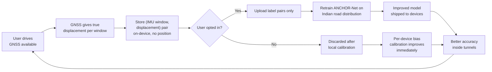
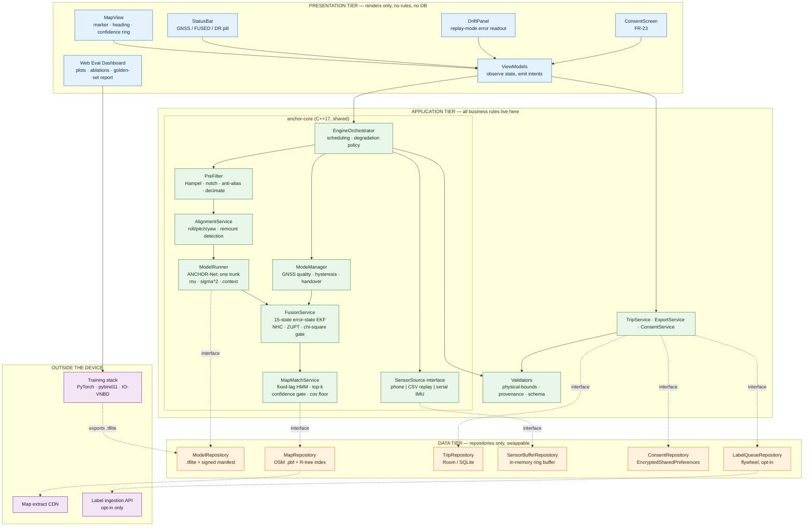
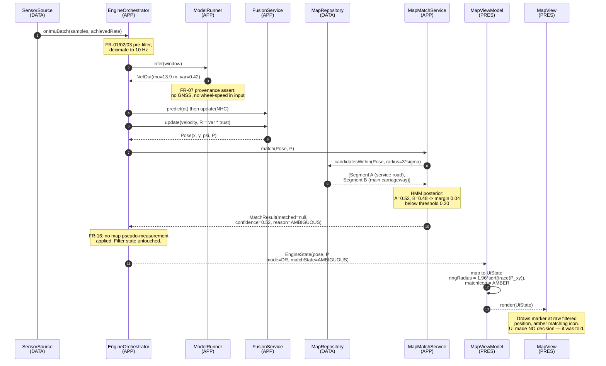
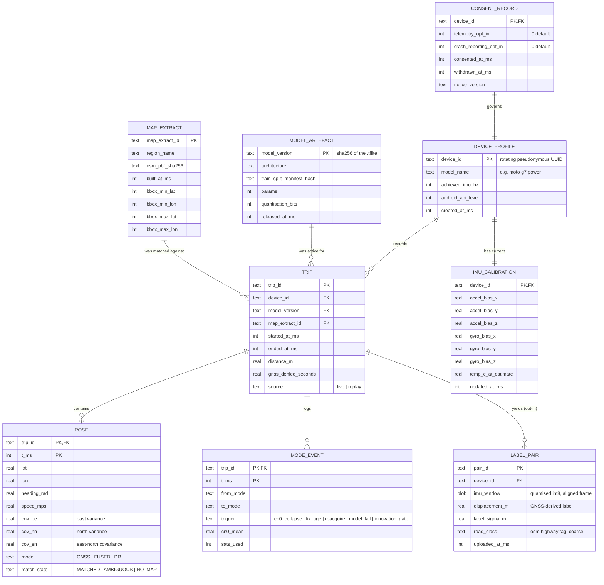
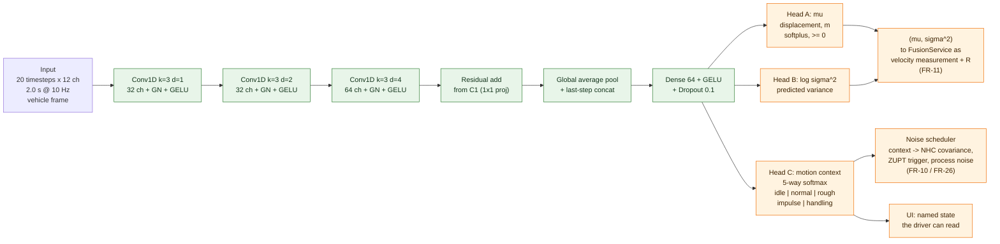

# PRD — Project **ANCHOR**
### AI-ML based Intelligent Dead Reckoning system for seamless navigation
**SIH 2026 · Problem Statement 26168 · ISRO / Department of Space · Category: Software · Theme: Smart Vehicles**

| | |
|---|---|
| Document owner | Harshit (Team Lead) |
| Version | 1.2 |
| Status | Pre-build specification — written before code, per §19 discipline |
| Changes in 1.1 | Filter changed from UKF to **error-state EKF**; `VelNet`/`CovNet` merged into **one shared-trunk, three-head model**; `GnssTrustNet` replaced by a **chi-square innovation gate**; **ZUPT**, the **map-matching lag decision** and the **map feedback-lock guard** promoted to functional requirements (FR-26/27/28); heading error added as a first-class error budget. Rationale in Appendix C. |
| Changes in 1.2 | **Execution hardening only, no scope or architecture change.** Named an owner and a parallel-track schedule for the C++ port (closes a single point of failure in P2); pre-decided the Week-5 pivot plan instead of leaving it implicit; added corridor-recording logistics (permission, backup date) as an owned task; moved the DPDP legal review from Week 4 to Week 2, ahead of FR-23 implementation; made CI gates hard blocks from Week 1. Full detail and rationale in Appendix D. |
| Primary readers | (a) Internal-round faculty panel, (b) the six engineers building this |
| Dataset of record | IO-VNBD (Onyekpe et al.) — `github.com/onyekpeu/IO-VNBD` |
| Target internal-round artefact | Recorded demonstration video + live Android app + web evaluation dashboard |

> **How to read this document.** Every section that contains dense engineering is followed by a block titled **In plain terms**. Those blocks are written so a faculty member can read them aloud to a colleague and be accurate. Nothing in an *In plain terms* block is a simplification of the claim — it is the same claim in ordinary language.

> **On numbers.** Every quantitative statement is either linked to a source or tagged `[VERIFY]`. A `[VERIFY]` tag means *we have not measured this yet and will not assert it in the pitch until we have*. There are no invented statistics in this document.

---

## 0. Assumptions this PRD is built on

These were fixed before writing. If one changes, the sections it touches are marked.

| # | Assumption | Consequence if wrong |
|---|---|---|
| A1 | Team of 6: 2 ML, 2 frontend, 1 backend, 1 generalist (pitch/design/security). | §20 phasing |
| A2 | More than 8 weeks to the internal round; exact date unconfirmed. PRD is phase-gated, not date-gated. | §20 |
| A3 | A live in-vehicle drive in front of judges is **not** possible. Primary evidence is a **recorded run** of a real GNSS-denied stretch; secondary evidence is the **live app handed to a judge** with location services disabled. | §19 entirely |
| A4 | Shipping target is **Android native (Kotlin)**, minimum API 29. Justified in §10. | §10, §14 |
| A5 | Own data collection is **opportunistic and not load-bearing**. All headline metrics come from IO-VNBD. | §14, §18 |
| A6 | Offline map database is OpenStreetMap `.osm.pbf` extracts: **UK (for metrics)** and **Delhi-NCR + Dehradun–Mussoorie hill corridor (for demonstration)**. Rationale in §14.6. | §12, §14 |
| A7 | The "edge-deployable software engine" is the **same core library** as the phone, not a second product. Rationale in §10. | §10, §11 |

---

# STEP 1 — Interrogating IO-VNBD before designing around it

This section exists because the rest of the document is only credible if it is buildable on what the dataset actually contains. We read the dataset paper, not just the repository abstract.

## 1.0.1 What is actually in the dataset

**Source:** Onyekpe, Palade, Kanarachos, Christopoulos, *IO-VNBD: Inertial and Odometry benchmark dataset for ground vehicle positioning*, arXiv:2005.01701 / Data in Brief. Field lists below are from Tables 3 and 4 of that paper.

**Vehicle stream (`V-*`) — recorded off the car's CAN bus and a Racelogic VBOX, at 10 Hz:**

GPS satellite count, time, latitude, longitude, velocity (km/h), heading (°), height (km), vertical velocity, sample period, **steering angle (°)**, **wheel speeds — front-left, front-right, rear-left, rear-right (rad/s)**, **yaw rate (°/s)**, **vehicle speed (km/h)**, **longitudinal and lateral acceleration (g)**, handbrake state, gear, engine speed (rpm), coolant temperature, clutch position, brake pressure (PSI), brake position, battery voltage, air temperature, accelerator pedal position (%).

**Smartphone stream (`S-*`) — Android phones, IMU at 10 Hz, GPS at 1 Hz:**

GPS latitude / longitude / altitude / speed / accuracy / orientation / satellites-in-range, time (ms), date, **accelerometer X/Y/Z (m/s²)**, **gravity X/Y/Z (m/s²)**, **gyroscope yaw/pitch/roll (rad/s)**, **magnetometer X/Y/Z (µT)**, device orientation yaw/roll/pitch (°).

**Ground truth:** GPS position from the vehicle-mounted VBOX receiver. There is **no RTK-corrected trajectory and no reference-grade INS attitude**. Ground truth is metre-class GPS, not centimetre-class.

**Volume and coverage:**

| Stream | Duration | Distance | Countries | Vehicles / phones |
|---|---|---|---|---|
| Vehicle (`V-*`) | ~40 h | ~1,300 km | England only | Ford Fiesta Titanium |
| Smartphone (`S-*`) | ~58 h | ~4,400 km | England, France, Nigeria | Volvo XC70, Renault Mégane, Toyota Corolla Verso; Huawei P20 Pro, Moto G7 Power, BlackBerry Priv |

Sequences are CSV, named by driver and location (`V-S1…V-S4`, `V-M`, `V-St*`, `V-Y*`, `V-Vta*`, `V-Vtb*`, `V-Vw*`, `V-Vf*`; `S-S*`, `S-M`, `S-Y*`, `S-T1…S-T11` France, `S-I` Nigeria, `S-A1…S-A13` England). The repository separates a **"Synchronised V and S datasets"** folder from an **"Unsynchronised V and S Dataset"** folder. Periods of GPS loss are documented in a separate text file.

## 1.0.2 The single most important thing in this dataset

**The synchronised folder contains drives where the vehicle CAN bus and the smartphone were recording at the same time.** That means, for those drives and only those drives, we have:

- **Input:** smartphone accelerometer + gyroscope + magnetometer + gravity, 10 Hz — *exactly what a phone on a dashboard can see*.
- **Label:** four wheel-speed sensors and CAN vehicle speed, 10 Hz — *exactly what the problem statement forbids us from using at inference time*.

This is the entire technical premise of the project. **We use the vehicle's speedometer to teach the model, and then throw it away.** The trained model consumes only phone sensors. Nothing about the deployed system needs an OBD-II port, which is precisely what PS 26168 asks for.

`[VERIFY]` — the exact number of hours and kilometres inside the *synchronised* subfolder is not stated in the paper. **This is the first thing the team measures, in Week 1, before anything else is built,** because our entire supervised training set is bounded by it. If the synchronised subset turns out to be small, §14.3 describes the pre-training fallback.

## 1.0.3 What the dataset does **not** contain that PS 26168 implies we need

Stating these plainly is not a weakness in the proposal. It is the difference between a team that read the dataset and a team that read the abstract.

| PS 26168 asks for | IO-VNBD provides | How we handle it |
|---|---|---|
| Handling of "severe chassis vibrations, engine harmonics, pothole shocks" | IMU at **10 Hz**. Nyquist limit is 5 Hz. Engine harmonics (typically tens of Hz) and pothole impulses are **not observable** in this data — they are aliased away before we see them. | The learned model is trained and evaluated at 10 Hz, which is honest. The high-frequency vibration-rejection block is a **classical signal-processing stage** (Hampel despiking + adaptive notch) that runs on the phone's native ~100–200 Hz stream *before* decimation, and is tuned on our own high-rate captures, not on IO-VNBD. We will not claim IO-VNBD validates it. |
| Tunnels, multi-level parking, urban canyons | No labelled tunnel or car-park sequences. GPS-loss intervals exist but are documented as receiver dropouts, not as a controlled scenario set. | GNSS outages are **synthetically induced** by masking GNSS updates over held-out segments of known ground truth — the standard protocol, and the one WhONet used (30 s / 60 s / 120 s / 180 s). This is a *stronger* evaluation than natural dropouts because ground truth continues through the outage. |
| Two-wheelers (the PS explicitly names "millions of two-wheelers") | Four-wheeled passenger cars only. | Named as an open gap in §18. Motorcycle roll dynamics violate assumptions our NHC block makes. We will *not* claim two-wheeler support on IO-VNBD evidence. Optional own-collection run (A5) is the only path, and it is scoped as Phase 2. |
| Indian roads | England, France, Nigeria. | Named as domain-shift risk R-04 in §18. Mitigated by feature design (see §14.1) and a documented recalibration procedure, not by pretending it is absent. |
| Phone remount / misalignment events | Not labelled. | We synthesise them: apply random SO(3) rotations and mid-sequence rotation changes as a training augmentation, and evaluate on synthetic remounts. Labelled as synthetic wherever reported. |
| FOG-grade external IMU at ~200 Hz | Nothing above 10 Hz. | The engine is written rate-agnostic (§10). We can *architecturally* support 200 Hz and *demonstrate* it on synthetic/replayed data, but we will state that we have **no FOG-grade validation data** and mark those numbers `[VERIFY]`. |

## 1.0.4 The split — and the leakage trap

**A naive random split of this dataset is guaranteed to leak, in four separate ways.** Naming all four is the point.

1. **Window overlap.** With a 2-second sliding window at 10 Hz and a 1-sample stride, adjacent windows share 19 of 20 samples. Random assignment puts near-identical windows in train and test. Reported error collapses toward zero and means nothing.
2. **Intra-drive correlation.** Two windows 30 seconds apart in the same drive share road surface, weather, tyre pressure, fuel load, driver mood and phone mounting angle. They are not independent samples.
3. **Driver, vehicle and phone identity.** IO-VNBD labels drivers A–H, three car models and three phone models. A model that memorises "this is the Moto G7 in the Corolla Verso, driven by Driver F" will score well and generalise to nothing.
4. **Route repetition.** Several sequence families (`V-Vta*`, `V-Vtb*`, `V-Vw*`) are repeated runs. Same road, different day. Random splitting puts the same geometry on both sides.

**Our split protocol — held out at the whole-sequence level, never at the window level:**

| Split | Content | Purpose |
|---|---|---|
| **Train** | Synchronised England sequences from drivers A–D. | Fit `ANCHOR-Net` — trunk, velocity, variance and context heads. |
| **Validation** | Two whole held-out England sequences from a **driver not in train**. | Early stopping, hyperparameters. Touched often. |
| **Test (in-distribution)** | Whole held-out England sequences, **unseen driver + unseen route**. | Headline numbers. Touched at most twice. |
| **Test (out-of-distribution)** | France (`S-T*`) and Nigeria (`S-I`) sequences — different country, different road furniture, different vehicle. | Generalisation evidence. Reported separately and honestly. |
| **Golden set** (§14.7) | 40 frozen outage segments drawn from the test splits, checksummed and committed to the repo. | Regression gate in CI. Never used for tuning. |

Three additional hygiene rules, enforced in code and tested:

- **No window may cross a sequence boundary.** Enforced in `SequenceWindower`, tested by `test_no_cross_sequence_windows`.
- **Normalisation statistics (mean, std per channel) are computed on the training split only** and serialised with the model. Test data never contributes to them. Tested by `test_normaliser_fitted_on_train_only`.
- **A guard band of 10 seconds is dropped at every train/val/test sequence boundary** to eliminate residual temporal correlation.

## 1.0.5 The baseline, and what a fair comparison requires

We compare against four references. Three are things we should beat. One is a thing we deliberately cannot beat, and saying so is a credibility move.

| # | Baseline | What it gets | Why it is in the table |
|---|---|---|---|
| B1 | **Constant-velocity extrapolation** | Last known GNSS velocity, held constant. | This is effectively what a consumer navigation app does when the fix dies. It is the *true incumbent* and the honest zero-line. |
| B2 | **Strapdown INS mechanisation, no learning** | Phone accel + gyro, double integration, no constraints. | The physics-only path. Published work on this dataset family reports pure IMU integration reaching ~171% translational error on KITTI ([AI-IMU Dead-Reckoning, Table 1](https://arxiv.org/pdf/1904.06064)); the same catastrophe is expected here. It shows what the AI is actually buying. |
| B3 | **ESKF + NHC + ZUPT, no learned velocity** | Phone IMU + non-holonomic constraints + ZUPT, no learned velocity. | The ablation that isolates our contribution. If B3 ≈ our system, the ML adds nothing and we should say so. |
| B4 | **WhONet (wheel-encoder RNN)** — *upper bound we cannot reach* | Four wheel-speed sensors at 10 Hz. | Reports 0.23 m mean cross-track error at 30 s outage and 0.49 m at 180 s on IO-VNBD ([WhONet, arXiv:2104.02581](https://arxiv.org/pdf/2104.02581)). **It uses data our phone does not have.** We report the gap to it as the price of being OBD-free. |

**What a fair comparison requires:** identical outage segments, identical ground truth, identical metric definitions (§14.6), and every baseline evaluated by the *same* harness — `bench/run_baselines.py`, one command, results written to a versioned JSON. No baseline is re-implemented from memory; B4's published numbers are cited, not re-run, and are marked as cited.

> ### In plain terms
> The dataset was recorded in a car that had sensors on its wheels *and* a phone on the dashboard, both recording at the same moment. That lets us train a model to guess the car's speed from the phone alone, checking its guesses against the real wheel sensors, and then delete the wheel sensors. The dataset also has real limitations — it has no Indian roads, no motorcycles, no tunnels, and its phone sensors are slower than a modern phone's. We list these openly rather than designing around capabilities we cannot demonstrate. Finally, if you split sensor recordings randomly into practice and exam sets, the model effectively sees the exam paper in advance; we split by whole journeys and by driver so that never happens.

---

# STEP 2 — THE PRD

## 1. Problem decomposition

### 1.1 The five sub-problems

PS 26168 reads as one problem. It is five, and they are not equally hard.

| # | Sub-problem | Difficulty | Who usually solves this |
|---|---|---|---|
| **P1** | **Attitude / alignment.** Determine the phone's orientation relative to the vehicle's forward axis, continuously, and detect when it changes (the phone is nudged, re-seated, picked up). | Moderate. Solvable with gravity + heading correlation. | Most teams do this adequately. |
| **P2** | **Forward speed estimation without a speedometer.** Recover metres-per-second from a noisy consumer IMU. | **Hard. This is the bottleneck.** | Almost nobody solves this. Most teams integrate acceleration and call it a solution. |
| **P3** | **Constrained propagation.** Fuse the speed estimate, gyro heading and kinematic constraints into a position estimate whose error grows slowly. | Moderate-hard. Well-trodden filter engineering. | Solvable by any team that reads the literature. |
| **P4** | **Map binding.** Snap the drifting trajectory onto the actual road network using offline OSM, without snapping to the *wrong* road. | Moderate. The failure mode is the hard part. | Teams implement the snapping; almost none implement the refusal-to-snap. |
| **P5** | **Mode handover.** Transition between GNSS-aided INS and pure DR without a visible jump, and detect *degraded* GNSS (which is worse than absent GNSS). | Easy if architected right, impossible if bolted on late. | Teams treat it as a UI problem. |

### 1.2 The actual bottleneck is P2, and here is the arithmetic

Position from a smartphone IMU comes from double-integrating acceleration. An uncorrected accelerometer bias `b` produces a position error that grows as `½·b·t²`.

A typical consumer MEMS accelerometer bias instability is on the order of `[VERIFY: measure on our own target devices; published MEMS figures vary by 1–2 orders of magnitude]`. Taking a deliberately optimistic **1 mg = 0.0098 m/s²**:

- after 10 s: ½ × 0.0098 × 100 ≈ **0.49 m**
- after 30 s: ½ × 0.0098 × 900 ≈ **4.4 m**
- after 60 s: ½ × 0.0098 × 3600 ≈ **17.6 m**
- after 180 s: ½ × 0.0098 × 32400 ≈ **159 m**

That is from *one* error source, with a generous bias assumption, ignoring gyro drift, ignoring scale factor, ignoring vibration coupling. The PS benchmark is **under 100 m of drift over 1 km at 60 km/h**, which is a 60-second outage. Pure integration does not get there, and no amount of filter tuning fixes a quantity that grows quadratically.

**And speed is only half the budget. Heading is the other half, and it is the one teams forget.** Cross-track error from an uncorrected gyro yaw bias `b` grows as `v·b·t²/2`. At 60 km/h (v = 16.7 m/s) with a residual yaw bias of 0.1°/s (= 0.001745 rad/s) over a 60 s outage:

`16.7 × 0.001745 × 60² / 2 ≈ 52 m`

**That is half the entire 100 m error budget, from heading alone, before speed error contributes anything.** `[VERIFY: measure the residual yaw bias on our target devices after the filter's bias states have converged — 0.1°/s is a plausible uncalibrated figure, and the post-estimation residual should be far lower.]` Two consequences follow, and they shape §14: the filter must carry gyro bias as estimated states and re-observe them at every opportunity (which is what makes ZUPT, FR-26, load-bearing rather than a nicety), and **the magnetometer is not a rescue** — inside a steel vehicle body, next to an alternator and a phone charger, its heading output is largely unusable. The road bearing from the offline map is a far better heading constraint than the compass.

**The only way out is to stop integrating acceleration for speed.** Speed must come from a *learned regression* on the IMU signal's texture — the vibration signature, the suspension response, the frequency content that correlates with how fast a vehicle is actually moving — rather than from the integral of its mean. A regression's error does **not** compound; it stays bounded per-window. That converts a quadratic error into a roughly linear one. **That single substitution is the project.**

Everything else — P1, P3, P4, P5 — is competent engineering. P2 is the research contribution, and it is the sub-problem that IO-VNBD's synchronised subset uniquely enables.

> ### In plain terms
> When a phone tries to work out how far a car has travelled by adding up its acceleration readings, tiny sensor errors get added up too, and the mistake grows with the *square* of time — so it doubles, then quadruples, then goes wildly wrong within a minute. Our answer is to stop adding up accelerations for speed altogether. Instead we train a model to *recognise* how fast a vehicle is going from the pattern and texture of the vibrations the phone feels, the same way you can tell roughly how fast a bus is moving with your eyes shut. Because it recognises rather than accumulates, its mistakes do not pile up.

### 1.3 Stakeholder map

| Role | Who | What they feel |
|---|---|---|
| **Feels the pain** | The driver: delivery rider, ambulance driver, cab driver, family on a Char Dham route, truck driver in a hill tunnel. | Missed exit, wrong turn at a tunnel mouth, phone icon spinning in a basement car park, a "recalculating" loop at 60 km/h. |
| **Pays for it** | Logistics and quick-commerce operators (re-delivery cost, SLA penalties), fleet insurers, and ultimately the end customer. | Cost per failed delivery, driver idle minutes, disputed trip distances. |
| **Administers it** | Fleet operations managers; municipal and highway authorities operating tunnels and underpasses; ISRO / DoS as custodians of the national positioning stack. | No lever to fix it — the failure is in the handset, not the road. |
| **Blamed today** | The driver ("you should know the route") and the navigation app ("Google Maps sent me wrong"). | Neither is the actual cause; the cause is the physics of GNSS signal blockage. |
| **Would adopt first** | Fleet operators with a captive Android driver-app — they can ship an SDK update to thousands of phones overnight. | This is the go-to-market in §17. |

### 1.4 Quantified pain

We give sourced numbers where they exist and mark the rest. **We will not say an unsourced number out loud in the pitch.**

| Claim | Value | Source / status |
|---|---|---|
| India's longest road tunnel, a fully GNSS-denied stretch on a national highway | **9.28 km**, Dr. Syama Prasad Mookerjee Tunnel (Chenani–Nashri), NH-44, J&K, opened 2017 | [Wikipedia](https://en.wikipedia.org/wiki/Dr._Syama_Prasad_Mookerjee_Tunnel) |
| Time inside that tunnel at 60 km/h — i.e. duration of continuous GNSS blackout | **~9.3 minutes** (9.28 km ÷ 60 km/h × 60) | Arithmetic from the above |
| Drift of an uncorrected phone INS over that duration | Catastrophic; see §1.2 arithmetic — hundreds of metres to kilometres | Derived, §1.2 |
| Two-wheeler sales in India, FY26 | **crossed 20 million units in a single financial year** for the first time | [Business Standard, VAHAN data, Mar 2026](https://www.business-standard.com/industry/auto/a-first-two-wheeler-sales-cross-20-million-in-fy26-shows-vahan-data-126032200739_1.html) |
| Total registered motor vehicles in India | `[VERIFY]` — cite VAHAN dashboard directly on the slide, not a secondary source | — |
| NavIC constellation status, July 2026 | **Down to three functional satellites**; the last atomic clock on IRNSS-1F failed in March 2026; four satellites are the minimum for independent positioning. NVS-03/04/05 in the recovery pipeline. | [NextIAS, 31 Jul 2026](https://www.nextias.com/ca/current-affairs/31-07-2026/navic-navigation-system) |
| Minutes lost per delivery due to navigation failure in dense/covered areas | `[VERIFY]` — obtain from a partner fleet or measure ourselves; do not estimate | — |
| Cost per failed/re-attempted delivery in Indian quick-commerce | `[VERIFY]` | — |

The NavIC line is worth pausing on, because the sponsoring organisation is ISRO. **The national regional constellation is currently below the minimum satellite count for independent positioning.** That is not an argument against NavIC — the recovery launches are in progress — but it is the strongest possible argument for the thing this PS asks for: *a positioning capability that does not depend on receiving a signal at all.* An inertial engine that survives nine minutes of blackout also survives a degraded constellation, a jammer, and a solar event. We will make this point once, respectfully, and move on.

### 1.5 The as-is workflow, step by step

A delivery rider approaching a covered stretch — the actual sequence, with time cost.

| Step | What happens | Time cost |
|---|---|---|
| 1 | Rider follows turn-by-turn guidance on a phone in a handlebar mount. | — |
| 2 | Vehicle enters underpass / basement ramp / tunnel portal. GNSS carrier-to-noise ratio collapses within roughly a second. | 0 s |
| 3 | Navigation app holds the last fix. The blue marker **freezes** on the map. | 1–5 s |
| 4 | App's internal filter extrapolates or the fix jumps to a spurious multipath position. Marker **teleports** to a parallel road or the level above. | 5–20 s |
| 5 | Voice guidance goes silent or announces a turn that has already been passed. | ongoing |
| 6 | Rider must choose: guess, or stop. **Stopping in a tunnel is not an option**, so the rider guesses. | 0 s decision, high risk |
| 7 | Exit portal reached. GNSS reacquires. Cold-ish reacquisition and map re-match. | 5–30 s `[VERIFY: measure on target devices]` |
| 8 | App recalculates. If the correct exit was missed, reroute adds distance. | **2–15 min** `[VERIFY]` |
| 9 | Repeat at every covered stretch on the route. | multiplied |

The compounding step is 8. The *dangerous* step is 6.

> ### In plain terms
> Today, the moment a vehicle goes under cover, the map either freezes or jumps to a road the driver is not on. The driver has to guess, at speed, with no way to stop. If they guess wrong they lose several minutes and, on a highway or a hill road, they take a real safety risk. Our system is designed so that the marker never freezes and never jumps.

---

## 2. Existing solutions teardown

| Solution | What it does | Where it fails | Why users tolerate it anyway |
|---|---|---|---|
| **Status quo: the driver's memory and eyes** (the real incumbent) | Driver recalls the route, reads overhead signage, follows the vehicle in front. | Fails on unfamiliar routes, at multi-exit interchanges inside tunnels, in multi-level car parks with identical floors, and at night in hill terrain. Zero support for a new rider on their first week. | It is free, requires no software, and works ~90% of the time on familiar routes. Nobody has offered them anything better. |
| **Google Maps / Apple Maps / MapmyIndia (consumer navigation)** | GNSS + Wi-Fi/cell positioning + map matching + some vendor-specific sensor fusion. Excellent when a fix exists. | Marker freeze and teleport during blackout; no exposed confidence; no lane-level continuity through a 9 km tunnel; behaviour is a black box the fleet cannot tune or audit. Hill and forested routes are additionally weak — travel-time and routing accuracy on Char Dham-type roads is widely reported as unreliable `[VERIFY: cite a primary source, not a travel blog, before using this in the pitch]`. | They are free, superb 95% of the time, and there is no alternative. Users have simply normalised the failure. |
| **Factory-fitted automotive INS / dead-reckoning head units** (OEM, and chipsets such as u-blox with automotive DR) | True GNSS+INS fusion with a wheel-tick or CAN speed feed. Genuinely solves the problem. | Requires a hardware install and a physical connection to the vehicle. Absent from the overwhelming majority of Indian commercial trucks, older cars, and every two-wheeler. Cost and retrofit labour per vehicle are prohibitive at fleet scale `[VERIFY: unit economics]`. | Where fitted, it works, so nobody complains. The problem is the vehicles where it is *not* fitted — which is the population PS 26168 names. |
| **OBD-II dongle + telematics app** (fleet telematics vendors) | Reads vehicle speed off the OBD-II port, feeds a phone or a tracker. | Needs a port, a dongle, and a dongle that stays plugged in. No OBD-II on two-wheelers. Adds per-vehicle hardware cost and a theft/tamper surface. Explicitly ruled out by the PS. | Fleets that already bought them accept the cost because it also gives them fuel and diagnostics data. |
| **Published research: WhONet / R-WhONet** (Onyekpe et al.) | RNN over four wheel-speed sensors at 10 Hz; the reference result on this exact dataset. Reports 0.23 m mean cross-track error at 30 s outage, 0.49 m at 180 s, 8.62 m after 5.6 km. [arXiv:2104.02581](https://arxiv.org/pdf/2104.02581) | **Requires wheel encoders.** A phone on a dashboard has none. Excellent science, not deployable on the target population. | Not a consumer product; it is the academic state of the art we measure ourselves against. |
| **Published research: AI-IMU Dead-Reckoning** (Brossard et al.) | IMU-only IEKF with a small CNN that adapts measurement noise covariances, plus zero-lateral/zero-vertical velocity pseudo-measurements. Reports **1.10% mean translational error on KITTI IMU-only**, versus **171% for raw IMU integration** and 1.17% for stereo ORB-SLAM2. [arXiv:1904.06064](https://arxiv.org/pdf/1904.06064) | Uses a **100 Hz automotive-grade IMU rigidly mounted to the vehicle**, with no arbitrary phone-to-vehicle rotation and no dashboard vibration coupling. Does not estimate forward speed from learning — it constrains the *sideways* error. No runtime or on-device cost is reported. | It is a research result, not a product. It is also the single most useful piece of prior art for our filter design, and we build directly on its covariance-adaptation idea. |

### 2.1 The gap none of them cover

Line them up and a hole appears in the middle. The consumer apps have the phone but not the physics. The OEM systems have the physics but not the phone. The research has both the physics and the rigour but assumes a sensor — a wheel encoder or a rigidly-bolted automotive IMU — that the target vehicle does not have.

**Nobody has shipped a system that recovers vehicle forward speed from an arbitrarily-mounted consumer phone IMU alone, with a calibrated confidence estimate, running offline on-device.**

It remains open for three reasons, and all three have recently changed:

1. **The labelled data did not exist publicly.** Training a phone-IMU-to-speed regressor requires simultaneous phone IMU and ground-truth vehicle speed. IO-VNBD's synchronised subset is the first public source of exactly that pairing. It was published in 2020; almost nobody has used it this way, because the dataset's own authors used the wheel speeds as *inputs*, not as *labels*.
2. **On-device inference of a sequence model was impractical until recently.** A quantised temporal CNN now runs in single-digit milliseconds on mid-range Android hardware `[VERIFY: benchmark on our target devices]`.
3. **The incumbents have no incentive.** A global navigation app optimises for the median user in a well-surveyed city, where GNSS works. The 5% of route-kilometres that are covered are not where their engineering leverage is. They are, however, exactly where Indian logistics, hill tourism and emergency response lose the most time.

> ### In plain terms
> Cars that already solve this problem solve it by plugging a wire into the vehicle's own speedometer. Phones cannot do that. The best published research also assumes access to sensors a phone does not have. So the gap is specific and narrow: nobody has built a system that works out how fast a vehicle is going using nothing but an ordinary phone lying in a dashboard holder. The reason nobody has is that the data needed to teach such a system only became public in 2020, and even the people who published it used it for a different purpose.

---

## 3. Solution thesis

### 3.1 One sentence

> **ANCHOR teaches a phone to feel how fast a vehicle is moving, so that when the satellite signal disappears in a tunnel, the map keeps moving correctly instead of freezing.**

### 3.2 The insight

Competing teams will treat this as a **filter-tuning problem**: better Kalman filter, better noise model, better map snapping. That is what the phrase "sensor fusion" pulls people toward.

Our belief is that **filter tuning cannot fix this, because the error is quadratic in time and no filter beats quadratic growth without a new measurement.** A Kalman filter is an optimal way of combining information; it cannot manufacture information that is not present. Double-integrated acceleration contains almost no usable information about distance after twenty seconds.

So the insight is a substitution, not a refinement: **treat forward speed as a perception problem rather than an integration problem.** The vibration spectrum a phone feels — road roughness excitation, suspension resonance, tyre-cavity noise, engine order content — is *correlated with speed* in a way that is learnable and, critically, **non-accumulating**. Every window's estimate is independent, so errors average out instead of compounding.

The second, quieter half of the insight: **the model must also say how sure it is.** A speed estimate without a confidence is unusable inside a filter, because the filter needs to know how much to trust it. We therefore train the velocity head to output a distribution, not a number, and we feed its predicted variance directly into the filter's measurement noise. That is what makes it fuse properly rather than merely be averaged in.

### 3.3 The 30-second pitch

> When your car enters a tunnel, your phone loses the satellites and your map freezes — and if you miss the exit, you lose ten minutes and take a real risk on a highway. Cars that solve this plug a wire into the speedometer. Phones cannot. So we asked a different question: can a phone *feel* how fast the vehicle is going, from vibration alone?
>
> We trained a model on a public research dataset where a car recorded its real wheel-sensor speed and a dashboard phone recorded its sensors at the same moment. The model learns to predict the wheel-sensor speed from the phone signal alone. Then we throw the wheel sensors away. On the phone, that predicted speed is combined with the gyroscope, with the physical fact that a car cannot slide sideways, and with an offline road map, inside a filter that tracks its own uncertainty.
>
> The result is a marker that keeps moving, accurately, through a nine-kilometre tunnel — on an ordinary Android phone, with no wires, no dongle, and no internet. It runs on the phone you already own.

> ### In plain terms
> A phone cannot be plugged into a car's speedometer, so we taught it to estimate speed from vibration instead. We trained it using recordings where the true speed was known, then removed the true-speed sensor. Everything runs on the phone itself, with no internet connection required.

---

## 4. Moat

The dominant axis is **accuracy on a population currently excluded**, with a **data flywheel** as the durable second layer. We defend both with arithmetic.

### 4.1 Accuracy — the arithmetic

The PS benchmark, restated exactly: *positional drift under 10% of distance travelled; under 5 m over 50 m in under 1 minute; under 100 m over 1 km at 60 km/h.*

| System | Error over a 60 s / 1 km GNSS-denied stretch | Meets PS benchmark? |
|---|---|---|
| B1 — constant-velocity extrapolation (what a consumer app effectively does) | Unbounded. Error equals the entire deviation of the true path from a straight line. In a curved tunnel, hundreds of metres. | No |
| B2 — raw IMU double integration | Order-of-magnitude reference: 171% translational error reported for pure IMU integration on KITTI with a *better* IMU than a phone's ([AI-IMU, Table 1](https://arxiv.org/pdf/1904.06064)). At 1 km that is ~1,710 m. | No |
| B3 — ESKF + NHC + ZUPT, no learned speed | Constrains sideways drift only. Along-track error still grows quadratically from speed error. `[VERIFY — this is our own ablation, measured in Week 5]` | Expected: no |
| **ANCHOR (target)** | **< 100 m over 1 km, i.e. < 10% drift** `[VERIFY — this is a target, not a result, until the golden set says otherwise]` | Target: yes |
| B4 — WhONet, with wheel encoders (upper bound) | 8.62 m after 5.6 km travel, 0.49 m mean cross-track error at 180 s ([arXiv:2104.02581](https://arxiv.org/pdf/2104.02581)) | Yes — but needs hardware we do not have |

**Reach arithmetic — the population currently excluded.** Every vehicle without factory INS and without an OBD-II dongle is excluded from continuous positioning under cover. Two-wheeler sales alone crossed 20 million units in FY26 ([VAHAN](https://www.business-standard.com/industry/auto/a-first-two-wheeler-sales-cross-20-million-in-fy26-shows-vahan-data-126032200739_1.html)), and no two-wheeler has an OBD-II port. The addressable population is *every Android phone in a vehicle*. We deliberately do **not** state a total figure here; §16 does the beneficiary arithmetic properly, from a defensible small base.

### 4.2 Cost — the arithmetic

| Line | Value | Basis |
|---|---|---|
| Marginal inference cost per vehicle per month | **₹0** | All inference is on-device. There is no server in the positioning loop. This is a structural advantage, not a discount. |
| Marginal cost of the competing solution | Retrofit INS or OBD dongle: hardware + install labour per vehicle `[VERIFY: obtain a real quote]` | Per-vehicle hardware |
| Our backend cost | Map extract hosting + optional opt-in telemetry only | §17 |

**A competitor with a server-side positioning API pays per request, forever, and fails when the tunnel also has no cellular coverage.** Ours cannot fail that way, because there is nothing to call.

### 4.3 The data flywheel, concretely

This is the part that compounds, and it is worth stating as a loop rather than a claim:

1. A user drives with ANCHOR running. **GNSS is available for most of the drive.**
2. During those GNSS-available stretches, GNSS gives an accurate speed and displacement. That is a **free, automatically-generated training label** — the exact quantity the velocity head predicts.
3. The device stores `(IMU window → GNSS-derived displacement)` pairs locally, quantised and stripped of position.
4. With explicit opt-in (§9, §15), these label pairs — **not trajectories, not locations** — are uploaded.
5. Retraining on real Indian roads, real Indian vehicles, real Indian phone models closes the domain gap that IO-VNBD leaves open (§1.0.3).
6. The improved model ships back. Accuracy in tunnels improves *because* of driving done outside tunnels.

**The elegance is that the labels are generated exactly where the system is not needed, and spent exactly where it is.** No user ever has to label anything.



### 4.4 What stops a competent team cloning this in a week?

Answered honestly, component by component. **Two of the five are not defensible, and we say so.**

| Component | Clonable in a week? | Verdict |
|---|---|---|
| ESKF + NHC + ZUPT pseudo-measurements | **Yes.** Textbook. A good team does this in three days. | **No moat.** We do not claim one. |
| HMM map matching on OSM | **Yes.** Newson–Krumm is published and there are open implementations. | **No moat.** |
| The velocity head trained with a leakage-safe protocol on the synchronised subset | **No — 4 to 6 weeks.** Not because the architecture is hard, but because the *protocol* is. A team that random-splits will get an impressive-looking number that collapses on a held-out driver, and will not know why. Getting a genuinely generalising model requires the split discipline in §1.0.4, the augmentation regime in §14.3, and a calibrated variance head. | **Moat: the method, ~5 weeks.** Erodes once published. |
| Calibrated uncertainty feeding the filter (variance head → measurement noise) | **No — this is the part teams skip.** Most produce a point estimate and hand-tune `R`. Getting a *calibrated* variance (§14.6, expected calibration error on the golden set) is a distinct piece of work. | **Moat: ~3 weeks.** |
| Data flywheel on real Indian driving | **No — this is time, not skill.** It cannot be cloned at all without users. | **Durable moat.** The only one that grows. |

**Design consequence.** Since two of the five components have no moat, the design deliberately concentrates effort where the moat is: the ML pipeline discipline and the flywheel. We do **not** spend the team's scarce weeks re-deriving a Kalman filter — we implement the standard one carefully, test it against synthetic ground truth, and spend the saved time on the model's split protocol, its calibration and the on-device label-collection path. That is the reason for the phasing in §20.

> ### In plain terms
> Half of what we are building is standard engineering that any good team could reproduce in a week, and we say so openly rather than pretending otherwise. What is genuinely hard to copy is the training method — it is easy to produce a model that scores brilliantly in testing and fails on a road it has never seen, and avoiding that takes weeks of careful discipline. Harder still to copy is the fact that every ordinary drive with a working signal quietly produces free training material, so the system gets better at tunnels because of the driving people do outside tunnels.

---

## 5. USP and wow factor

### 5.1 Primary USP — "the marker that does not freeze"

**What it is:** a side-by-side, same-phone comparison. One half of the screen shows a conventional GNSS-only trace. The other shows ANCHOR. Both are fed the identical sensor recording of a real covered stretch. At the tunnel portal the conventional marker freezes, then teleports. The ANCHOR marker continues, follows the tunnel's curve, and arrives at the correct exit — with a live drift counter on screen showing metres of error against ground truth.

**What it enables that a conventional application cannot:** continuous, lane-plausible positioning during total signal loss, with an explicit, visible error bound. A conventional app cannot show a drift counter because it does not know its own error — it has no independent estimate to compare against.

**How it demonstrates in under 60 seconds:** press play on the replay; both markers move together; at 0:12 the portal is reached and the divergence is immediate and visually obvious; at 0:45 the exit arrives and the drift counter reads a number under the PS threshold. No explanation is needed while it runs. §19 scripts this exactly.

### 5.2 Supporting USP 1 — "hand the judge the phone"

**What it is:** a judge holds the phone, disables location services entirely in Android settings, and walks or is driven a known distance in the corridor outside the hall. The ANCHOR marker tracks them. The judge did the disabling themselves, on their own, in the OS settings — not in our app.

**What it enables:** it converts a claim into a demonstration the judge performed. This is the answer to the unspoken question every experienced faculty member has, which is *"is this a video, or does it work?"*

**Under 60 seconds:** yes — settings toggle (5 s), walk 30 m (25 s), read the on-screen distance and compare to the corridor's measured length (10 s).

> **Honesty note for the team:** a walking gait is *not* vehicle dynamics, and `ANCHOR-Net` is trained on vehicles. We will therefore ship a clearly-labelled **pedestrian step-model fallback** for this specific demonstration and say out loud that it is a different model. Passing off a walk as vehicle validation is exactly the kind of thing a sharp faculty member catches, and it would cost more than the demo gains. See R-09 in §18.

### 5.3 Supporting USP 2 — "it refuses to lie"

**What it is:** an on-screen confidence ring around the vehicle marker that grows as the filter's uncertainty grows, and a map-matching indicator that goes amber when the system declines to snap to a road because it is not sure which road.

**What it enables:** a conventional navigation app has exactly one failure mode visible to the user — silence. ANCHOR degrades *legibly*: it tells the driver "I am 12 m sure" instead of pretending to be exact. For an ambulance or a fleet controller, a known-bad estimate is operationally useful and an unknown-bad estimate is dangerous.

**Under 60 seconds:** the ring is visible throughout the primary demo; the amber refusal is triggered deliberately at a parallel-service-road section of the replay.

**Rule we hold ourselves to:** every one of these three exists on screen in the demo. None of them exists only in the architecture diagram.

> ### In plain terms
> The headline demonstration is a split screen: the same recorded drive, played twice, one with today's technology and one with ours. At the tunnel entrance the ordinary map stops dead and our marker keeps going, with a live counter showing exactly how many metres off we are. Then we hand a judge the phone, let them switch off location themselves, and show that it still tracks. Third, the system shows its own uncertainty on screen instead of pretending to be perfect.

---

## 6. Scope

### 6.1 MoSCoW

MVP is defined as **the smallest system that proves the thesis in §3.2 and survives §19's demo**. That is: a trained velocity head, a working filter, a map binding, and a replay harness that produces the split screen.

| ID | Item | Priority | In demo? | Note |
|---|---|---|---|---|
| S-01 | `ANCHOR-Net` velocity + variance heads, trained on synchronised IO-VNBD, leakage-safe split | **Must** | Yes | The thesis. Without it there is no project. |
| S-02 | Error-state EKF (15-state) with NHC pseudo-measurements and ZUPT | **Must** | Yes | Implicit; visible as smooth motion and as a marker that does not creep at traffic lights. |
| S-03 | Phone→vehicle alignment estimator (roll/pitch from gravity, yaw from motion) | **Must** | Yes | Shown as a 5-second "calibrating" state at demo start. |
| S-04 | GNSS quality monitor + mode handover with hysteresis | **Must** | Yes | Shown as the GNSS/DR status pill. |
| S-05 | Offline OSM map matching (HMM), with confidence-gated snapping | **Must** | Yes | Shown as the amber refusal indicator. |
| S-06 | Replay harness — feed a recorded CSV through the live engine as if it were sensors | **Must** | Yes | This *is* the demo mechanism. Build it first. |
| S-07 | Android app: map, marker, confidence ring, mode pill, drift counter | **Must** | Yes | — |
| S-08 | Evaluation harness + golden test set + baseline comparison table | **Must** | Yes (one slide) | The credibility artefact. |
| S-09 | Motion-context head on the shared trunk (idle / normal / rough / impulse / handling) → filter noise parameters | **Should** | Yes if ready | The AI-fusion element the PS names, and the one that is *explainable on screen*. Falls back to fixed `R`. |
| S-10 | ~~Learned GNSS-trust model~~ — **cut in v1.1**, replaced by the chi-square innovation gate (FR-27) | **Won't** | n/a | The gate is principled, needs no training data, and is explainable. Cutting it removes an ML deliverable from a two-person ML team. |
| S-11 | Web evaluation dashboard (trajectory plots, error curves, ablations) | **Should** | Yes | Also the artefact submitted for proposal screening. |
| S-12 | Desktop/edge CLI engine consuming CSV or serial IMU at arbitrary rate | **Should** | One slide | Satisfies the PS's "not restricted to smartphone" clause. |
| S-13 | On-device label collection for the flywheel (opt-in) | **Could** | No | Architecture shown; data not collected before internal round. |
| S-14 | Per-device IMU bias auto-calibration during stationary periods | **Could** | No | Cheap win, low demo value. |
| S-15 | Hindi UI and voice guidance | **Could** | No | §9 commits to the string architecture; translation is Phase 2. |
| S-16 | Two-wheeler support | **Won't** (this round) | No | See §6.2. |
| S-17 | Turn-by-turn route planning and voice navigation | **Won't** | No | See §6.2. |
| S-18 | iOS app | **Won't** | No | See §6.2. |
| S-19 | Cloud positioning API | **Won't** — ever | No | Contradicts the architecture (§4.2). |

### 6.2 What we are deliberately not building, and why

- **Two-wheeler support (S-16).** IO-VNBD contains no two-wheeler data (§1.0.3). A motorcycle leans into turns, which violates the "no vertical motion" half of the non-holonomic constraint our filter relies on. We could *claim* two-wheeler support; we would be claiming it on zero evidence. It is Phase 2, gated on our own data collection, and we will say that on the slide.
- **Turn-by-turn routing and voice navigation (S-17).** ANCHOR is a **positioning engine**, not a navigation app. Routing is a solved, well-served problem. Building a worse Google Maps would consume the whole team and prove nothing. The correct product shape is an SDK a fleet's existing app embeds.
- **iOS (S-18).** iOS restricts background sensor sampling rates and raw GNSS access in ways that materially change the design. Supporting it properly is a project; supporting it badly is worse than not supporting it.
- **A cloud positioning API (S-19).** Not descoped for time — descoped on principle. A tunnel that blocks GNSS usually blocks cellular too. Any design with a network call in the positioning loop fails in exactly the situation it exists for.
- **NavIC-specific signal processing.** Tempting given the sponsor, but the constellation is currently below the four-satellite minimum (§1.4) and Android's raw-measurement API does not expose it uniformly. We treat NavIC as one more constellation the GNSS quality monitor consumes when present, and we do not build a story on it.

> ### In plain terms
> We are building a positioning engine, not a rival to Google Maps. We are deliberately not building motorcycle support, because the dataset contains no motorcycles and we refuse to claim something we cannot show. We are also refusing to put any part of the calculation on a server, because the tunnels where this is needed usually have no mobile signal either.

---

## 7. Personas and journeys

### 7.1 Personas

**P1 — Ravi, 24, quick-commerce delivery rider, Ghaziabad.**
Device: Android, 4 GB RAM, mid-range chipset, 3 years old, battery health degraded. Bandwidth: prepaid data, throttled after daily cap; frequently offline in basements. Literacy: functionally literate in Hindi, limited English; reads icons faster than text. Time pressure: paid per delivery, penalised on SLA. Phone: handlebar mount, gets knocked out of alignment several times a shift. **Design consequences:** the app must survive a mid-drive remount (S-03 must run continuously, not once), must not assume connectivity, must not assume English, and must not drain battery.

**P2 — Sunita, 41, ambulance driver, Dehradun–Mussoorie hill road.**
Device: fleet-issued Android tablet, dash-mounted, permanently powered. Bandwidth: intermittent; hill terrain with long no-coverage stretches. Literacy: high, professional. Time pressure: extreme; a wrong turn on a switchback road costs minutes that matter clinically. **Design consequences:** she needs the *confidence ring* more than anyone — a known-bad position lets her fall back on judgement, an unknown-bad one gets someone killed. She needs the system to work with no data connection at all, for the entire journey.

**P3 — Arun, 35, fleet operations manager, third-party logistics.**
Device: desktop web dashboard. Bandwidth: office broadband. Literacy: high; not a programmer. Time pressure: moderate; manages ~200 vehicles. **Design consequences:** he is the buyer (§1.3). He needs evidence, not vibes — trip-level drift statistics, a way to audit a disputed delivery, and an integration path that does not require touching 200 vehicles physically.

### 7.2 As-is vs to-be — Ravi, one basement-parking delivery

| t | **As-is** | **To-be with ANCHOR** |
|---|---|---|
| 00:00 | Enters mall basement ramp. GNSS drops. | Enters ramp. GNSS quality monitor sees CN0 collapse; filter stops accepting GNSS updates. **No mode "switch" occurs — the filter never stopped running.** |
| 00:02 | Marker freezes at the ramp mouth. | Marker continues down the ramp. Confidence ring begins to widen. Status pill reads **DR**. |
| 00:15 | Marker teleports to the road above the mall. | Marker is on level B1, following the ramp geometry. Map-matching goes amber — no OSM geometry indoors — and the filter relies on NHC, ZUPT and the velocity head alone. |
| 00:40 | Rider is lost among identical parking levels; starts checking pillar numbers manually. | On-screen distance-travelled and level-change indicator; rider navigates by the trace. |
| 03:30 | Rider finds the lift lobby by memory or by asking. Delivery made late. | Rider reaches lobby directly. |
| 06:00 | Returns to bike. Marker still wrong. Waits ~20 s at the exit ramp for reacquisition. `[VERIFY]` | Exits ramp. GNSS returns. Filter **fuses rather than jumps** — the correction is applied over ~1 s, weighted by both uncertainties, so the marker slides rather than teleports. |
| **Delta** | **~3–6 minutes lost per covered delivery** `[VERIFY]` | **Near zero minutes lost.** The delta *is* the pitch. |

### 7.3 As-is vs to-be — Sunita, tunnel/hill emergency run

| t | **As-is** | **To-be** |
|---|---|---|
| 00:00 | Approaching a hill tunnel portal with a fork 400 m inside. | Same. |
| 00:05 | GNSS lost. Guidance goes silent. | DR engaged. Guidance continues from the offline map. |
| 00:20 | Reaches the internal fork with no guidance. Must guess. | Guidance announces the fork; position is map-matched to the correct bore. |
| 00:21 | **Wrong bore taken.** | Correct bore taken. |
| 05:00+ | Exits into the wrong valley. Reroute adds `[VERIFY]` minutes on a road with few turnarounds. | On route. |
| **Delta** | Minutes, on a clinical clock. | — |

> ### In plain terms
> For a delivery rider, the win is three to six minutes per basement delivery, and those minutes repeat every shift. For an ambulance driver on a hill road, the win is not convenience — it is taking the correct branch inside a tunnel where there is no signal and no chance to turn around.

---

## 8. Functional requirements

Each is atomic and testable. IDs are reused verbatim in §11.

| ID | Requirement | Acceptance criteria |
|---|---|---|
| **FR-01** | Sensor acquisition at the highest rate the device supports. | **Given** an Android device with accelerometer and gyroscope, **when** the engine starts, **then** it registers listeners at `SENSOR_DELAY_FASTEST`, records the *actual achieved* rate, and logs a warning if the achieved rate is below 50 Hz. |
| **FR-02** | High-rate pre-filtering of vibration and impulse noise. | **Given** a raw IMU stream containing injected impulse spikes, **when** pre-filtering runs, **then** spikes exceeding the Hampel criterion are replaced by the local median and the residual signal energy above 5 Hz is attenuated by at least `[VERIFY: target dB, set after measuring real vibration spectra]`. |
| **FR-03** | Decimation to the model's operating rate with anti-aliasing. | **Given** a pre-filtered stream at rate `f`, **when** decimating to 10 Hz, **then** a low-pass filter with cutoff below 5 Hz is applied first, and the decimated output is bit-identical to the reference Python implementation on the golden vectors. |
| **FR-04** | Estimate phone→vehicle orientation (roll, pitch) from the gravity vector. | **Given** ≥3 s of data with the vehicle stationary or in steady motion, **when** alignment runs, **then** roll and pitch are estimated to within `[VERIFY]`° of the synthetic ground truth on the augmentation test set. |
| **FR-05** | Estimate the yaw offset between phone forward-axis and vehicle forward-axis. | **Given** ≥1 longitudinal acceleration event above a threshold, **when** yaw estimation runs, **then** the estimated heading offset agrees with the GNSS course-over-ground to within `[VERIFY]`° while GNSS is available. |
| **FR-06** | Detect mid-drive remount and re-run alignment. | **Given** a sequence with a synthetic rotation discontinuity injected at t=T, **when** the change detector runs, **then** the discontinuity is flagged within 2 s of T and alignment is re-initialised; filter covariance is inflated accordingly. |
| **FR-07** | Predict forward displacement per window from phone IMU alone. | **Given** a 2 s window of aligned IMU data, **when** `ANCHOR-Net` infers, **then** its velocity head returns a mean displacement and a variance, and the *inference path reads no GNSS and no wheel-speed input* (asserted by an input-provenance test). |
| **FR-08** | The predicted variance must be calibrated. | **Given** the golden test set, **when** predictions are binned by predicted variance, **then** the empirical error distribution matches the predicted distribution with expected calibration error below `[VERIFY: target, e.g. 0.05]`. |
| **FR-09** | Propagate a 15-state error-state EKF (position, velocity, attitude, accelerometer bias, gyroscope bias) from IMU at the device's native rate. | **Given** a stream of aligned IMU samples, **when** the filter propagates, **then** the 15-state estimate and covariance update without numerical failure over a 10-minute sequence, and the covariance remains positive-definite (asserted every step via a Joseph-form or square-root update). |
| **FR-10** | Apply non-holonomic constraints as pseudo-measurements. | **Given** the vehicle is in motion, **when** the NHC update runs, **then** lateral and vertical velocity in the body frame are updated toward zero with covariance supplied by the context head (S-09) or a fixed default, and the update is **suppressed** when the vehicle is detected as stationary (FR-26) or reversing. |
| **FR-11** | Fuse the predicted displacement as a velocity measurement, weighted by its predicted variance. | **Given** a velocity-head output `(μ, σ²)`, **when** the update runs, **then** the measurement noise `R` used equals `σ²` scaled by the configured trust factor, and a unit test confirms that doubling `σ²` halves the state correction magnitude. |
| **FR-12** | Monitor GNSS quality and classify each fix as trusted / degraded / absent. | **Given** a GNSS fix with associated CN0 values, satellite count and reported accuracy, **when** the monitor runs, **then** it emits one of three states, and a fix classified *degraded* is either down-weighted or rejected per policy — never silently accepted. |
| **FR-13** | Continuous operation across GNSS loss with no discontinuity in output. | **Given** a replay in which GNSS updates stop at t=T, **when** the engine runs, **then** the output pose stream contains no gap, no NaN, and no position jump exceeding `[VERIFY]` m at t=T; the transition is logged with a timestamp. |
| **FR-14** | Smooth reacquisition without a visible teleport. | **Given** GNSS returns at t=T′ with a position differing from the estimate, **when** the update is applied, **then** the correction is distributed over a configurable window (default 1 s) and the rendered marker's inter-frame displacement never exceeds a plausible vehicle speed. |
| **FR-15** | Offline map matching against a local OSM extract. | **Given** an `.osm.pbf` extract loaded from device storage and a filtered trajectory, **when** the HMM matcher runs, **then** it returns a matched road segment sequence and a per-fix matching confidence, **with no network access** (asserted by a no-network test). |
| **FR-16** | Refuse to snap when map-matching confidence is low. | **Given** a trajectory in an area with parallel candidate roads, **when** matching confidence falls below the threshold, **then** no map pseudo-measurement is applied, the UI indicator goes amber, and the raw filtered position is rendered. |
| **FR-17** | Render a live map with vehicle marker, heading, confidence ring and mode pill. | **Given** the engine is emitting poses at ≥10 Hz, **when** the map view is visible, **then** the marker updates at ≥10 Hz, the ring radius equals the 95% horizontal position uncertainty, and the pill reads GNSS / FUSED / DR. |
| **FR-18** | Replay a recorded CSV through the identical engine code path as live sensors. | **Given** an IO-VNBD CSV, **when** replay mode runs, **then** the engine consumes it through the same `SensorSource` interface as the live device, and produces a pose stream comparable to the reference implementation within tolerance. |
| **FR-19** | Display live drift against ground truth in replay mode. | **Given** a replay with a ground-truth column, **when** replay runs, **then** the UI shows instantaneous and cumulative horizontal error in metres, and drift as a percentage of distance travelled. |
| **FR-20** | Export a trip trace for audit. | **Given** a completed trip, **when** the user exports, **then** a GeoJSON/CSV containing timestamped poses, covariances, mode states and model version is written to device storage. |
| **FR-21** | Consume an external (non-phone) IMU stream at arbitrary rate. | **Given** a CSV or serial source at 200 Hz, **when** the edge CLI runs, **then** the same core library produces a pose stream, with the model's decimation stage adapting to the input rate. |
| **FR-22** | Operate with zero network access for the entire trip. | **Given** the device is in airplane mode with location disabled, **when** the engine runs in replay mode, **then** all functionality except live GNSS operates, and a network-access assertion in the test suite fails the build if any positioning-path code opens a socket. |
| **FR-23** | Obtain explicit, granular, withdrawable consent before any data leaves the device. | **Given** a first launch, **when** the user is shown the consent screen, **then** telemetry defaults to **off**, the purpose of each data category is stated in plain language, and withdrawal is available at any time from settings without degrading positioning. |
| **FR-24** | Fall back safely when the model is unavailable or its output is implausible. | **Given** the model file is missing, corrupt, or returns a value outside physical bounds, **when** inference is attempted, **then** the engine logs the failure, degrades to the NHC-only filter (B3 behaviour), sets the mode pill to a degraded state, and does not crash. |
| **FR-25** | Version and pin every model artefact. | **Given** a running engine, **when** a pose is emitted or a trace exported, **then** it carries the model version hash, and loading a model whose hash is not in the signed manifest is refused. |
| **FR-26** | Apply a zero-velocity update (ZUPT) when the vehicle is detected stationary. | **Given** a window in which IMU energy is below the stationarity threshold and the velocity head reports near-zero displacement, **when** ZUPT runs, **then** velocity is updated toward zero, **the accelerometer and gyroscope bias states are re-observed**, NHC is suppressed (FR-10), and a test confirms the marker does not creep by more than `[VERIFY]` m over a 120 s simulated idle. |
| **FR-27** | Gate every GNSS update with a chi-square test on the normalised innovation. | **Given** a GNSS fix and the filter's predicted measurement and innovation covariance `S`, **when** the update is attempted, **then** the normalised innovation squared `νᵀS⁻¹ν` is compared against the chi-square threshold for the measurement dimension at the configured confidence, and a fix exceeding it is rejected and logged as a `MODE_EVENT` with trigger `innovation_gate`. A unit test injects a synthetic position jump and asserts rejection. |
| **FR-28** | Bound map-matching latency and prevent feedback lock-in. | **Given** a fixed-lag HMM matcher with lag `L`, **when** a map pseudo-measurement is applied, **then** (a) the reported pose lag never exceeds `L` (default 5 s) and the UI indicates when the matched pose is lagged, (b) the matcher retains at least the top-`k` road hypotheses rather than committing to one, and (c) **the map update can never reduce the position covariance below a configured floor**, so a wrong snap cannot make the filter confident. Tested by `test_map_cannot_drive_covariance_below_floor`. |

> ### In plain terms
> These twenty-five requirements are written so that each one can be checked as passed or failed by a test, rather than argued about. Several of them are requirements that the system *refuse* to do something — refuse to snap to a road it is unsure of, refuse to accept a poor satellite fix, refuse to run a model file it cannot verify. Those are as important as the requirements to do things.

---

## 9. Non-functional requirements

### 9.1 Latency budget

The hard constraint is the PS's **10 Hz position update rate on a smartphone**, i.e. a 100 ms budget per pose. Our internal target is stricter, because the budget must also absorb rendering and OS jitter.

| Stage | p50 target | p95 target | Notes |
|---|---|---|---|
| Sensor callback → pre-filter output | 0.5 ms | 2 ms | Runs on a dedicated sensor thread. |
| Decimation + feature assembly | 0.5 ms | 2 ms | Ring buffer, no allocation in the hot path. |
| `ANCHOR-Net` inference — one shared trunk, three heads (quantised, 1 window) | **≤ 8 ms** | **≤ 15 ms** | `[VERIFY: benchmark on a 4 GB mid-range device — Ravi's phone, not a flagship]` One forward pass produces displacement, variance **and** motion context; there is no second model to schedule. |
| ESKF propagate + all updates (NHC, ZUPT, velocity, gated GNSS) | 0.5 ms | 2 ms | 15-state error-state EKF. Roughly an order of magnitude cheaper than the UKF this replaced — no sigma-point propagation. |
| Map matching (HMM incremental step) | 3 ms | 10 ms | Runs at 2 Hz, not 10 Hz; amortised. |
| **Engine total, per 100 ms tick** | **≤ 13 ms** | **≤ 31 ms** | Leaves ≥69 ms headroom. The EKF and single-model changes in v1.1 bought back ~4 ms of p95. |
| Pose → rendered frame | 8 ms | 16 ms | One display frame at 60 Hz. |
| **User-visible: motion → marker moves** | **≤ 25 ms** | **≤ 55 ms** | — |
| **Edge engine, FOG IMU at 200 Hz** | propagation ≤ 1 ms/sample | ≤ 2 ms | Model still runs at its trained rate; propagation runs at 200 Hz. `[VERIFY]` |

**Degradation policy when the budget is exceeded:** the filter propagation is never skipped (it is the cheapest and most critical stage). `ANCHOR-Net` inference is skipped first — a missed window is handled as an increased-covariance gap, not an error. Map matching is skipped second. Rendering is throttled last. This ordering is asserted in `EngineScheduler` and tested under simulated CPU starvation.

### 9.2 Concurrency and load

**The positioning path has no server, so there is no positioning concurrency target.** This is the honest answer and it is a strength.

The only server-side components are (a) map extract distribution and (b) opt-in flywheel label ingestion.

| Component | Target | Load assumption behind it |
|---|---|---|
| Map extract CDN | 10,000 downloads/day, ~200 MB each `[VERIFY: actual extract sizes]` | One download per device per region per quarter. At a 100,000-device fleet with 4 regions and quarterly refresh, that is ~4,400 downloads/day; 10,000 gives 2× headroom. |
| Label ingestion API | 50 req/s sustained | 100,000 devices × 1 upload/day × ~2 MB, batched, uploaded on Wi-Fi only, spread over a 24 h window ≈ 1.2 req/s average; 50 req/s absorbs a 40× diurnal peak. |
| Evaluation dashboard | 20 concurrent users | Internal + judges. Not a scale problem. |

### 9.3 Offline and degraded-network behaviour

| Condition | Behaviour |
|---|---|
| No network, GNSS available | Full functionality. Map extract is already local. This is the normal operating mode. |
| No network, no GNSS | Full DR functionality. This is the mode the product exists for. |
| Network available but slow | No effect on positioning. Telemetry uploads are deferred to Wi-Fi. |
| Map extract missing for the current region | Positioning continues without map binding; UI states "no offline map for this area"; matching indicator permanently amber. Positioning is *degraded*, never *stopped*. |
| Model file missing or corrupt | FR-24: degrade to NHC-only filter, announce degraded mode. |
| Device in airplane mode | Everything except live GNSS works. Enforced by the FR-22 test. |

### 9.4 Language and accessibility

- **Strings:** all user-facing text in Android string resources from commit one. No hardcoded strings — enforced by a lint rule in CI. English at internal round; Hindi committed for Phase 2 (S-15). Adding a language must require zero code changes.
- **Icon-first UI:** Ravi (P1) reads icons faster than text. Mode, confidence and matching state are each communicated by shape *and* colour, never colour alone.
- **Colour-blind safe:** the GNSS/FUSED/DR palette is checked against deuteranopia and protanopia simulation; state is redundantly encoded by icon.
- **Contrast:** minimum 4.5:1 for text, verified against WCAG 2.1 AA. Dashboard glare is the realistic condition, so a high-contrast daylight theme is the default, not an option.
- **Touch targets:** ≥48 dp. The user is in a moving vehicle with one hand.
- **Screen reader:** content descriptions on every interactive element; the mode pill announces changes via an accessibility live region.
- **No audio-only critical information:** helmet and traffic noise make audio unreliable for P1.

### 9.5 Data privacy and DPDP Act 2023 alignment

India's **Digital Personal Data Protection Act, 2023** is operationalised by the **Digital Personal Data Protection Rules, 2025, notified by MeitY on 14 November 2025**, with phased implementation ([DPDP Rules 2025](https://en.wikipedia.org/wiki/Digital_Personal_Data_Protection_Rules,_2025)). Location data tied to an identifiable person is personal data. Our obligations, and how the architecture discharges them:

| Obligation | How ANCHOR satisfies it |
|---|---|
| **Data minimisation / purpose limitation** | The positioning loop transmits nothing. The flywheel (S-13) uploads `(IMU feature window → scalar displacement)` pairs — **no latitude, no longitude, no timestamp-of-day, no device identifier beyond a rotating pseudonymous key**. Absolute position is never uploaded, so the most sensitive category never leaves the device. This is a design decision, not a policy promise. |
| **Notice** | FR-23. Plain-language, per-category, at first launch, in the user's language. States purpose, categories, retention period and withdrawal method. |
| **Consent — free, informed, specific, unambiguous** | Telemetry defaults to **off**. There is no bundled consent: declining telemetry has zero effect on positioning quality for that user. Consent is per-category. |
| **Withdrawal** | One toggle in settings; takes effect immediately; queued uploads are deleted locally on withdrawal. |
| **Retention and erasure** | Per-table retention in §12.4. Local sensor buffers are ring buffers overwritten within minutes. Uploaded label pairs have a stated retention period after which they are deleted or irreversibly aggregated into model weights. |
| **Breach notification** | Documented runbook with the Data Protection Board notification path; §15 audit logging provides the evidence trail. Specific statutory timelines `[VERIFY: read the notified Rules text directly before asserting a number]`. |
| **Children's data** | The app is not directed at children and collects no age data. If a fleet deploys it, the fleet is the Data Fiduciary for its drivers and we are the Data Processor; this split is stated in the integration documentation. |
| **Security safeguards** | §15. |

> ### In plain terms
> Because all the calculation happens on the phone, the system does not need to send anyone's location anywhere — which is both faster and the strongest possible privacy position. The optional improvement feature uploads only anonymous "vibration pattern to distance travelled" pairs with no location attached at all, it is switched off by default, and switching it on or off makes no difference to how well the app works for that person. The screen is designed for someone glancing at a phone in daylight while driving, with icons rather than text and colour choices that work for colour-blind users.

---

## 10. Three-tier architecture

### 10.1 The dependency rule, stated as a sentence

> **Source code dependencies point inward only: Presentation depends on Application, Application depends on Data through interfaces it owns, and no tier ever depends on a tier above it. The Presentation tier contains no business rule and never touches a repository; the Data tier contains no business rule and never calls a service.**

Enforced mechanically, not by convention: a Gradle module-dependency check and an ArchUnit-style test (`test_tier_dependencies`) fail the build if `presentation` imports anything from `data`, or if `core` imports anything from `presentation`.

### 10.2 Why one core library, three consumers (assumption A7)

PS 26168 requires the algorithms to work with external IMUs, not just phones. Two obvious approaches are wrong:

- **Rejected: build the phone app and a separate desktop engine.** Two implementations diverge within weeks. Any number measured on desktop stops being evidence for the phone.
- **Rejected: write everything in Python and ship Python to the phone.** Inference latency and packaging both fail.

**Chosen: one C++17 core (`anchor-core`) with three thin bindings** — JNI for Android, `pybind11` for the training/evaluation stack, and a plain CLI binary for the edge engine. The core is rate-agnostic and sensor-source-agnostic by construction: it consumes an abstract `SensorSource`, so a phone, a CSV replay, and a 200 Hz serial FOG IMU are three implementations of one interface. **FR-21 becomes almost free**, and the desktop numbers are evidence for the phone because it is the same compiled logic.

**De-risking this choice (it is the largest engineering risk in the plan):** Phase 0 builds a complete **Python reference implementation** first. It generates the proposal plots and defines correct behaviour. Phase 1 ports it to C++ and adds a **golden-vector conformance test**: identical input CSVs must produce identical outputs from both implementations within a fixed numerical tolerance. If the C++ port slips, the Python reference plus a Chaquopy-embedded fallback still yields a working (slower) app. See R-01 in §18.

### 10.3 Component diagram



### 10.4 One feature traced end to end through all three tiers

**Feature: FR-16 — the system declines to snap to a road because it is not sure which road, and the UI goes amber.**



**Read the tier boundaries in that diagram.** The decision *not to snap* is made in `MapMatchService`, in the Application tier. `MapRepository` only answered "here are the candidate road segments near this point" — it applied no rule. `MapView` only drew what it was handed — it computed nothing. Swap SQLite for a different store, or the Android map view for a desktop OpenGL view, and the decision logic is untouched.

### 10.5 Repository folder tree

```text
anchor/
├── README.md                    Architecture diagram above the fold + 3-command quickstart
├── PRD.md                       This document
├── TASKS.md                     Work breakdown, owner and status per FR
├── CLAUDE.md                    Points at PRD.md and TASKS.md; conventions for AI-assisted work
├── .env.example                 Every required variable, no values, no secrets ever committed
├── .github/workflows/ci.yml     Lint + unit + golden-set regression on every push
│
├── core/                        anchor-core — C++17, the ONLY place business rules live
│   ├── include/anchor/          Public headers; the API all three bindings compile against
│   ├── src/sensors/             SensorSource interface + phone/CSV/serial implementations
│   ├── src/prefilter/           Hampel despiking, notch, anti-alias, decimation (FR-02/03)
│   ├── src/alignment/           Gravity roll/pitch, motion yaw, remount detection (FR-04/05/06)
│   ├── src/model/               ModelRunner — LiteRT/ONNX invocation, provenance guards (FR-07)
│   ├── src/fusion/              Error-state EKF, NHC, ZUPT, chi-square gate (FR-09/10/11/26/27)
│   ├── src/mapmatch/            HMM matcher, confidence gate (FR-15/16)
│   ├── src/mode/                GNSS quality monitor, hysteresis, handover (FR-12/13/14)
│   ├── src/orchestrator/        Scheduling, degradation policy, budget enforcement
│   └── tests/                   Unit + golden-vector conformance vs the Python reference
│
├── reference/                   Python reference implementation — defines correct behaviour
│   ├── anchor_ref/              Mirror of core/, NumPy, readable over fast
│   └── tests/conformance/       Generates and checks the golden vectors core/ must reproduce
│
├── ml/                          Training and evaluation stack — never shipped to the device
│   ├── data/                    IO-VNBD loaders, schema validation, synchronised-pair joiner
│   ├── splits/                  The §1.0.4 protocol, as code. Split manifests are committed.
│   ├── models/                  ANCHOR-Net: shared trunk + velocity/variance/context heads
│   ├── train/                   Training loops, augmentation, calibration
│   ├── eval/                    Metrics (§14.6), outage simulator, ablation runner
│   ├── golden/                  Frozen 40-segment golden set + SHA-256 manifest
│   ├── bench/run_baselines.py   One command, all four baselines, versioned JSON out
│   └── export/                  PyTorch → LiteRT/ONNX, quantisation, manifest signing
│
├── android/                     Presentation tier + JNI binding. NO business rules.
│   ├── app/src/main/            Compose UI, ViewModels, DI wiring
│   ├── app/src/main/cpp/        JNI bridge to anchor-core — thin, no logic
│   └── app/src/test/            ViewModel state-mapping tests, tier-dependency test
│
├── edge/                        CLI engine — CSV/serial in, pose stream out (FR-21)
├── web/                         Evaluation dashboard (S-11): plots, ablations, golden report
├── server/                      Map CDN config + opt-in label ingestion API (§13)
├── maps/                        OSM extract build scripts + checksums. No .pbf in git.
└── docs/                        ADRs, threat model, DPDP notes, demo script, runbooks
```

> ### In plain terms
> The system is built in three layers with one strict rule: the screen may only display what it is handed, all the actual decision-making sits in one middle layer, and the storage layer only stores. This means the same decision-making code runs unchanged on a phone, on a laptop replaying a recorded drive, and on an industrial sensor — so a result measured on one is genuine evidence for the others. We write that middle layer twice on purpose: once in Python where it is easy to get right, and once in C++ where it is fast, and an automatic test proves the two agree.

---

## 11. Traceability matrix

Every FR from §8 appears exactly once as a row. This table is the contract between the spec and the repository.

| FR | Module | Tier | Files | Test |
|---|---|---|---|---|
| FR-01 | Sensor acquisition | Data → App | `core/src/sensors/AndroidSensorSource.cpp`, `android/app/src/main/cpp/sensor_jni.cpp` | `core/tests/test_sensor_rate_reporting.cpp` |
| FR-02 | PreFilter | Application | `core/src/prefilter/Hampel.cpp`, `core/src/prefilter/Notch.cpp` | `core/tests/test_prefilter_impulse_rejection.cpp` |
| FR-03 | PreFilter | Application | `core/src/prefilter/Decimator.cpp` | `core/tests/test_decimator_golden_vectors.cpp` |
| FR-04 | AlignmentService | Application | `core/src/alignment/GravityAlign.cpp` | `core/tests/test_gravity_roll_pitch.cpp` |
| FR-05 | AlignmentService | Application | `core/src/alignment/YawResolver.cpp` | `core/tests/test_yaw_offset_vs_gnss_course.cpp` |
| FR-06 | AlignmentService | Application | `core/src/alignment/RemountDetector.cpp` | `core/tests/test_remount_detection_latency.cpp` |
| FR-07 | ModelRunner / ANCHOR-Net | Application | `core/src/model/ModelRunner.cpp`, `ml/models/anchornet.py`, `ml/export/to_litert.py` | `core/tests/test_model_input_provenance.cpp`, `ml/tests/test_anchornet_forward.py` |
| FR-08 | Calibration | Application (ML) | `ml/train/calibration.py`, `ml/eval/calibration_metrics.py` | `ml/tests/test_expected_calibration_error.py` |
| FR-09 | FusionService | Application | `core/src/fusion/ErrorStateEKF.cpp` | `core/tests/test_ekf_covariance_psd_long_run.cpp` |
| FR-10 | FusionService | Application | `core/src/fusion/NhcUpdate.cpp` | `core/tests/test_nhc_suppressed_when_stationary.cpp` |
| FR-11 | FusionService | Application | `core/src/fusion/VelocityUpdate.cpp` | `core/tests/test_velocity_update_scales_with_variance.cpp` |
| FR-12 | ModeManager | Application | `core/src/mode/GnssQualityMonitor.cpp` | `core/tests/test_gnss_classification_states.cpp` |
| FR-13 | ModeManager / Orchestrator | Application | `core/src/mode/ModeManager.cpp`, `core/src/orchestrator/EngineOrchestrator.cpp` | `core/tests/test_no_output_gap_across_outage.cpp` |
| FR-14 | ModeManager | Application | `core/src/mode/ReacquisitionSmoother.cpp` | `core/tests/test_reacquisition_no_teleport.cpp` |
| FR-15 | MapMatchService | App ← Data | `core/src/mapmatch/HmmMatcher.cpp`, `core/src/mapmatch/OsmRepository.cpp` | `core/tests/test_mapmatch_offline_no_network.cpp` |
| FR-16 | MapMatchService | Application | `core/src/mapmatch/ConfidenceGate.cpp` | `core/tests/test_refuse_snap_on_ambiguous_candidates.cpp` |
| FR-17 | MapView / MapViewModel | Presentation | `android/app/src/main/.../MapScreen.kt`, `.../MapViewModel.kt` | `android/app/src/test/MapViewModelStateTest.kt` |
| FR-18 | Replay SensorSource | Data → App | `core/src/sensors/CsvReplaySource.cpp`, `reference/anchor_ref/replay.py` | `core/tests/test_replay_matches_reference.cpp` |
| FR-19 | DriftPanel | Presentation | `android/app/src/main/.../DriftPanel.kt`, `.../DriftViewModel.kt` | `android/app/src/test/DriftComputationTest.kt` |
| FR-20 | ExportService / TripRepository | App ← Data | `core/src/orchestrator/TripExporter.cpp`, `android/.../TripRepositoryImpl.kt` | `android/app/src/test/TripExportSchemaTest.kt` |
| FR-21 | Edge CLI / SensorSource | Application | `edge/main.cpp`, `core/src/sensors/SerialImuSource.cpp` | `edge/tests/test_200hz_serial_replay.cpp` |
| FR-22 | Whole positioning path | All | build-level assertion in `.github/workflows/ci.yml` | `core/tests/test_no_socket_in_positioning_path.cpp` |
| FR-23 | ConsentService / ConsentScreen | Pres + App ← Data | `android/.../ConsentScreen.kt`, `core/src/orchestrator/ConsentGate.cpp` | `android/app/src/test/ConsentDefaultsOffTest.kt` |
| FR-24 | ModelRunner fallback | Application | `core/src/model/ModelFallback.cpp` | `core/tests/test_degrade_to_nhc_on_model_failure.cpp` |
| FR-25 | ModelRepository | Data | `core/src/model/ModelManifest.cpp`, `ml/export/sign_manifest.py` | `core/tests/test_reject_unsigned_model.cpp` |
| FR-26 | FusionService / ZUPT | Application | `core/src/fusion/ZuptUpdate.cpp`, `core/src/fusion/StationarityDetector.cpp` | `core/tests/test_zupt_no_creep_when_idle.cpp` |
| FR-27 | FusionService / innovation gate | Application | `core/src/fusion/ChiSquareGate.cpp` | `core/tests/test_chi_square_rejects_position_jump.cpp` |
| FR-28 | MapMatchService | Application | `core/src/mapmatch/FixedLagViterbi.cpp`, `core/src/mapmatch/CovarianceFloor.cpp` | `core/tests/test_map_cannot_drive_covariance_below_floor.cpp`, `core/tests/test_matcher_lag_bound.cpp` |
| — | Tier dependency rule (§10.1) | All | `core/CMakeLists.txt`, `android/app/build.gradle.kts` | `android/app/src/test/TierDependencyTest.kt` |

**Coverage check: FR-01 … FR-28, all 28 present.**

---

## 12. Data model

### 12.1 ER diagram



**Note the deliberate absence.** `LABEL_PAIR` — the only entity that ever leaves the device — has **no latitude, no longitude, no trip reference and no wall-clock timestamp**. It carries a quantised sensor window, a scalar distance, and a coarse road class. There is no join key back to a `TRIP`. That is enforced by schema, not by policy (§9.5).

### 12.2 Selected table definitions

```sql
CREATE TABLE pose (
    trip_id      TEXT    NOT NULL REFERENCES trip(trip_id) ON DELETE CASCADE,
    t_ms         INTEGER NOT NULL CHECK (t_ms >= 0),
    lat          REAL    NOT NULL CHECK (lat  BETWEEN  -90.0 AND  90.0),
    lon          REAL    NOT NULL CHECK (lon  BETWEEN -180.0 AND 180.0),
    heading_rad  REAL    NOT NULL CHECK (heading_rad >= 0 AND heading_rad < 6.2831853),
    speed_mps    REAL    NOT NULL CHECK (speed_mps >= 0 AND speed_mps <= 70.0),
    cov_ee       REAL    NOT NULL CHECK (cov_ee > 0),
    cov_nn       REAL    NOT NULL CHECK (cov_nn > 0),
    cov_en       REAL    NOT NULL,
    mode         TEXT    NOT NULL CHECK (mode IN ('GNSS','FUSED','DR')),
    match_state  TEXT    NOT NULL CHECK (match_state IN ('MATCHED','AMBIGUOUS','NO_MAP')),
    PRIMARY KEY (trip_id, t_ms)
) WITHOUT ROWID;

CREATE TABLE mode_event (
    trip_id    TEXT    NOT NULL REFERENCES trip(trip_id) ON DELETE CASCADE,
    t_ms       INTEGER NOT NULL,
    from_mode  TEXT    NOT NULL CHECK (from_mode IN ('GNSS','FUSED','DR')),
    to_mode    TEXT    NOT NULL CHECK (to_mode   IN ('GNSS','FUSED','DR')),
    trigger    TEXT    NOT NULL,
    cn0_mean   REAL,
    sats_used  INTEGER CHECK (sats_used >= 0),
    PRIMARY KEY (trip_id, t_ms)
) WITHOUT ROWID;

CREATE TABLE label_pair (
    pair_id         TEXT    PRIMARY KEY,
    device_id       TEXT    NOT NULL,
    imu_window      BLOB    NOT NULL,
    displacement_m  REAL    NOT NULL CHECK (displacement_m >= 0 AND displacement_m <= 200.0),
    label_sigma_m   REAL    NOT NULL CHECK (label_sigma_m > 0),
    road_class      TEXT,
    uploaded_at_ms  INTEGER
    -- intentionally NO lat, lon, trip_id or wall-clock timestamp. See 12.1.
);
```

The `speed_mps <= 70.0` and `displacement_m <= 200.0` checks are not cosmetic — they are the database-level half of FR-24's physical-bounds validation. A model that returns a nonsense value cannot persist it.

### 12.3 Indexing decisions, each paired with the query it serves

| Index | Query it serves |
|---|---|
| `pose` primary key `(trip_id, t_ms)`, `WITHOUT ROWID` | `SELECT … FROM pose WHERE trip_id = ? ORDER BY t_ms` — the trip-replay and export query (FR-20). This is *the* hot read. Clustering by the PK means the whole trip is one sequential scan. |
| `CREATE INDEX idx_pose_mode ON pose(trip_id, mode, t_ms)` | `SELECT SUM(...) FROM pose WHERE trip_id = ? AND mode = 'DR'` — computing GNSS-denied duration and DR-only distance for the trip summary and the fleet dashboard. Without it this is a full trip scan for a metric shown on every trip card. |
| `CREATE INDEX idx_trip_device_started ON trip(device_id, started_at_ms DESC)` | `SELECT … FROM trip WHERE device_id = ? ORDER BY started_at_ms DESC LIMIT 20` — the trip history list, first screen after the map. |
| `CREATE INDEX idx_label_pending ON label_pair(uploaded_at_ms) WHERE uploaded_at_ms IS NULL` | `SELECT … FROM label_pair WHERE uploaded_at_ms IS NULL LIMIT 500` — the flywheel upload batcher. Partial index, so it stays tiny regardless of history. |
| **Deliberately no index** on `pose(lat, lon)` | Nothing queries poses by geography on-device. An R-tree here would cost write throughput at 10 Hz for a query nobody makes. The *map* has a spatial index; the *trace* does not need one. |

**Caching.** The OSM extract's R-tree road index is memory-mapped, not loaded — the working set is the road segments near the current position, and the OS page cache handles this better than we would. Model weights are loaded once and pinned. Sensor data lives in a fixed-size preallocated ring buffer with no allocation in the hot path.

### 12.4 Retention policy per table

| Table | Retention | Rationale |
|---|---|---|
| `sensor ring buffer` (memory only) | ~60 s, overwritten continuously. Never persisted. | Raw IMU is the most re-identifying signal we hold. It never touches disk. |
| `pose` | 30 days on-device, then deleted. User can delete any trip immediately. | Long enough to audit a disputed delivery; short enough to be defensible. |
| `mode_event` | 30 days, with the parent trip (`ON DELETE CASCADE`). | Diagnostics. |
| `trip` | 30 days on-device. Fleet deployments may configure longer under the fleet's own DPDP notice — the fleet is then the Data Fiduciary (§9.5). | — |
| `label_pair` (local, pending) | Deleted immediately on successful upload, or after 7 days if not uploaded, or immediately on consent withdrawal. | FR-23. |
| `label_pair` (server) | `[VERIFY: set an explicit period, e.g. 18 months, and state it in the consent notice]`, after which rows are deleted; the information persists only as model weights. | Purpose limitation. |
| `imu_calibration` | Indefinite while the app is installed; deleted on uninstall or reset. | It is device physics, not personal history. |
| `consent_record` | Retained for the life of the install including withdrawal timestamps. | Evidence of compliance — deleting consent records defeats their purpose. |
| `model_artefact`, `map_extract` | Indefinite. Contains no personal data. | Reproducibility of any past trip's result. |

> ### In plain terms
> The database is arranged so the single most sensitive thing — the raw motion recording — never gets written to storage at all; it lives in memory for about a minute and is overwritten. Journey traces stay on the phone for thirty days and then delete themselves. The only information that can ever be sent off the phone is deliberately built with no place to put a location, so it cannot leak one even by mistake.

---

## 13. API contract

There is **no positioning API**. Position is computed on the device and never leaves it. The server surface is deliberately tiny: map distribution and opt-in label ingestion.

**Base URL:** `https://api.anchor.example/v1`
**Versioning:** URI-path major version (`/v1`). Breaking changes bump the path. Minor additive changes never break clients; clients must ignore unknown JSON fields. Each version is supported for 12 months after its successor ships, announced via the `Sunset` response header (RFC 8594).
**Auth:** `Authorization: Bearer <token>`. Devices hold a short-lived (24 h) device token obtained by exchanging a fleet-issued enrolment key; fleet dashboards use OAuth 2.0 client credentials. Public map metadata is unauthenticated.
**Rate limiting:** token-bucket per device token. `60 req/min` sustained, burst 120, on all authenticated endpoints; `10 req/min` on `/devices/enrol`. Responses carry `X-RateLimit-Limit`, `X-RateLimit-Remaining`, `X-RateLimit-Reset`. Exceeding returns `429` with `Retry-After`.

| Method | Path | Auth | Request | Success response | Errors |
|---|---|---|---|---|---|
| `GET` | `/maps/regions` | none | — | `200` `{regions:[{id, name, bbox, size_bytes, sha256, built_at}]}` | `503` |
| `GET` | `/maps/regions/{id}/download` | none | — | `302` redirect to CDN URL, or `206` on `Range` request | `404` unknown region, `416` bad range |
| `GET` | `/models/latest?arch=velnet&target=litert` | Bearer | — | `200` `{model_version, url, sha256, signature, min_app_version, params, quantisation_bits}` | `401`, `404`, `409` if `min_app_version` exceeds client |
| `POST` | `/devices/enrol` | enrolment key | `{enrolment_key, device_model, android_api}` | `201` `{device_id, device_token, expires_at}` | `400` malformed, `401` bad key, `409` key already consumed, `429` |
| `POST` | `/labels/batch` | Bearer | `{schema_version, model_version, pairs:[{imu_window_b64, displacement_m, label_sigma_m, road_class}]}` max 500 pairs, max 8 MB | `202` `{accepted, rejected:[{index, reason}]}` | `400` schema, `401`, `403` consent not on record, `413` too large, `422` value out of physical bounds, `429` |
| `GET` | `/fleet/trips?from=&to=&device_id=` | OAuth | — | `200` paginated `{trips:[…], next_cursor}` | `401`, `403` wrong tenant, `422` bad range |
| `GET` | `/fleet/trips/{trip_id}/quality` | OAuth | — | `200` `{distance_m, gnss_denied_seconds, dr_distance_m, mean_cov_m2, mode_events:[…]}` | `401`, `403`, `404` |
| `GET` | `/healthz` | none | — | `200` `{status, version}` | `503` |

**Error envelope**, identical on every non-2xx:

```json
{
  "error": {
    "code": "LABEL_OUT_OF_BOUNDS",
    "message": "displacement_m must be within [0, 200]",
    "field": "pairs[17].displacement_m",
    "request_id": "01JD2X9K7Q4F8N",
    "docs": "https://docs.anchor.example/errors/LABEL_OUT_OF_BOUNDS"
  }
}
```

`request_id` is echoed in the audit log (§15) so a support query maps to a server-side trace without the client ever sending identifying data.

**Contract enforcement:** the OpenAPI 3.1 spec lives at `server/openapi.yaml` and is the source of truth. Server handlers and the Kotlin client are both generated from it, and a CI job fails the build if the checked-in spec and the implemented routes diverge. The `403 consent not on record` case is a server-side re-check of FR-23 — the server refuses label uploads it has no consent record for, even if a client sends them.

> ### In plain terms
> There is no server involved in working out where the vehicle is — that happens entirely on the phone. The server only hands out map files and model updates, and optionally receives anonymous training material. It even double-checks that a user actually agreed before accepting anything, so a bug in the app cannot cause an upload nobody consented to.

---

## 14. Model and inference design

This is the section the technical judge reads carefully. It is written accordingly.

### 14.1 Input representation and windowing

**The rate problem, stated first because it constrains everything below.** IO-VNBD's smartphone IMU is sampled at **10 Hz** and its smartphone GPS at **1 Hz** (§1.0.1). A modern Android phone delivers IMU at roughly 100–200 Hz. We therefore split the pipeline at the rate boundary and are explicit about which half the dataset validates:

| Stage | Rate | Validated by IO-VNBD? |
|---|---|---|
| Hampel despiking, adaptive notch, anti-alias low-pass | device-native (~100–200 Hz) | **No.** Nyquist at 10 Hz is 5 Hz; engine harmonics and pothole impulses are not observable in IO-VNBD. Tuned on our own captures; reported separately and labelled as such. |
| Decimation to 10 Hz | → 10 Hz | Trivially, by construction. |
| `ANCHOR-Net` inference | 10 Hz | **Yes.** This is the dataset's native rate and the model is trained and tested there. |
| ESKF propagation | device-native | Partially — mechanisation is rate-agnostic; validated at 10 Hz against IO-VNBD ground truth, and at higher rates against synthetic trajectories only. |

Refusing to claim high-frequency validation we do not have is the point of the table.

**Frame.** Every input is rotated from the phone body frame into the **vehicle frame** by the alignment estimate (FR-04/05) before it reaches the model. This matters more than any architecture choice: it removes the single largest nuisance variable, so the model never has to learn "what if the phone is sideways". It also means a remount (FR-06) is handled by re-estimating a rotation, not by confusing the model.

**Window.** 2.0 s, i.e. **20 samples at 10 Hz**, stride 0.5 s at training time (75% overlap for data efficiency — legitimate *within* a split, catastrophic *across* splits, see §1.0.4), stride 1 window at inference.

**Channels (12 per timestep):**

| Channel group | Fields | Why |
|---|---|---|
| Linear acceleration, vehicle frame | `a_fwd`, `a_lat`, `a_up` (gravity removed using the dataset's gravity channels) | The primary speed-correlated signal. |
| Angular rate, vehicle frame | `ω_roll`, `ω_pitch`, `ω_yaw` | Turning dynamics; yaw rate is strongly informative about speed through a corner of known radius. |
| Acceleration magnitude and its short-window std | `‖a‖`, `σ(‖a‖)` | Vibration energy — the texture that carries speed information. |
| Angular-rate magnitude and std | `‖ω‖`, `σ(‖ω‖)` | Road roughness excitation. |
| Gravity-direction stability | `Δθ_gravity` | Detects mount disturbance within the window. |
| Vertical acceleration band energy | `E_up` | Suspension response, correlates with speed over a given surface. |

**Target.** Not instantaneous speed — **scalar forward displacement over the window, in metres.** Two reasons. First, displacement is the quantity the filter actually needs; predicting speed and then integrating it re-introduces an integration we are trying to eliminate. Second, displacement is smoother and better-conditioned as a regression target than instantaneous speed, which is noisy at 10 Hz.

**Label construction.** From the *synchronised* subset only: integrate the four CAN wheel-speed channels (rad/s) over the window, converted to linear distance using the vehicle's wheel radius, cross-checked against the CAN `vehicle speed (km/h)` channel and rejected where they disagree by more than a tolerance. The `label_sigma_m` we store is derived from that disagreement — so the model is trained with a per-sample label uncertainty rather than a pretence of perfect labels. Wheel radius per vehicle is `[VERIFY: derive by regressing wheel angular rate against VBOX GPS speed over straight, GNSS-clean stretches — do not look it up]`.

**Normalisation.** Per-channel mean and std computed on the **training split only**, serialised into the model manifest, applied identically at inference. Tested (§1.0.4).

**Augmentation** — this is where the dataset's gaps are addressed honestly:

| Augmentation | Addresses | Note |
|---|---|---|
| Random static SO(3) rotation of the whole window | Phone mounted at an arbitrary angle | Alignment is imperfect in practice; the model must tolerate residual misalignment. |
| Mid-window rotation discontinuity | Remount events (FR-06), absent from IO-VNBD | Results on this are labelled **synthetic**. |
| Additive band-limited noise, per-channel gain jitter | Different phone models / MEMS grades | IO-VNBD has 3 phone models; India has hundreds. |
| Simulated bias walk on accel and gyro | Thermal drift over a long trip | — |
| Time-warp ±5% | Clock drift and rate jitter | — |
| **Not used: mirroring or time reversal** | — | A reversed drive is not a physically valid drive; it would teach the model wrong dynamics. |

### 14.2 Architecture, and the alternative we rejected

**`ANCHOR-Net` — one dilated temporal convolutional trunk, three heads.**

v1.0 of this document specified two separate models (`VelNet` for speed, `CovNet` for covariance adaptation). **v1.1 merges them into a single trunk with three heads.** Three reasons, in order of importance: (1) both models consume the *identical* 2 s aligned window, so a second trunk is pure duplicated computation — merging roughly halves inference cost and removes a model from the scheduler; (2) **motion-context supervision regularises the velocity representation** — a trunk that must also distinguish idle from rough-road learns features that make the displacement estimate better, which is the standard multi-task benefit and it is free here; (3) one artefact to sign, version, export and quantise instead of two (FR-25).



Receptive field with dilations 1, 2, 4 and kernel 3 is 15 timesteps = 1.5 s, comfortably inside the 2 s window. Parameter count target: **under 50,000 parameters**, int8-quantised. `[VERIFY: exact params and on-device latency after export]`

**Two heads, and the second is the one that matters.** Head B predicts `log σ²`, trained with a **Gaussian negative log-likelihood loss**, so the model is explicitly optimised to know when it is uncertain. That variance is handed straight to the ESKF as the measurement noise `R` (FR-11). A point-estimate model cannot do this, and hand-tuning a fixed `R` is exactly the failure mode described in §4.4.

**Rejected alternative 1 — an LSTM/GRU over the raw sequence.** This is the natural choice and it is what the closest prior work uses (WhONet is a single-hidden-layer RNN with 72 units, [arXiv:2104.02581](https://arxiv.org/pdf/2104.02581)). We rejected it for our setting because:
- **Inference cost and export.** Recurrent ops quantise poorly and have worse LiteRT/NNAPI delegate support than 1D convolutions; the per-window latency budget is 8 ms on a mid-range phone (§9.1).
- **Statefulness across an outage.** A recurrent hidden state carried across a GNSS outage is a hidden integrator — precisely the accumulating-error structure we are trying to remove. A TCN over a fixed window is stateless by construction, which is the property §3.2 depends on.
- **It is not obviously more accurate here.** A 2 s window is short; a dilated CNN covers it fully. The RNN's advantage is long-horizon memory we deliberately do not want.

We will still **train a GRU variant as an ablation** and report it. If it wins, we say so and switch. Rejecting an alternative in a document and then not measuring it is not engineering.

**Rejected alternative 2 — a transformer / attention model.** Sequence length is 20. Attention over 20 timesteps buys nothing that dilated convolution does not, and costs parameters, latency and export complexity. Rejected on the budget in §9.1, not on fashion.

**Head C (S-09) — the AI in "AI-based fusion", and the one that is explainable on a slide.** Five mutually-exclusive motion contexts, each mapped to a concrete change in how much the filter trusts each input:

| Context | What it means physically | What the filter does about it |
|---|---|---|
| `idle` | Stationary, engine running, vibration present but no motion | **Trigger ZUPT (FR-26).** Re-observe accelerometer and gyroscope bias. Suppress NHC. This is where the filter gets its bias corrections for free. |
| `normal` | Steady driving on reasonable surface | Nominal noise parameters. |
| `rough` | Sustained road-surface excitation, unpaved or broken surface | Inflate the velocity measurement noise; the displacement estimate is less reliable when vibration energy is dominated by the surface rather than by speed. |
| `impulse` | Pothole, speed breaker, expansion joint — a transient shock | **Momentarily distrust the vertical NHC constraint**, because "the vehicle does not move vertically" is briefly false. Inflate process noise for one window. |
| `handling` | The phone is being touched, re-seated or has come loose | Suppress the velocity update entirely, inflate covariance, and hand off to the remount detector (FR-06). |

This follows the mechanism of [AI-IMU Dead-Reckoning](https://arxiv.org/pdf/1904.06064), where a small CNN over a window of N=15 inertial measurements adapts the lateral and vertical pseudo-measurement covariances; Brossard et al. report that adaptation taking IMU-only translational error from 171% down to 1.10% on KITTI. **We adopt the mechanism, not the numbers.** The difference in our version is that the adaptation is expressed as a *named, discrete context* rather than two continuous scalars, which costs a little expressiveness and buys a great deal of explainability: the demo can show the context label on screen and a judge can see *why* the filter changed its mind.

**Where the context labels come from — and the honest gap.** IO-VNBD has no context annotations. Three of the five are derivable from the synchronised subset's CAN stream, which is the quiet advantage of having chosen a dataset with a full vehicle bus:

- `idle` ← `engine speed > 0` **and** `vehicle speed ≈ 0` **and** `handbrake`/`gear` state. Directly labelled, no heuristics.
- `normal` ← the complement, under moderate `brake pressure` and `accelerator pedal position`.
- `rough` ← high vertical-acceleration variance sustained over the window, cross-checked against the absence of a braking or steering event on CAN.

**`impulse` and `handling` have no CAN correlate and cannot be honestly labelled from this dataset.** Two options, and we take the second: (a) synthesise them — inject impulse transients and mid-window rotation discontinuities, which we already do as augmentation (§14.1), and train the head on synthetic positives; (b) train Head C with a masked loss on the three real classes only, and detect `impulse` and `handling` with the deterministic detectors we already have (the Hampel despiker's rejection count for impulse, FR-06's remount detector for handling), rendering all five as one context label in the UI. **Option (b) is the default** because it means no reported number depends on a synthetic label. Option (a) is measured as an ablation and reported separately, clearly marked synthetic.

**~~`GnssTrustNet`~~ — cut in v1.1.** v1.0 specified a gradient-boosted tree over per-fix CN0, satellite count and accuracy to predict multipath corruption. It is replaced by the **chi-square innovation gate (FR-27)**, which is strictly better for our situation on four counts: it needs no training data (v1.0 already carried a `[VERIFY]` doubting IO-VNBD could train it); it is a standard, citable statistical test rather than a black box; it is explainable to a judge in one sentence; and it removes an entire ML deliverable from a two-person ML team (R-11). The gate compares the normalised innovation squared `νᵀS⁻¹ν` against the chi-square threshold for the measurement dimension — in plain terms, *does this satellite fix disagree with what the vehicle physically just felt, by more than chance explains?*

### 14.3 Training procedure

| Item | Value |
|---|---|
| Framework | PyTorch; export to LiteRT (TFLite) via ONNX; int8 post-training quantisation with a calibration set drawn from the training split only. **One artefact, three outputs** — the heads are exported in a single graph so there is one file to sign and version (FR-25) |
| Loss | Multi-task: `L = L_NLL + λ·L_context`. `L_NLL` is the Gaussian NLL on displacement `0.5·(log σ² + (y−μ)²/σ²)` plus a small L2 on `log σ²` to prevent variance collapse; `L_context` is masked cross-entropy over the three CAN-derived classes only (§14.2). `λ` tuned on validation; **`λ = 0` is run as an ablation to confirm the context head is helping the velocity head and not competing with it** |
| Optimiser | AdamW, lr 3e-4, cosine decay, weight decay 1e-4 |
| Batch | 256 windows; batches sampled so that no batch is dominated by one sequence |
| Epochs | Early stopping on validation NLL, patience 15 |
| Class balance | Windows are re-weighted by speed decile — otherwise 60% of the data is steady motorway cruising and the model is poor at exactly the low-speed, high-manoeuvre situations that occur in tunnels and car parks |
| Seeds | Every reported number is the mean ± std over **5 seeds**. A single-seed result is not reported. |
| Determinism | Seeds, split manifests and dataset SHA-256s are committed; `ml/train/run.py --config` is fully reproducible from the repo |
| Hardware | Colab / a single consumer GPU. The model is small; this is not a compute-bound project. |

**Fallback if the synchronised subset turns out to be too small (`[VERIFY]`, §1.0.2).** Two-stage training: (1) **pre-train** on the *unsynchronised* smartphone sequences (~58 h, 4,400 km) using **GNSS-derived displacement as a weak label** — GPS at 1 Hz gives a noisier but abundant target; (2) **fine-tune** on the synchronised subset with clean wheel-speed labels. This is the same mechanism as the §4.3 flywheel, applied to the dataset itself, and it turns the largest data risk into a pre-training corpus.

### 14.4 The leakage-safe split

Specified in full in **§1.0.4**, and repeated here in one line because §14 is where a technical judge will look for it: **splits are held out at whole-sequence, whole-driver and whole-vehicle granularity, never at window granularity; a 10 s guard band is dropped at every boundary; no window crosses a sequence boundary; normalisation statistics are fitted on train only; and France/Nigeria sequences form a separate out-of-distribution test set reported separately.** Split manifests are committed files, not code that regenerates them, so a reported number can be traced to an exact list of sequences.

### 14.5 Inference cost and latency on target hardware

| Target | Model | Expected latency per window | Status |
|---|---|---|---|
| Mid-range Android (4 GB, ~3-year-old chipset) — Ravi's phone | `ANCHOR-Net` int8, XNNPACK delegate — **one forward pass, all three heads** | ≤ 8 ms p50 / ≤ 15 ms p95 (§9.1 budget) | `[VERIFY: measure — this is a Week-6 gate, and if it fails we shrink the model, not the budget]` |
| Same device | Chi-square gate + noise scheduler | < 0.05 ms | Arithmetic on a 3×3; not a model. |
| Memory | all models + OSM R-tree working set | target < 150 MB RSS | `[VERIFY]` |
| Battery | continuous 1 h run, screen on, map rendering | target < 12% of a 4,000 mAh battery | `[VERIFY]` |
| Desktop / edge engine, 200 Hz FOG IMU | propagation only at 200 Hz; models at their trained rate | ≤ 1 ms per propagation step | `[VERIFY]` |

Model inference runs at 10 Hz, **not** at the IMU rate. Filter propagation runs at the IMU rate. Conflating the two is the standard way teams blow this budget. The v1.1 changes (one model instead of two, EKF instead of UKF) recovered roughly 4 ms of p95 headroom — worth knowing, because R-05 says we spend it on model capacity only if the golden set asks for it.

### 14.6 Evaluation metrics — positioning metrics, not accuracy

"Accuracy" is meaningless here. These are the metrics, and each is defined so two people compute the same number.

| Metric | Definition | Why it is here |
|---|---|---|
| **Drift as % of distance travelled** | `‖p̂(T) − p(T)‖ / ∫‖ṗ‖dt` over the outage | **This is the PS's own benchmark.** Under 10%. Reported first, always. |
| **CTE** — cross-track error | Perpendicular distance from the estimate to the ground-truth path | Directly comparable to WhONet's published numbers (B4). Reported as mean and max. |
| **CRSE** — cumulative root squared error | As defined in the WhONet protocol | Same reason: comparability with the reference work on this dataset. |
| **ATE** — absolute trajectory error | RMSE of position over the whole outage, after rigid alignment at outage start | Standard odometry metric; what an external reviewer expects to see. |
| **RTE** — relative trajectory error | Error over fixed sub-intervals (10 m, 100 m, 500 m) | Separates "drifts slowly" from "one bad jump". Two systems with equal ATE can be very different here. |
| **Error growth curve** | Median and 95th-percentile horizontal error plotted against outage duration at 30 / 60 / 120 / 180 s | The single most informative plot in the whole project. **It is the shape, not the endpoint, that shows whether the error is linear or quadratic** — i.e. whether §3.2's thesis is actually true. |
| **Expected calibration error of `σ²`** | Binned empirical vs predicted error distribution | FR-08. Nobody else will show this. It is the evidence that the uncertainty is real and not decorative. |
| **Heading error at outage end** | Absolute yaw error in degrees | A correct position with wrong heading gives wrong turn guidance. |
| **Map-match precision / refusal rate** | Fraction of snaps that were to the correct road; fraction of steps where snapping was declined | FR-16. A high refusal rate in ambiguous geometry is a *good* result, not a bad one. |
| **Time-to-recover after reacquisition** | Seconds until horizontal error falls below the pre-outage level | FR-14. |

**Outage protocol.** Outages are synthetically induced on held-out sequences with continuous ground truth, at 30 / 60 / 120 / 180 s, matching WhONet's protocol so the comparison in §1.0.5 is like-for-like. Outage start points are sampled to cover the scenario mix (motorway cruise, roundabout, hard braking, sharp cornering, successive turns, stop-start traffic) and the per-scenario breakdown is reported, not just the average — averages hide the roundabout.

**Ablation table to be reported in full** (each row is one line in the results slide):

| Configuration | Purpose |
|---|---|
| Strapdown INS only | B2 |
| + NHC | Isolates the sideways constraint |
| + NHC + ZUPT | B3. **ZUPT is separated out because it is expected to carry a large share of the classical gain** — it is the only free bias observation the filter gets |
| + velocity head (fixed `R`) | Does the learned speed help? |
| + velocity head (predicted `σ²` → `R`) | Does calibrated uncertainty help beyond the point estimate? |
| + context head → adaptive noise | Does the AI-fusion element help? |
| Context head trained with `λ = 0` vs `λ > 0` | **Does multi-task training help the velocity head, or compete with it?** If `λ = 0` wins, split the models again and say so |
| + map matching (forward-only) vs (fixed-lag Viterbi) | Does the lag buy accuracy, and is it worth the latency? (FR-28) |
| GRU variant of the trunk | The §14.2 rejected alternative, measured |
| Out-of-distribution (France, Nigeria) | Does any of it generalise? |

### 14.7 The golden test set and the evaluation plan

**Almost no hackathon team does this. It is the strongest available signal that the team is serious.**

**Construction.** 40 outage segments, frozen at the end of Week 3, drawn *only* from the test splits, chosen to cover the scenario mix and the outage durations. Each carries: the source sequence ID, start/end sample indices, scenario label, distance travelled, and a SHA-256 of the extracted CSV. The manifest is committed at `ml/golden/manifest.json`. **The underlying data is never modified; the manifest is append-only and any change requires a PR that says why.**

**Rules we bind ourselves to:**

1. The golden set is **never used for training, hyperparameter selection, early stopping or architecture choice.** Validation exists for that.
2. It is evaluated at most **twice before the internal round** — once at the Week-6 gate, once at the final freeze. Every additional evaluation is a form of overfitting-by-human.
3. **CI runs a regression gate** on a 10-segment public subset on every push: if median drift regresses by more than 5% relative, the build fails. The other 30 segments are held for the two full evaluations.
4. Every reported result carries: model version hash, split manifest hash, dataset SHA-256, seed list, and the commit that produced it. A number without this provenance does not go on a slide.
5. **If the golden set says we do not meet the PS benchmark, the slide says we do not meet it, and by how much.** A team that reports an honest 14% drift with a clear error-growth curve and a named cause is more credible than a team reporting 4% that no judge can reproduce.

**What the evaluation plan produces** (this is the artefact submitted for proposal screening, per the PS's requirement to include preliminary models and position plots):

- Position plots: ground truth vs ANCHOR vs each baseline, for six representative outage segments across the scenario mix.
- The error-growth curve (§14.6) with 95% bands over 5 seeds.
- The full ablation table.
- The calibration reliability diagram.
- A one-page results README with every provenance hash.

### 14.8 Failure modes and the fallback path

| Failure mode | Symptom | Detection | Fallback |
|---|---|---|---|
| Model file missing, corrupt, or unsigned | No inference | Manifest hash check at load (FR-25) | FR-24: degrade to NHC-only filter (B3 behaviour), degraded-mode pill, log |
| Model returns a physically impossible value | Displacement > 200 m in 2 s | Bounds validator (§12.2, FR-24) | Reject the measurement; treat the window as a gap; inflate covariance |
| Sustained low confidence (`σ²` high for > 10 s) | Estimate is unreliable | Threshold on the predicted variance | Widen confidence ring aggressively; if it exceeds a limit, tell the user "position uncertain" rather than showing a precise-looking marker |
| Domain shift (Indian road, unseen phone) | Systematically biased displacement | Online residual monitor: compare the velocity head's output against GNSS-derived displacement whenever GNSS *is* available | Per-device scale-factor correction learned online; if the residual stays large, fall back to B3 and flag the device for the flywheel |
| Vehicle stationary but engine idling | Model predicts spurious motion | Context head reports `idle`; zero-velocity detector on IMU energy corroborates | **Zero-velocity update (ZUPT, FR-26)** applied to the filter; NHC suppressed (FR-10). This is a classic and it must be handled or the marker creeps at every traffic light — and it is also where the bias states get re-observed for free. |
| Vehicle reversing | Displacement is signed; the model predicts magnitude | Gear/CAN unavailable on a phone; detect via longitudinal acceleration sign integrated over the manoeuvre + map context | **Known limitation.** Reversing in a car park is a genuine weak spot. Named in §18 as R-07, not hidden. |
| Map matching snaps to the wrong road | Confidently wrong position — the worst outcome | Confidence gate (FR-16) | Refuse to snap. A drifting-but-honest position beats a confident lie. |
| Phone picked up mid-drive | Alignment invalid, huge spurious motion | Remount detector (FR-06) | Inflate covariance, re-align, suppress velocity updates until alignment converges |
| GNSS returns with a multipath fix in an urban canyon | Filter jumps to a wrong position | **Chi-square innovation gate (FR-27)** — the fix disagrees with what the vehicle physically felt | Reject or heavily down-weight the fix. **A bad fix is worse than no fix**, and the system must be able to say so. |
| **Gyro yaw bias accumulates during a long outage** | Position is plausible but the heading is wrong, so guidance names the wrong turn | Heading covariance growth in the ESKF; disagreement with the map's road bearing | This is the §1.2 error budget's other half. Mitigations in order: gyro bias states re-observed at every ZUPT (FR-26); road bearing from the offline map used as a heading constraint; **the magnetometer is deliberately not trusted** inside a vehicle body. Report heading error separately (§14.6). |
| **Map matcher locks in a wrong road** | Filter is snapped to road A, which makes road A more likely next step — positive feedback into a confident lie | Posterior margin collapse; disagreement between matched and unmatched trajectories | FR-28: keep top-`k` hypotheses rather than committing; require a decisive posterior margin before injecting; **floor the position covariance so a map update can never make the filter certain.** This is the most dangerous feedback path in the system. |
| **Slow, sophisticated GNSS spoofing** | Position is dragged off gradually, each step within the gate | **Not reliably detectable by the chi-square gate** — see §15 T3 | Named limitation, not a solved problem. Partial mitigation: long-horizon consistency between the map-matched route and the GNSS track. We do not claim resistance to a patient spoofer. |

**The governing principle across every row: the system degrades toward honesty, never toward confident error.** Every fallback ends in either a wider uncertainty or an explicit refusal, and none of them ends in a crash or a silently wrong number.

### 14.9 Orchestration layer

ANCHOR has **no LLM agent and no agentic loop**, so the agent-graph requirements of the brief do not apply — and saying so plainly is better than inventing an agent to fill the section. The orchestration that does exist is a deterministic real-time scheduler (`EngineOrchestrator`, §10.3) with a fixed execution order and the degradation policy in §9.1. Its guardrails are nonetheless stated in the same terms:

| Guardrail concept | ANCHOR's equivalent |
|---|---|
| **Grounding source** | The offline OSM extract and the physical kinematic constraints. Every position the system asserts is either supported by sensor evidence or explicitly marked low-confidence. |
| **Refusal behaviour** | FR-16 (refuse to snap when ambiguous), FR-27 (refuse a GNSS fix that fails the chi-square gate), FR-24 (refuse an out-of-bounds model output), FR-28 (refuse to let a map update make the filter certain). |
| **Confidence threshold** | Map-match posterior margin (default 0.20) and the velocity head's predicted `σ²` ceiling; both are configuration, both are logged when crossed. |
| **Human-in-the-loop trigger** | When cumulative uncertainty exceeds the configured limit, the UI stops showing a precise marker and asks the driver to confirm position at the next landmark or recognisable exit. The system hands control back rather than guessing. |

> ### In plain terms
> The model is small and deliberately simple: it looks at two seconds of phone motion and outputs three things — how far the vehicle moved, how sure it is about that, and what kind of motion it is seeing (stopped, normal, rough road, a jolt, someone handling the phone). The second output is what most teams leave out, and it is what lets the rest of the system know how much to trust the answer; the third is what lets us show a judge *why* the system changed its mind at a given moment. We hold back forty recordings the model never sees during development, we agree in advance to test on them only twice, and we have written down that if those forty recordings say we missed the target, the slide will say we missed the target. Every way the system can fail ends in it either widening its stated uncertainty or openly refusing to answer — never in a confident wrong answer.

---

## 15. Security

### 15.1 Threat model

| # | Threat | Realistic scenario | Impact | Mitigation |
|---|---|---|---|---|
| **T1** | **Malicious model substitution** | An attacker with device access, or a compromised CDN, replaces `velnet.tflite` with a model that reports systematically short distances, making a fleet's delivery distances under-report — or making an ambulance's position wrong. | High. The model is the trust root of the position estimate. | FR-25: every model artefact is SHA-256 hashed and **signed**; the app ships with the public key pinned; a model whose signature does not verify is refused at load and the engine falls back to B3 (FR-24). The manifest hash is recorded in every exported trace so a bad result is attributable after the fact. |
| **T2** | **Label-poisoning of the flywheel** | An attacker enrols devices and uploads crafted `(imu_window, displacement)` pairs designed to bias the retrained model. | High and slow-burning — the classic supply-chain attack on a data flywheel, and the one most teams forget because the flywheel is a feature, not an input. | Physical-bounds validation server-side (`422`, §13); per-device upload rate limits; **robust aggregation** — per-device contribution capped, and outlier windows rejected by a Mahalanobis gate against the existing training distribution; every retraining run is gated on the golden test set (§14.7), so a poisoned model cannot ship without failing the regression gate. Enrolment keys are single-use (`409`). |
| **T3** | **GNSS spoofing** | A transmitter broadcasts counterfeit GNSS signals — the electromagnetic interference the PS explicitly names. The receiver reports a confident but false fix. | High. This is a real attack on navigation, and unlike jamming it is *silent*. | This is where an INS is structurally advantaged: **the inertial solution is unspoofable**, so a spoofed GNSS fix shows up as a large innovation against the filter's own propagated estimate. The **chi-square innovation gate (FR-27)** rejects fixes that disagree with what the vehicle physically felt, and a spoof that moves the reported position faster than the vehicle can accelerate is rejected outright. Detected events are logged as a `MODE_EVENT` with trigger `innovation_gate`. **Stated precisely, because this is easy to overclaim: the gate detects *discontinuous* spoofing and multipath. A patient spoofer that drags the position off slowly stays inside the gate the whole way and will not be caught.** We say "detects discontinuous spoofing and multipath", never "is spoof-proof". |
| **T4** | **Trip-trace exfiltration from the device** | Malware or a shared/rooted phone reads the local SQLite database and recovers a driver's 30-day movement history. | High — this is the most privacy-sensitive data in the system. | Database encrypted at rest (SQLCipher / Android `EncryptedFile`), key in the Android Keystore, hardware-backed where available. 30-day retention (§12.4) bounds the blast radius. Raw IMU never persisted at all (§12.4) — the most re-identifying stream is unreachable by definition. Exports (FR-20) require an explicit user action. |
| **T5** | **Tenant boundary violation in the fleet API** | Fleet A's dashboard token is used to query Fleet B's trips via a guessed `trip_id`. | High. Classic IDOR, and the single most common real-world API vulnerability. | Every `/fleet/*` handler resolves the tenant from the token and filters at the repository layer, never at the handler layer; `403` on cross-tenant (§13). `trip_id` is a ULID, not sequential. An automated test suite asserts cross-tenant `403` on every fleet endpoint — a route added without it fails CI. |
| **T6** | **Enrolment key theft** | A fleet's enrolment key leaks and is used to register unlimited devices, giving an attacker an authenticated path to T2. | Medium. | Single-use keys (`409 already consumed`), short-lived device tokens (24 h), rate limit of 10 req/min on `/devices/enrol`, and per-fleet enrolment quotas with alerting on anomalous rates. |

### 15.2 Authentication and authorisation

- **Device → server:** enrolment key (single use) exchanged for a 24-hour device token. Tokens are scoped to exactly two operations: fetch model, upload labels. A device token can read nothing.
- **Fleet dashboard → server:** OAuth 2.0 client credentials, tenant-scoped, with roles `viewer` (read trips) and `admin` (manage enrolment). Authorisation is enforced in the repository layer, not the handler.
- **On-device:** no user account is required for positioning. The app works fully with no login at all — a deliberate choice, since requiring an account to compute a position would contradict the offline-first architecture.
- **Principle:** the device never has read access to anything on the server beyond artefacts that are identical for every device. There is no per-user server-side state to leak.

### 15.3 Secrets handling

- `.env.example` is committed with every required variable name and **no values**. Real `.env` files are gitignored from commit one.
- Signing keys for model artefacts live in the CI secret store; the private key never touches a developer machine. The **public** key is pinned in the app.
- A pre-commit hook and a CI job run `gitleaks`; a detected secret fails the build. Because history is what matters, the hook is installed in Week 1 — before there is any history to clean.
- Android: no secrets in `strings.xml`, no API keys in the APK. The map CDN is unauthenticated by design, precisely so there is no key to embed.
- Key rotation: device tokens expire in 24 h; the model-signing key has a documented rotation runbook in `docs/runbooks/`.

### 15.4 Input validation and injection surface

The injection surface is unusually small because there is no user-authored text anywhere in the positioning path. It is enumerated anyway:

| Surface | Risk | Control |
|---|---|---|
| Sensor stream (device) | NaN, Inf, absurd magnitudes from a faulty sensor or a hostile app feeding a mock provider | Every sample validated for finiteness and physical bounds before entering the ring buffer; rejects counted and logged |
| Replay CSV (FR-18) | Malformed or hostile CSV crashing the parser; path traversal in the filename | Strict typed schema validation, row-count and field-count limits, no `eval`, filenames resolved against a fixed directory with canonicalisation |
| OSM `.pbf` extract | A tampered map file, or a decompression bomb | SHA-256 verified against the manifest before parsing; size limits; parsing in a memory-bounded reader |
| Model artefact | Malicious serialised model | Signature verification (T1); LiteRT flatbuffer, not a pickle — **we never load a Python pickle on the device**, which removes the entire arbitrary-code-execution class |
| `/labels/batch` payload | Oversized payload, out-of-bounds values, malformed base64 | `413`, `422`, strict OpenAPI schema validation before the handler runs |
| Fleet API query params | SQL injection via `from`/`to`/`device_id` | Parameterised queries throughout; ORM with no raw string interpolation; a CI lint rule bans string-built SQL |
| Deep links / intents (Android) | A hostile app launching the export flow | Exported components minimised; export requires explicit foreground user action |

### 15.5 Audit logging

| Event | Logged where | Fields |
|---|---|---|
| Mode transitions (GNSS ↔ FUSED ↔ DR) | On-device `mode_event` | timestamp, from, to, trigger, CN0 mean, satellites |
| GNSS fix rejected by the trust model or innovation gate | On-device `mode_event`, trigger `innovation_gate` / `gnss_trust` | as above — **this is the spoofing audit trail (T3)** |
| Model load: success, signature failure, fallback | On-device app log + exported trace header | model version hash, outcome |
| Map-match refusal (FR-16) | On-device, aggregated count per trip | count, not per-event, to bound log volume |
| Consent granted / withdrawn | `consent_record`, retained for life of install | timestamp, notice version, categories |
| Label batch accepted / rejected | Server | `request_id`, device pseudonym, counts, rejection reasons — **never the payload** |
| Fleet API access | Server | `request_id`, tenant, principal, route, status, latency. Cross-tenant `403`s are alerted, not just logged. |
| Model retraining run | ML pipeline | split manifest hash, dataset hashes, seeds, golden-set result, approver |

**What is deliberately not logged:** raw IMU samples, absolute positions on the server, and any payload content from `/labels/batch`. Logs that would themselves become a privacy liability are not collected.

> ### In plain terms
> The most serious risk is not someone stealing data — it is someone tampering with the model or the training material so the system quietly reports wrong positions. So every model file is cryptographically signed and refused if it does not verify, and every retrained model has to pass the same forty held-out recordings before it can ship. There is also a pleasant side effect of the design: because the phone works out its position from its own motion, a fake satellite signal contradicts what the phone physically felt, and the system can detect and reject it — something a satellite-only navigation app fundamentally cannot do.

---

## 16. Societal impact and SDG mapping

### 16.1 SDG mapping

| SDG | Specific target | Mechanism — how ANCHOR moves it | Measurable indicator we would track |
|---|---|---|---|
| **SDG 9 — Industry, Innovation and Infrastructure** | **9.1** — *"Develop quality, reliable, sustainable and resilient infrastructure … to support economic development and human well-being, with a focus on affordable and equitable access for all."* | India is building tunnels and covered corridors at pace; each one is a hole in the national positioning service. ANCHOR makes existing digital navigation infrastructure **resilient** through those holes without any roadside hardware, and does so on the phones people already own — the "affordable and equitable access" clause is the operative one, because the alternative (factory INS) is available only to expensive vehicles. | Percentage of route-kilometres on a monitored corridor with continuous, sub-10%-drift positioning, before vs after deployment. Directly measurable from `mode_event` and `pose` data. |
| **SDG 11 — Sustainable Cities and Communities** | **11.2** — *"Provide access to safe, affordable, accessible and sustainable transport systems for all, improving road safety, notably by expanding public transport, with special attention to the needs of those in vulnerable situations."* | The people most exposed to navigation failure are gig-economy riders on two-wheelers and drivers of older commercial vehicles — precisely the vehicles with no factory INS. ANCHOR removes a class of failure that currently falls hardest on the lowest-paid road users. | Reduction in navigation-attributable wrong turns and re-routes per 100 trips on covered corridors, from trip telemetry (opt-in) and fleet operations data. |
| **SDG 3 — Good Health and Well-being** | **3.6** — *"Halve the number of global deaths and injuries from road traffic accidents."* | Two mechanisms. First, a driver who does not have to guess at a tunnel fork, or look down at a frozen map at 60 km/h, is a less distracted driver. Second, emergency vehicles reach incidents faster when guidance does not fail in exactly the covered, complex geometry where getting lost costs the most. | Distraction proxy: screen-interaction events per kilometre in GNSS-denied stretches, before vs after. Response-time proxy: emergency-fleet time-to-scene on routes containing covered stretches. Both require a partner fleet — `[VERIFY]` until one exists. |

**A note on honesty for SDG 3.** We can measure the mechanism (fewer glances at a frozen screen, faster emergency routing). We **cannot** claim a causal reduction in road deaths from a hackathon project, and we will not put such a claim on a slide. Stating the mechanism and the proxy indicator, and stopping there, is the correct scope.

### 16.2 Beneficiary estimate, with arithmetic shown

**We deliberately build this from a small, defensible base rather than quoting a large national figure.** A judge who challenges a large number wins; a judge who challenges a number built in front of them does not.

**Step 1 — pick one concrete corridor.** The Dr. Syama Prasad Mookerjee Tunnel on NH-44 is **9.28 km** of continuous, fully GNSS-denied national highway ([source](https://en.wikipedia.org/wiki/Dr._Syama_Prasad_Mookerjee_Tunnel)).

**Step 2 — how long is a vehicle inside it?** At 60 km/h (the PS's own reference speed): `9.28 km ÷ 60 km/h × 60 = 9.28 minutes` of continuous blackout. Every vehicle. Every transit.

**Step 3 — how many vehicles?** Average annual daily traffic through that tunnel: `[VERIFY — obtain from NHAI/NHIDCL toll data; do not estimate]`. Call it `N` vehicles/day.

**Step 4 — beneficiaries per corridor per year.** `N × 365` transits, each of which currently has 9.28 minutes of failed navigation. **We state this as transits, not as people**, because one driver may transit many times, and inflating a transit count into a headcount is exactly the sort of arithmetic a faculty member catches.

**Step 5 — scale honestly.** Rather than multiplying up to a national figure, we state the addressable set as a *structure*: `(number of covered corridors and basement facilities) × (daily transits each)`. We can enumerate the tunnel count precisely `[VERIFY: NHAI tunnel inventory]`. We do not multiply by India's total vehicle population, because most vehicles never enter a tunnel.

**Step 6 — the population the system is *for*, stated as an exclusion rather than a total.** Every vehicle without factory-fitted INS and without an OBD-II dongle is currently excluded from continuous covered-area positioning. Two-wheeler sales alone crossed **20 million units in FY26** ([VAHAN via Business Standard](https://www.business-standard.com/industry/auto/a-first-two-wheeler-sales-cross-20-million-in-fy26-shows-vahan-data-126032200739_1.html)) and **no two-wheeler has an OBD-II port**. That single-year sales figure is a sourced lower bound on the annual growth of the excluded population — which is a stronger statement than any total we could estimate.

**Direct pilot beneficiary claim we are willing to defend:** one partner fleet of `[VERIFY]` drivers, each making `[VERIFY]` covered-area deliveries per day, recovering `[VERIFY: measured, not estimated]` minutes each. That number will be small. It will also be true, and it will be the only beneficiary number we say out loud.

> ### In plain terms
> Rather than claiming to help hundreds of millions of people, we work out the benefit for one real tunnel where every vehicle loses navigation for over nine minutes, and we say plainly what we would need to measure to scale that up. The clearest thing we can point to is that motorcycles and scooters — over twenty million sold in India last financial year alone — have no port to plug a navigation sensor into, so a phone-only solution is the only one available to them.

---

## 17. Unit economics

### 17.1 Cost per user per month

The dominant fact: **inference is on-device, so the marginal positioning cost is zero.** Everything below is the small residue.

| Component | Cost driver | Per user per month |
|---|---|---|
| **Inference** | Runs on the user's phone. No server, no GPU, no per-request cost. | **₹0.00** |
| **Hosting — map extracts** | One `.osm.pbf` download per region per quarter. CDN egress. Extract sizes `[VERIFY: build the Delhi-NCR and Dehradun–Mussoorie extracts and measure]`; assume 200 MB, refreshed quarterly ⇒ ~67 MB/user/month. At an assumed CDN egress of `[VERIFY: ₹1.5–4 per GB depending on provider and region]`, take ₹2/GB ⇒ 0.067 GB × ₹2. | **≈ ₹0.13** |
| **Hosting — model updates** | A sub-1 MB artefact, a few times a year. Negligible. | **< ₹0.01** |
| **Hosting — API compute** | Label ingestion + fleet queries. §9.2 load: ~1.2 req/s average at 100K devices. Two small instances with headroom `[VERIFY: ₹4,000–8,000/month for the pair]`; take ₹6,000/month ÷ 100,000 users. | **≈ ₹0.06** |
| **Storage — label pairs** | Opt-in only. Assume 30% opt in, 2 MB/user/month, retained 18 months ⇒ ~36 MB steady state per opted-in user ≈ 10.8 MB averaged over all users. Object storage at `[VERIFY: ~₹2/GB/month]`. | **≈ ₹0.02** |
| **Storage — everything else** | Trip traces live on the device, not the server. | **₹0.00** |
| **Total** | | **≈ ₹0.22 per user per month** `[VERIFY: every input above]` |

**Sanity check on the shape, not the number:** the cost is dominated by *map file egress*, which is a fixed-size download, not by anything that scales with usage. A user who drives eight hours a day costs the same as one who drives eight minutes. That is a direct consequence of the §4.2 architecture, and it is the number worth saying out loud.

### 17.2 Cost at scale

| Scale | Map egress | API compute | Storage | **Monthly total** | **Per user** |
|---|---|---|---|---|---|
| **1,000 users** | ₹134 | ₹6,000 (minimum viable footprint — this is the floor, not a per-user cost) | ₹22 | **≈ ₹6,156** | ≈ ₹6.16 |
| **100,000 users** | ₹13,400 | ₹6,000 | ₹2,160 | **≈ ₹21,560** | ≈ ₹0.22 |
| **1,000,000 users** | ₹1,34,000 | ₹30,000 (5× instances) | ₹21,600 | **≈ ₹1,85,600** | ≈ ₹0.19 |

All figures `[VERIFY]`. **The interesting property is the shape:** cost per user *falls* with scale and then flattens, because the only meaningfully scaling line is CDN egress, which is itself heavily discounted at volume and is trivially reducible with regional caching or by shipping map extracts through an app-bundle asset pack. There is no cliff. A conventional cloud-positioning competitor has the opposite curve — their cost scales with every position request, forever.

### 17.3 Who funds and operates it after the hackathon

Three paths, in order of realism for this team:

1. **Open-source core + fleet SDK (primary).** `anchor-core`, the training pipeline and the evaluation harness are published under a permissive licence. Revenue and funding come from the **fleet integration SDK and dashboard** — a logistics or quick-commerce operator embeds it in their existing driver app and pays for support, custom regional model training, and the fleet analytics view. The operator's incentive is direct and measurable: recovered driver minutes (§7.2). One paying fleet of a few thousand drivers funds the ₹22K/month infrastructure many times over.
2. **Institutional sponsorship (ISRO / DoS).** The PS is ISRO-sponsored, and the capability — positioning that survives constellation degradation, jamming and spoofing — is strategically aligned with the NavIC situation described in §1.4. Continued development under an institutional grant, with the engine as a reference implementation for the wider ecosystem, is a credible path and one the sponsor is explicitly inviting by running this PS.
3. **College-hosted maintenance (the honest floor).** If neither of the above materialises, the realistic outcome is that the repository is maintained by the MLCoE lab as an ongoing student project, with infrastructure costs at the 1,000-user tier — roughly **₹6,000/month, and reducible to near zero** by serving map extracts from a static host and disabling the label-ingestion service. **We state this floor deliberately:** a project whose minimum operating cost is a few thousand rupees a month does not die when the hackathon ends, and a judge asking "what happens to this in six months" deserves a real answer rather than a business plan.

> ### In plain terms
> Because all the computation happens on the phone, running this costs a fraction of a rupee per user per month — and that cost does not grow when people drive more, because the only real expense is a map file downloaded a few times a year. Even if no company ever funds it, the whole thing can be kept running for a few thousand rupees a month, or almost nothing if we serve the map files statically.

---

## 18. Risks

| ID | Risk | Likelihood | Impact | Mitigation | Trigger to act |
|---|---|---|---|---|---|
| **R-01** | **The C++ core port slips** and the team is left with a Python reference that will not run at 10 Hz on a phone (§10.2). | Medium | High | Phase 0 builds the Python reference first, which alone produces every proposal plot. The C++ port is a separate phase with a golden-vector conformance test. Contingency: embed the Python reference via Chaquopy for a slower-but-working demo app. | The C++ ESKF does not match the Python reference on golden vectors by the end of Week 7. |
| **R-02** | **The synchronised V+S subset is much smaller than assumed**, starving the velocity head of clean labels (§1.0.2). | **Medium-high** | **High — this is the largest data risk in the project.** | Two-stage training (§14.3): pre-train on the full 58 h of unsynchronised smartphone data with 1 Hz GNSS-derived weak labels, fine-tune on whatever synchronised data exists. | **Week 1, day 2.** Measuring the synchronised subset is the first task in the plan, before any model code is written. |
| **R-03** | **The velocity head does not beat the B3 ablation** — i.e. the learned speed adds nothing over NHC alone, and the whole thesis (§3.2) is wrong. | Low-medium | **Existential** | Discover it early, not late: the ablation runs at the Week-5 gate, not at the end. If it holds, the honest pivot is to present ANCHOR as a rigorous, well-engineered classical system with a *negative* ML result clearly reported — which is a defensible and unusually mature submission. | Week-5 ablation shows less than a 20% relative improvement over B3 on the validation split. |
| **R-04** | **Domain shift**: models trained on UK/France/Nigeria roads underperform on Indian roads, which is where we will demonstrate them (§1.0.3). | **High — near-certain to some degree** | Medium | Named openly in the PRD and on the slide rather than discovered by a judge. Mitigated by: vehicle-frame inputs (removes phone-mounting variation), aggressive augmentation (§14.1), online per-device scale correction (§14.8), and the flywheel (§4.3) as the structural fix. | Any own-collected Indian data shows systematic bias beyond the augmentation range. |
| **R-05** | **Latency budget missed** on a mid-range phone; inference exceeds 15 ms p95 (§14.5). | **Low-medium** (reduced in v1.1 — one model instead of two, EKF instead of UKF, ~4 ms p95 recovered) | Medium | Model is already tiny (<50K params target) and int8. Levers in order: reduce channel width, shorten the window to 1.5 s, drop the context head to the deterministic detectors, run inference at 5 Hz with filter propagation unchanged. We shrink the model; we do not relax the budget. | Week-6 on-device benchmark. |
| **R-06** | **OSM coverage in hill and rural corridors is sparse or geometrically inaccurate**, so map matching hurts more than it helps in the exact terrain we chose to showcase. | Medium | Medium | FR-16's confidence gate means poor map data causes *refusal to snap*, not wrong snapping — the failure is graceful by design. Map quality for the chosen demo corridors is audited in Week 4 before the corridor is locked. | Week-4 audit shows the demo corridor's OSM geometry deviating from ground truth beyond a set tolerance. |
| **R-07** | **Reversing is not handled.** The velocity head predicts displacement magnitude; sign is inferred weakly (§14.8). Reversing in a multi-level car park is a real use case. | High (it will happen) | Low-medium | Named as a known limitation in the PRD, on the slide, and in the README. Partial mitigation via integrated longitudinal-acceleration sign and map context. Full fix is Phase 2. | — accepted for this round. |
| **R-08** | **Two-wheeler claims cannot be supported** by IO-VNBD; a judge asks "does this work on a scooter?" (§6.2). | **Certain — this question will be asked** | Medium | Answer prepared and rehearsed: *"No, and here is exactly why — the dataset has no two-wheelers, and a leaning motorcycle violates an assumption our filter makes. It is Phase 2 and it is gated on our own data collection."* A prepared honest answer converts a weakness into evidence of rigour. | — pre-empted. |
| **R-09** | **The "hand the judge the phone" demo (§5.2) uses a pedestrian model**, not `ANCHOR-Net`, and could be read as misleading if not declared. | Medium | **High — a credibility risk, which is worse than a technical one** | The UI itself labels the mode as "pedestrian mode — different model", and the presenter says so out loud before the judge picks up the phone. Non-negotiable. | — enforced by the demo script (§19). |
| **R-10** | **Recorded demo video is read as "it does not really work"** because there is no live drive (assumption A3). | Medium | Medium | The video is only the *primary* evidence. The live phone demo (§5.2) and the live replay through the actual engine (S-06, FR-18) are what convert it — the replay is genuinely running the shipped code, not playing a movie, and the presenter demonstrates that by scrubbing and re-running it. | — designed around in §19. |
| **R-11** | **Team bandwidth**: 2 ML engineers must deliver the model, the split protocol, the calibration and the full evaluation harness. | **Medium** (reduced in v1.1 — three models became one, and one of them was cut entirely) | High | Scope defence: the context head (S-09) is **Should**, not Must, and falls back to deterministic detectors; `GnssTrustNet` is cut (S-10). The Must list is **one model with three heads**. The backend engineer owns the evaluation harness and the replay path, which are engineering, not ML. | Week-5 gate: if the velocity head is not training end-to-end, the context head is cut that day. |
| **R-13** | **Fixed-lag map matching is chosen too late.** HMM Viterbi needs future observations to disambiguate; a forward-only matcher is weaker, a fixed-lag matcher makes the rendered marker lag by seconds. Deciding this during integration week is how the demo ends up with a visibly laggy marker. | **Medium-high** | Medium | **Decide in P0, not P3.** Default is fixed-lag Viterbi with `L = 5 s` and the UI marking the lagged segment; forward-only is measured as the §14.6 ablation. The filter's own (unlagged) pose is what the marker renders; the map correction is applied retroactively to the trailing trace. FR-28 makes the lag bound testable. | Any map-matching work starting without the lag decision recorded in an ADR. |
| **R-14** | **The context head has no real labels for two of its five classes** (`impulse`, `handling`), and training on synthetic labels quietly contaminates a reported number. | High | Medium | Default is option (b) in §14.2: train on the three CAN-derived classes with a masked loss, detect the other two deterministically. Any synthetic-label variant is reported separately and labelled synthetic. | — designed around. |
| **R-15** | **Big-bang integration.** Approach A has more moving parts than a monolithic model, and its stated cost is integration risk. Wiring the model, the map matcher and the filter together for the first time in week 7 is how that cost gets paid all at once. | Medium | High | **Stub-first**: the ESKF is built in P0 against a constant-speed stub and a constant-noise stub, so the full pipeline runs end to end from week 2. Each model then *replaces a stub* rather than joining a merge. The stubs stay in the repo permanently — they are also the FR-24 fallback path. | Any component whose first integration is after the P2 gate. |
| **R-12** | **Golden-set discipline erodes** under deadline pressure — the team evaluates on it repeatedly and tunes against it, silently invalidating the headline number. | **High. This is a human risk, not a technical one, and it is how good teams quietly cheat themselves.** | High | The golden set's full 30-segment portion is access-controlled: evaluating it requires a PR that records the reason, and the two permitted evaluations are scheduled in advance (§14.7). CI only ever touches the 10-segment public subset. | Any request for a third full evaluation. |

**On R-03 in particular.** A PRD that does not contain the sentence "our central hypothesis might be wrong, and here is what we will do and say if it is" has not been written honestly. The Week-5 gate exists precisely so that this is discovered with three weeks left rather than three days.

> ### In plain terms
> The three risks worth watching are: the training data we most need may turn out to be smaller than we hope, the models are trained on European and African roads rather than Indian ones, and the central idea might simply not work. We have scheduled a checkpoint in week five specifically to find out if the central idea works, so that if it does not we still have three weeks to present an honest, well-engineered result instead of a rushed excuse. We have also written down the awkward questions a judge will ask — about motorcycles, about reversing — and prepared truthful answers rather than hoping they are not asked.

---

## 19. Demo script

**Written before building, deliberately.** Anything not on this page is not MVP. Total: **3 minutes**.

**Setup before judges enter:** app installed on two phones (primary + identical backup, both charged, both airplane mode with the demo replay preloaded); laptop mirrored to the projector showing the web dashboard; the recorded corridor video queued at 0:00; a printed one-page results sheet with every provenance hash (§14.7) on the judges' table.

| t | Screen | Action — exact sequence | Words |
|---|---|---|---|
| **0:00** | Slide 1 | — | *"When your car enters a tunnel, your phone loses the satellites and your map freezes. Cars that solve this plug a wire into the speedometer. Phones cannot. So we taught the phone to feel how fast the vehicle is going."* |
| **0:15** | Laptop → web dashboard, **split-screen replay** | Click **Play** on the pre-loaded IO-VNBD test segment. Both markers move together on the left (GNSS-only) and right (ANCHOR) panes. | *"Same recording, same phone sensors, played through two systems. Watch the left one."* |
| **0:27** | Split screen — **the divergence** | The GNSS feed is masked at the tunnel portal. Left marker **freezes**, then jumps. Right marker continues along the curve. **Do not speak over this. Let it run for four seconds in silence.** | *(silence)* |
| **0:34** | Split screen, drift counter visible | Point at the live drift counter on the right pane. | *"That number is our error against ground truth, live, in metres."* |
| **0:50** | Split screen — **the wow moment lands** | Replay reaches the exit portal. The drift counter settles. Read the final number **out loud**. | *"[X] metres of drift over [Y] metres of tunnel — that's [Z]% . The requirement is under ten."* `[VERIFY: the real number goes here after the golden-set evaluation, and if it is above ten we say so]` |
| **1:05** | Slide 2 — how it works, one diagram | The §14.2 `ANCHOR-Net` diagram, simplified to three boxes: phone sensors → model → filter. | *"The dataset was recorded in a car with real wheel-speed sensors and a phone on the dashboard, both at once. We trained the model to predict the wheel sensors from the phone alone — then deleted the wheel sensors. Nothing at inference time touches a wire."* |
| **1:25** | Slide 3 — **the honesty slide** | The error-growth curve, the ablation table, and one line reading *"held-out drivers, held-out routes, held-out countries."* | *"We split the data by whole journeys and whole drivers, never randomly — a random split leaks and produces a number that means nothing. These are the four baselines we measured against, including one we cannot beat because it uses wheel sensors we don't have."* |
| **1:45** | **Hand a phone to a judge** | Presenter unlocks phone, hands it over. **Judge disables Location themselves in Android settings.** Presenter says the R-09 declaration *before* the judge starts walking. | *"This is pedestrian mode — a different, smaller model, and I want to be clear about that. Please switch off location yourself. Now walk to the door and back."* |
| **2:15** | Judge holds phone; screen mirrors to projector | Judge walks ~15 m and returns. The marker tracks. On-screen distance is read against the room's measured length. | *"No satellites, no internet, no wires."* |
| **2:35** | Slide 4 — confidence and refusal | Show the amber map-match refusal from the replay. | *"When it isn't sure which road you're on, it says so rather than snapping you to the wrong one. A confidently wrong position is more dangerous than an honestly uncertain one."* |
| **2:50** | Slide 5 — the closing number | — | **The one number said out loud:** *"[Z]% drift through a GNSS blackout, on a phone that costs under fifteen thousand rupees, with nothing plugged into the vehicle."* `[VERIFY]` |

### 19.1 Fallbacks, per component

| If this fails | Then |
|---|---|
| Web dashboard will not load | Run the identical replay natively **on the phone** (FR-18 — same engine, same code path) and mirror the phone to the projector. The dashboard is a convenience, not the demo. |
| Projector mirroring fails | Play the pre-rendered split-screen video file from the laptop. Recorded during rehearsal from the real replay, not animated. |
| Phone crashes or hangs | Swap to the identical backup phone, already unlocked and preloaded. **Rehearse the swap; it should take under five seconds and be narrated as normal.** |
| Judge declines to hold the phone | Presenter performs the walk. Slightly less powerful, unchanged in substance. |
| Judge disables location and the app misbehaves | Say so plainly, note it as a bug, move to slide 4. **Do not fake it.** One admitted bug costs less than one detected pretence. |
| The drift number is worse than 10% | Say the real number, then immediately show the error-growth curve and name the cause. *"We're at [X]% and here's the segment where it degrades and why."* This is a stronger position than any judge expects. |
| Everything fails | The one-page printed results sheet with provenance hashes is on the table from the start, precisely for this. |

### 19.2 What the demo script revealed about scope

Writing this first changed the build order, which is the point of writing it first:

- **The replay harness (S-06) is the single most load-bearing component in the demo**, and it is not in the PS's expected-solution list at all. It is now a **Must**, built in Phase 0, before the UI.
- Turn-by-turn routing appears nowhere in the three minutes. Confirms S-17 as **Won't**.
- The confidence ring appears in three separate moments. Confirms S-03/FR-17 as **Must**.
- The web dashboard (S-11) is a convenience with a native fallback. Correctly a **Should**.
- The pedestrian fallback model is required for the highest-impact 30 seconds of the demo and appears nowhere in the FR list — **it is now added as an explicit Phase-2 build item with its own honesty label** (R-09).

> ### In plain terms
> The demonstration is three minutes with one moment that matters: at twenty-seven seconds, the ordinary map freezes and ours keeps going, and we say nothing at all for four seconds while the judges watch it happen. Everything else supports that moment. We also wrote down, in advance, exactly what to do if each piece of equipment fails — including what to say if our own result is worse than the target, which is to say the real number out loud.

---

## 20. Roadmap

Phase-gated rather than date-gated (assumption A2). **Each gate has an exit criterion, and a gate that is not met means the next phase's scope shrinks — not that the gate moves.**

| Phase | Work | Exit criterion (the gate) | Unlocked by |
|---|---|---|---|
| **P0 — Foundations** (Weeks 1–2) | Measure the synchronised subset (**R-02, day 2**). Data loaders + schema validation. Split protocol as committed manifests. Python reference: pre-filter, alignment, strapdown INS, **ESKF + NHC + ZUPT + chi-square gate**. Replay harness (S-06). **Stub model (constant speed, constant noise) wired in from day one — R-15.** Map-matching lag decision recorded as an ADR — R-13. Repo hygiene, CI, `gitleaks`. | **B2 and B3 baselines produce plots on held-out data, and the full pipeline runs end to end against stubs.** The physics works before any ML exists. | — |
| **P1 — The thesis** (Weeks 3–5) | `ANCHOR-Net`: trunk, velocity head, variance head, calibration. CAN-derived context labels built (§14.2). Context head added and the `λ = 0` ablation run. Golden set frozen (end of Week 3). Full ablation runner. GRU variant measured. **Week-5 gate: does the velocity head beat B3?** | **Velocity head + ESKF beats B3 by >20% relative on validation, at 5 seeds.** If not → R-03 pivot, and the context head is cut. | P0 |
| **P2 — On-device** (Weeks 6–7) | C++ port of `anchor-core` with golden-vector conformance. LiteRT export + int8 quantisation. JNI binding. **Week-6 gate: on-device latency benchmark.** Android app: map, marker, ring, pill, drift panel. | **Engine runs at 10 Hz on a mid-range phone within the §9.1 budget, and matches the Python reference on golden vectors.** | P1 |
| **P3 — Binding and polish** (Week 8) | OSM extract build for the demo corridors + Week-4-audited geometry. Fixed-lag HMM matcher + confidence gate + covariance floor (FR-28). Mode handover + reacquisition smoothing. Context head wired to the noise scheduler if P1 allowed it. Edge CLI (S-12). Web dashboard (S-11). | **Full demo script (§19) rehearsed end to end, twice, with the fallbacks exercised.** | P2 |
| **P4 — Freeze and evidence** (final week) | Second and final golden-set evaluation. Results sheet with provenance hashes. Slide deck per §21. Pedestrian fallback model + its honesty labelling. Corridor video recorded. | **The number on slide 5 is measured, not targeted.** | P3 |
| **P5 — Post-internal → National round** | Own data collection in NCR + a hill corridor. Fine-tune on Indian data. Domain-shift results reported as a before/after. Hindi UI (S-15). Flywheel label collection (S-13) shipped opt-in. | Indian-road results that either close the R-04 gap or quantify it. | Clearing the internal round |
| **P6 — Two-wheeler** | Own two-wheeler collection. Revised kinematic constraints for a leaning vehicle (the NHC vertical constraint must be relaxed and re-derived). Separate model or a vehicle-class conditioning input. | Two-wheeler drift measured on own data. | P5's collection capability |
| **P7 — External IMU / FOG** | Serial adapter, 200 Hz validation against a real tactical or FOG-grade IMU. Removes every `[VERIFY]` in the §14.5 edge row. | Measured 200 Hz results, no longer marked. | Access to the hardware — **the gate is a loan, not an engineering task**, and we say so |
| **P8 — Fleet product** | SDK packaging, fleet dashboard, tenant isolation hardening, DPDP documentation pack for a fleet acting as Data Fiduciary. | A pilot fleet integrated. | A partner (§17.3) |

**Two things deliberately absent from every phase:** iOS, and any server in the positioning loop. Both are §6.2 decisions, not backlog items.

---

## 21. Presentation notes

Five judging axes, five slides, one sentence each. **The sentence is what is said while the slide is on screen — it is not the slide's title.**

| Axis | The slide that carries it | The one sentence to say while it is up |
|---|---|---|
| **Real-world use case** | **Slide 1 — the frozen marker.** A single screenshot of a navigation app frozen at a tunnel mouth, and the number **9.28 km / 9.3 minutes** beside it. No architecture, no logos, no bullet list. | *"Every vehicle that enters this one tunnel loses navigation for over nine minutes, and the driver has to guess at a fork with no way to stop."* |
| **Technical soundness** | **Slide 3 — the honesty slide.** The error-growth curve with 95% bands over 5 seeds, the ablation table, and the line *"held-out drivers, held-out routes, held-out countries."* | *"We split the data by whole journeys and whole drivers rather than randomly, because a random split on sensor data leaks and produces a number that means nothing — and these are the four baselines we measured against, including one we cannot beat because it uses wheel sensors a phone doesn't have."* |
| **Novelty** | **Slide 2 — the substitution.** Two boxes: *training* (phone sensors + wheel sensors → model) and *inference* (phone sensors only → model). An arrow with the wheel-sensor box crossed out. | *"We use the car's own speedometer to teach the model, and then throw it away — so at the moment it actually runs, nothing is plugged into the vehicle at all."* |
| **Moat** | **Slide 6 — the flywheel loop diagram** (§4.3), with the §4.4 clonability table shown honestly beside it, including the two rows marked "no moat". | *"Half of this any good team could copy in a week and we say so — what they cannot copy is that every ordinary drive with a working signal quietly produces free training data, so the system gets better at tunnels because of the driving people do outside them."* |
| **Societal impact** | **Slide 7 — the exclusion, not the total.** One line: *"20 million two-wheelers sold in FY26. None has an OBD-II port."* with the SDG 9.1 / 11.2 / 3.6 targets listed by number underneath. | *"We're not claiming to help hundreds of millions of people — we're pointing at the specific population that physically cannot be helped any other way, because there is no port on a scooter to plug anything into."* |

### 21.1 Delivery notes for the presenter

- **The four seconds of silence at 0:27 is the most important thing in the presentation.** Rehearse holding it. The instinct to narrate over the divergence will destroy it.
- **Lead every technical answer with the limitation.** *"It doesn't handle reversing yet, and here's why"* buys more credibility with an experienced academic than any claim does.
- **Never say "state-of-the-art", "cutting-edge", or "leveraging AI".** Say what the thing does. Faculty have heard the adjectives from every team before you and after you.
- **When asked a question you cannot answer, say so and write it down in front of them.** *"I don't know — let me note that."*
- **Have the printed results sheet with provenance hashes on the table from the beginning**, not produced defensively when challenged. A judge who picks it up unprompted has already scored you on technical soundness.
- **Prepared answers for the three questions that will certainly come:** two-wheelers (R-08), reversing (R-07), and *"how is this different from Google Maps?"* — answer to the last: *"Google Maps is a navigation app and it is better than anything we will build. This is a positioning engine that a navigation app would use. The difference is that it keeps working when the satellite signal doesn't."*

---

## Appendix A — Repository hygiene this PRD mandates

Non-negotiable, from commit one. **Judges do open the commit log.**

| Item | Requirement | Enforced by |
|---|---|---|
| `README.md` | Architecture diagram **above the fold**, then a quickstart that actually runs in three commands on a clean machine. Tested by a team member on a fresh clone. | Manual check at each phase gate |
| `PRD.md`, `TASKS.md` | Committed at repository root. `TASKS.md` maps every FR to an owner and a status. | Review |
| `CLAUDE.md` | At root, pointing at `PRD.md` and `TASKS.md`, with conventions for AI-assisted contributions. | Review |
| `.env.example` | Every required variable name, no values. **No secret ever enters git history.** | `gitleaks` pre-commit hook + CI job, installed Week 1 |
| Commits | Conventional Commits (`feat:`, `fix:`, `test:`, `docs:`, `refactor:`). Meaningful, incremental history — **no single "initial commit" containing the whole project**, which is the clearest possible signal to a judge that the work was not done as described. | `commitlint` in CI |
| Branching | Short-lived feature branches, PRs into `main`, at least one review. | Branch protection |
| Tests | Business-logic tier (`core/`) must have tests. Every FR in §11 has a named test file. Target coverage on `core/`: `[VERIFY: set a real threshold, e.g. 70%, and enforce it — do not set one you will disable]` | CI coverage gate |
| CI | Lint + unit tests + the 10-segment golden regression gate on every push. A red build blocks merge. | `.github/workflows/ci.yml` |
| ADRs | `docs/adr/` — one short record per significant decision, including the rejected alternatives from §10.2 and §14.2. | Review |
| Data | **No dataset files, no `.pbf`, no model binaries in git.** Checksums and download scripts only. | `.gitignore` + CI size check |
| Reproducibility | `ml/splits/*.json` and `ml/golden/manifest.json` are committed artefacts, not regenerated at runtime. | Review |

---

## Appendix B — Open `[VERIFY]` items, ranked by urgency

Every unmarked number in this document is sourced. Every marked one is here. **This list is the team's first sprint backlog.**

| Priority | Item | Section | Owner | When |
|---|---|---|---|---|
| **1** | Size of the synchronised V+S subset (hours, km, sequence list) — **gates the entire training plan** | §1.0.2, R-02 | ML | **Week 1, day 2** |
| **1** | Wheel radius per vehicle, derived by regression against VBOX GPS speed | §14.1 | ML | Week 1 |
| **2** | On-device inference latency and memory on a mid-range target phone | §9.1, §14.5 | App | Week 6 gate |
| **2** | Measured drift figures for every row of §4.1 and the §14.6 metrics | §4.1, §14.6 | ML | Week 5, Week 8 |
| **2** | OSM extract sizes and geometry quality for the two demo corridors | §12, §17.1, R-06 | Backend | Week 4 |
| **3** | Statutory breach-notification timelines from the notified DPDP Rules text | §9.5 | Generalist | Week 4 |
| **3** | AADT (daily traffic) through the chosen tunnel corridor, from NHAI/NHIDCL | §16.2 | Generalist | Week 4 |
| **3** | Real CDN egress and compute pricing for §17 | §17 | Backend | Week 6 |
| **4** | Minutes lost per covered delivery, and cost per failed delivery | §1.4, §7.2 | Generalist | Requires a partner fleet |
| **4** | Retrofit INS / OBD dongle per-vehicle cost, from an actual quote | §2, §4.2 | Generalist | Week 6 |
| **4** | A primary source for hill-route navigation unreliability — **not a travel blog** | §2 | Generalist | Before it is used in any pitch |
| **5** | FOG-grade IMU 200 Hz validation | §14.5, P7 | — | Blocked on hardware access |

---

---

## Appendix C — Changelog: v1.0 → v1.1, with rationale

Recorded here rather than silently edited in, because a judge who reads an ADR folder will find these and the reasoning should match.

| # | Change | Why | Sections touched |
|---|---|---|---|
| **C1** | **Error-state UKF → error-state EKF.** | v1.0 over-specced. In an *error-state* formulation the error state stays small, so the linearisation is genuinely good and the UKF's 31 sigma points buy very little for roughly an order of magnitude more compute. Standard INS/GNSS practice is the ESKF, and the closest prior art ([AI-IMU](https://arxiv.org/pdf/1904.06064)) uses an invariant EKF. Recovers ~3 ms of p95 budget. | §4.1, §6.1, §9.1, §10.3, §10.5, §11, §14.1, §14.2, §18, §20 |
| **C2** | **`VelNet` + `CovNet` → one `ANCHOR-Net` trunk with three heads** (μ, σ², context). | Both consumed the identical 2 s window, so a second trunk was duplicated computation. Merging halves inference cost, gives one artefact to sign and version (FR-25), and adds a genuine multi-task benefit — context supervision regularises the velocity representation. **Guarded**: the `λ = 0` ablation checks the heads help rather than compete, and if they compete we split them again and say so. | §6.1, §9.1, §10.3, §10.5, §11, §14.2, §14.3, §14.5, §14.6 |
| **C3** | **`GnssTrustNet` cut; replaced by a chi-square innovation gate (FR-27).** | Strictly better on four counts: no training data needed (v1.0 already carried a `[VERIFY]` doubting IO-VNBD could train it), a standard citable statistical test rather than a black box, explainable in one sentence, and it removes an entire ML deliverable from a two-person ML team. Directly reduces R-11. | §6.1, §8, §11, §14.2, §14.8, §15 |
| **C4** | **ZUPT promoted from a failure-mode note to FR-26.** | v1.0 buried it. It is the filter's only *free* re-observation of accelerometer and gyroscope bias, and given the C6 heading budget those bias states are load-bearing. Every traffic light is a calibration opportunity. Also separated out in the §14.6 ablation, because it likely carries a large share of the classical gain and we should know how much. | §6.1, §8, §11, §14.2, §14.6, §14.8 |
| **C5** | **Map-matching lag and feedback-lock guards → FR-28.** | Two real gaps in v1.0. (a) HMM Viterbi needs *future* observations to disambiguate, so it is not a real-time algorithm; the fixed-lag-vs-forward-only choice must be made in P0, not discovered in P3 (R-13). (b) Snapping to road A moves the filter toward road A, which makes road A more likely next step — positive feedback into a confident lie. The covariance floor is what breaks that loop. | §8, §10.3, §11, §14.6, §14.8, §18, §20 |
| **C6** | **Heading added as a first-class error budget in §1.2.** | v1.2's arithmetic covered accelerometer bias only. Cross-track error from residual gyro yaw bias is `v·b·t²/2`, which at 60 km/h and 0.1°/s over 60 s is ≈52 m — **half the entire 100 m budget, from heading alone**. Also records that the magnetometer is not a rescue inside a steel vehicle body. | §1.2, §14.6, §14.8 |
| **C7** | **Stub-first integration mandated (R-15).** | Approach A's own stated cost is integration complexity. That cost is only fatal if paid all at once in week 7. Building the ESKF against constant-speed and constant-noise stubs from week 2 means each model *replaces a stub* rather than joining a big-bang merge — and the stubs stay in the repo permanently as the FR-24 fallback path. | §18, §20 |
| **C8** | **Spoofing claim narrowed in §15 T3.** | A chi-square gate rejects *inconsistent* fixes. A patient spoofer that drags the position off gradually stays inside the gate the whole way. The PRD now says "detects discontinuous spoofing and multipath", never "spoof-proof", and §14.8 carries the slow-spoof case as a named limitation. | §14.8, §15 |

**Unchanged and deliberately so:** the §1.0.4 leakage-safe split protocol, the §14.7 golden-set discipline, FR-16's confidence-gated refusal to snap, FR-24's model-failure fallback, and every `[VERIFY]` in Appendix B. None of the v1.1 changes touch the evidence discipline, which is the part that actually scores.

---

## Appendix D — v1.2 hardening: six risks the v1.1 plan did not close

Added after an independent review of the whole document. These are not new features — they are gaps in *how the existing plan gets executed*, found by asking "what happens when this specific thing goes wrong, on this specific week, with this specific person."

### D1. C++ port ownership (closes the P2 single point of failure)

**Problem.** §20 assigns P2 (Weeks 6–7: C++ port of `anchor-core`, golden-vector conformance, LiteRT export, JNI binding, latency gate) to "App," but §7.1/A1 lists the team as 2 ML, 2 frontend, 1 backend, 1 generalist. No role on that list is "systems/C++ engineer," and the two ML engineers are mid-ablation in Weeks 6–7 per P1's own tail.

**Fix.**
- **Named owner:** the backend engineer leads the C++ port, starting the *scaffold* in Week 4 against the P0 stub model (not Week 6 against the real one) — the interface (`ModelRunner`, `FusionService`) is fixed by P0's stub-first mandate (R-15/C7), so the port does not need to wait for `ANCHOR-Net` to exist.
- **Parallel track, not sequential:** the reference Python implementation (`reference/anchor_ref/`) is the contract. The backend engineer ports incrementally against it from Week 4, so by Week 6 only the trained-model-specific pieces (LiteRT export, quantisation) remain — not the whole engine.
- **Generalist is the second pair of hands** on golden-vector conformance testing specifically, from Week 6, freeing the backend engineer to focus on the JNI boundary and latency.
- **New exit sub-gate, Week 6, day 3 (not just end-of-phase):** core fusion logic (EKF + NHC + ZUPT) passes golden-vector conformance against stubs, independent of whether `ANCHOR-Net`'s LiteRT export is ready. If it isn't passing by day 3, the team ships **B3 (ESKF + NHC + ZUPT, no learned velocity)** as the on-device engine for the demo and the learned model becomes a "Should" shown only on the web dashboard (§9.1/S-09's existing fallback pattern, applied one level higher).

### D2. Week-5 pivot plan, written down instead of implied

**Problem.** §20 states the Week-5 gate ("velocity head beats B3 by >20% relative, 5 seeds") and says "if not → R-03 pivot" without saying what P1–P3 look like under that branch — leaving the team to design a pivot during the week they can least afford to.

**Fix — decide now, not in Week 5:**

| If Week-5 result is | Then | P2/P3 changes to |
|---|---|---|
| **≥20% beat, calibration ECE below target** | Ship as planned. | No change. |
| **Beats B3 but <20%, or beats it with poor calibration** | Ship the velocity head anyway, but demote the confidence-ring/amber-refusal story to "assisted, not trusted" language on the slide — do not claim calibrated uncertainty (FR-08) unless the ECE number clears the bar. Context head (S-09) is cut immediately to save the two ML engineers a week; §9.1 falls back to fixed `R`, already an existing fallback path. | S-09 → Won't for this round. |
| **Does not beat B3 at all** | **The demo pivots to B3 as the shipped system.** This is not a failure state to hide — §5.1's split-screen still works with B3 alone (ESKF+NHC+ZUPT already outperforms a GNSS-only freeze), and Slide 3's honesty framing becomes *"the learned component didn't clear our own bar, so we're not shipping it — here's the classical system we're standing behind instead, and here's the ablation that shows the ceiling a learned velocity head would need to clear."* This is a stronger position than quietly shipping an unconvincing model. | S-01 demoted to an evidenced R&D appendix slide, not the main pitch. `ANCHOR-Net` inference removed from the live demo path; C++ port scope shrinks to B3 only, recovering ~1 week for P2/P3 polish. |

**Who decides, and when:** the two ML leads present the Week-5 numbers to the full team at a fixed checkpoint (end of Week 5, before Week 6 work starts). The row above is applied mechanically — this is decided now specifically so it is not re-litigated under deadline pressure in Week 5.

### D3. Corridor-recording logistics (closes the gap between "we need a recording" and "we have one")

**Problem.** §5.1 and §16.2's entire evidentiary case depends on a real recorded run through an actual GNSS-denied corridor. The PRD treats this as a data question (AADT figures, `[VERIFY]`) but not as a *logistics* question — permission, safety, and a backup date are absent from every phase.

**Fix — added to P3 (Week 8) as an explicit, named task, owned by the generalist, starting no later than Week 5:**
- Identify one accessible, permission-simple GNSS-denied corridor near the demo location (a covered multi-level car park is far easier to get access to than a national highway tunnel — prioritise it as the primary recording target; the NH-44 tunnel figure in §16.2 remains the *arithmetic example* in the pitch regardless of which corridor is actually filmed).
- Get written permission (facility management for a car park; NHIDCL/local authority if a tunnel is attempted) **before** Week 7 — recording without it risks losing the primary demo asset for reasons that have nothing to do with the engineering.
- Record the primary run in Week 6–7, not Week 8, so there is one full week of buffer for a re-shoot if the first recording is unusable (bad GPS lock beforehand, phone mount failure, traffic).
- A named backup corridor and backup date are decided at the same time as the primary — not improvised if the first one falls through.

### D4. DPDP legal review moved earlier

**Problem.** §9.5 and Appendix B schedule the statutory breach-notification and consent review for Week 4, but FR-23's consent architecture is built and wired into the label-upload path (§13) well before that — so a Week-4 finding has nowhere to go.

**Fix.** Move the DPDP review to **Week 2** (a desk review of the notified DPDP Rules text against the *already-designed* consent flow in §12/§13 — this does not require the app to exist yet, only the design). Week 4 becomes a *confirmation* pass against the as-built system, not the first legal look at it. If Week 2 surfaces a required design change, it lands before FR-23 is implemented, not after.

### D5. Discipline-under-deadline guard

**Problem.** The credibility strategy for the "technical soundness" judging axis *is* the engineering discipline (Appendix A: conventional commits, ADRs, no big-bang merges, coverage gates). That discipline is exactly what erodes first when Week 7 gets tight — which would quietly undercut the axis it's meant to protect.

**Fix.** Make Appendix A's CI gates (`commitlint`, `gitleaks`, coverage gate, golden-set regression) **hard merge blocks with no override from Week 1**, not aspirational guidelines — so relaxing them under deadline pressure requires an explicit, logged decision to weaken CI, rather than a habit that erodes silently. Add one line to the Week-6 and Week-8 phase gates: *"CI is still green, unweakened, with the same rules as Week 1."* If a rule genuinely needs to change, it goes through an ADR like any other decision (Appendix A already requires this for architecture — extend the same requirement to the CI rules themselves).

### D6. Team-capacity reality check

**Problem.** A1 lists 2 ML / 2 frontend / 1 backend / 1 generalist for a scope that includes: dataset science, model training + calibration + ablations, a from-scratch C++ port with bit-parity testing, an Android app, a web dashboard, a REST API with auth/rate-limiting, a security threat model, and a business/SDG case — inside roughly 8 weeks.

**Fix.** D1–D2 above already remove the single largest capacity risk (the C++ port no longer sequentially depends on both ML engineers finishing first, and there's a mechanical fallback that shrinks scope automatically if the model underperforms). No further scope should be added to this plan between now and Week 5 — every new "Could" idea gets parked in P5+ (§20), not pulled forward, because the honest read of A1 against the current Must-list is that the team is at capacity, not under it.

---

**Net effect of Appendix D:** no section of v1.1 is weakened — every fix above adds an owner, a date, or a mechanical decision rule to something the document already flagged as a risk but hadn't fully closed. Nothing here should be read as "the plan had errors"; it's the difference between naming a risk and pre-deciding what happens when it fires.

---

*End of PRD. Version 1.2. Every quantitative claim in this document is either linked to a source or listed in Appendix B. Appendix D changes are execution hardening only — no architectural or scope claim from v1.1 was altered.*
